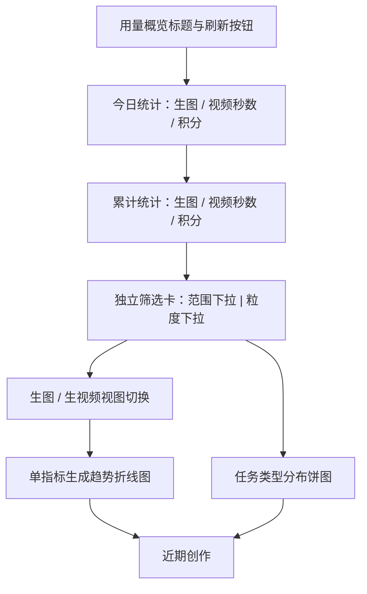
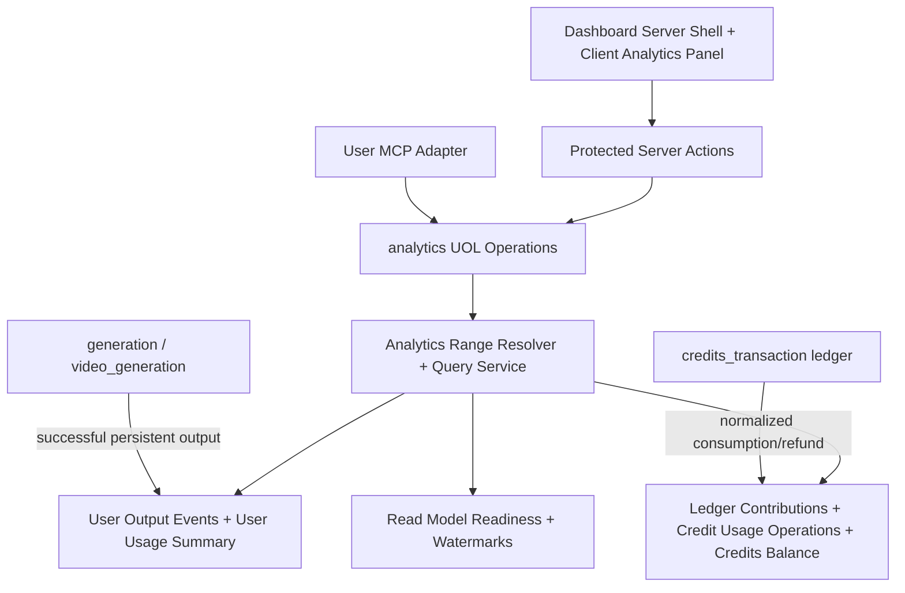
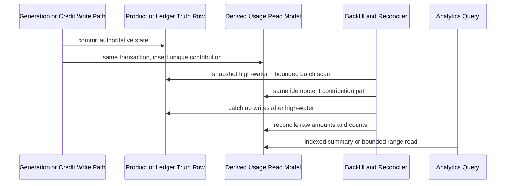

# 用户控制台统计重构 - Plan

## Goal Capsule

- **Objective:** 将普通用户控制台重做为分析优先首页，让用户快速了解今日与累计产出，并按有限时间范围查看生图、生视频趋势和任务类型分布。
- **Product authority:** 本文固定控制台的信息层级、统计口径、筛选行为、刷新行为、空状态和范围边界。
- **Technical authority:** Planning Contract 固定统计读模型、时间边界、UOL 与 User MCP 接口、页面状态机、迁移顺序和验证门槛；Product Contract 的产品口径优先于实现便利性。
- **Execution profile:** 按 U1-U6 的依赖顺序小步实施；先建立可重建读模型和双写，再回填对账，最后启用控制台 UI。
- **Stop conditions:** 任一账本退款无法关联原计费操作、读模型对账不为零、本人权限隔离失败、最大范围查询越过性能门槛，均停止启用 UI，不得以展示层补偿或读取时扫描历史绕过。
- **Tail ownership:** 实施者负责迁移、回填、对账、性能取证、浏览器验收、完整质量门和清理实验代码；计划文件不记录执行进度。
- **Open blockers:** 无。

---

## Product Contract

### Summary

用户控制台将成为分析优先的用量概览页，顶部展示不受筛选影响的今日与累计统计，下方通过统一筛选卡控制生成趋势和任务类型分布。
现有价格趋势卡从控制台首页迁移到“账单与用量”的“用量”页签。

### Problem Frame

产品尚未上线，当前控制台首页主要承担余额、累计图片、开始创作、价格趋势和近期创作展示，尚未形成面向用户的历史产出概览。
价格趋势回答的是计价问题，不适合作为控制台首页的核心分析内容；用户更需要看到已经产出多少图片和视频，以及这些活动如何随时间变化。

### Key Decisions

- **分析优先首页。** (session-settled: user-directed — chosen over action-first and balanced-overview layouts: the dashboard should first answer how the account has been used.) 折线图是下方分析区域的主体，摘要数据位于其上方，近期创作位于辅助区域。
- **成功产物而非请求数。** (session-settled: user-approved — chosen over counting created or attempted requests: image outputs, video seconds, and consumed credits are more meaningful to ordinary users.) 请求数量不出现在今日、累计或趋势统计中。
- **图像和视频分视图展示。** (session-settled: user-approved — chosen over combining different units on one series: image count and video seconds are not directly comparable.) 折线图默认展示生图数量，并支持切换到生视频秒数。
- **积分不进入时间范围图表。** (session-settled: user-directed — chosen over an image/video plus credit-consumption dual trend: removing ledger correlation keeps the chart query bounded and avoids slow-query risk.) 积分只出现在顶部今日与累计摘要中。
- **筛选只控制下方图表。** (session-settled: user-directed — chosen over filtering the whole page: today and lifetime totals must remain stable context.) 时间范围同时作用于折线图和任务类型分布，粒度决定折线图的时间分桶与可选范围族。
- **小时与天使用不同范围族。** (session-settled: user-directed — chosen over one shared range list: each granularity needs useful defaults and bounded point counts.) 页面默认按小时与近 24 小时；切换按天后默认近 7 天。
- **刷新代替开始创作。** (session-settled: user-directed — chosen over a creation call to action: this page is an analytics surface.) 刷新重新加载全页统计并保留筛选状态，加载期间图标旋转且按钮不可重复触发。
- **价格趋势迁入用量页签。** (session-settled: user-directed — chosen over keeping pricing on the dashboard: pricing belongs with billing and usage information.) 卡片功能暂时保持完整，不在本次重设计其内容。

### Actors

- A1. **已登录普通用户：** 查看本人统计、调整图表范围、切换生图或生视频视图、手动刷新数据，并访问近期创作。
- A2. **FluxMedia 统计能力：** 按当前用户、应用时区和已确认口径返回摘要与图表数据，拒绝越界范围。

### Requirements

**首页结构与摘要**

- R1. 控制台首页必须采用分析优先布局，依次呈现页面标题与刷新按钮、今日统计、累计统计、独立筛选卡、生成趋势、任务类型分布和近期创作。
- R2. 今日统计必须在同一行展示“今日生图数量”“今日生视频秒数”“今日消耗积分”三项，并按应用时区的当前自然日计算。
- R3. 累计统计必须在同一行展示“累计生图数量”“累计生视频秒数”“累计消耗积分”三项，并覆盖账户创建以来的完整历史。
- R4. 今日与累计统计不得随下方时间范围、粒度或生图/生视频视图变化。
- R5. 当前无数据时，六项摘要必须显示数值 0，不得隐藏统计区域。

**产出与积分口径**

- R6. 生图数量必须只统计成功完成的可计费图片产物数量，一次生成操作产生多张成品图时按实际成品图数量累计。
- R7. 生视频秒数必须只统计成功完成的视频产物时长，并以秒为单位累计。
- R8. 今日生图、今日生视频和下方图表必须按生成操作的创建时间归属到应用时区对应的自然日、小时或日期。
- R9. 今日消耗积分必须统计今日创建的计费操作最终产生的非负净消耗，退款应修正原计费操作而不是在退款发生时形成负数。
- R10. 累计消耗积分必须反映账户完整历史的总扣费减总退款，结果不得小于 0。
- R11. 积分统计必须以积分账本为财务真相，且不得因读取展示记录而改变财务口径。

**筛选卡与范围规则**

- R12. 筛选器必须作为独立整行卡片呈现，左侧为范围下拉，右侧为粒度下拉，并保持参考 UI 的单层白色卡片、圆角、轻阴影和标签同行结构。
- R13. 页面首次加载必须默认选择“按小时”和“近 24 小时”。
- R14. 按小时粒度必须提供“近 24 小时”“近 48 小时”和“自定义”范围，其中自定义允许选择开始与结束日期时间。
- R15. 按小时自定义范围不得超过连续 7 天，超出时必须阻止查询并给出可理解的范围提示。
- R16. 按天粒度必须提供“近 7 天”“本月”“本季度”“本年”和“自定义”范围，其中自定义允许选择开始与结束日期。
- R17. 按天自定义范围不得超过连续 366 个自然日，超出时必须阻止查询并给出可理解的范围提示。
- R18. 从按小时切换到按天时必须重置为“近 7 天”，从按天切换到按小时时必须重置为“近 24 小时”。
- R19. “近 24 小时”和“近 48 小时”必须是截至查询时刻的滚动时间窗；“近 7 天”必须包含应用时区的今天及之前 6 个自然日。
- R20. “本月”“本季度”和“本年”必须从应用时区对应当前日历周期的起点统计至查询时刻。
- R21. 自定义小时范围必须按所选开始与结束时刻查询，自定义天范围必须覆盖所选日期的完整应用时区自然日。

**折线图与任务类型分布**

- R22. 折线图必须支持“生图”和“生视频”两个互斥视图，默认选择“生图”。
- R23. 生图视图必须按所选粒度展示成功图片产物数量，生视频视图必须按所选粒度展示成功视频秒数。
- R24. 折线图不得展示积分消耗曲线，且绘图区必须横向充分利用卡片宽度，仅保留坐标与标签所需边距。
- R25. 所选范围内没有活动的时间桶必须以 0 呈现，使趋势轴连续而不是省略空桶。
- R26. 任务类型分布必须使用尺寸清晰的饼图展示所选范围内成功生图任务与成功生视频任务的占比，并按生成操作创建时间归属。
- R27. 范围下拉必须同时控制折线图和任务类型分布；粒度必须控制折线图分桶以及可用范围族，饼图使用同一最终时间范围。
- R28. 图表无数据时必须保留卡片和当前筛选上下文，并显示明确的无数据状态，不得用空白区域代替。

**刷新、迁移与适配**

- R29. 页面标题区域必须使用带循环箭头图标的“刷新”按钮替代“开始创作”按钮。
- R30. 刷新必须重新加载今日统计、累计统计、折线图、任务类型分布和近期创作，同时保留当前粒度、范围和生图/生视频选择。
- R31. 刷新进行期间循环箭头必须持续旋转，按钮必须禁用；成功或失败结束后必须停止旋转并恢复可用状态。
- R32. 刷新失败时必须保留用户当前筛选状态并提供可理解的失败反馈，不得把已有数据静默替换为 0。
- R33. 现有价格趋势卡必须从控制台首页完整迁移到“账单与用量”的“用量”页签，并保留当前展示能力。
- R34. 近期创作必须保留在控制台首页，并在无历史数据时呈现明确空状态。
- R35. 页面必须在常见桌面与移动宽度下保持可读；桌面摘要每组一行三项，窄屏可换行但不得改变指标顺序或含义。

**查询边界与接口约束**

- R36. 下方图表查询必须只处理当前用户在已验证时间范围内的生成记录，不得执行无界历史扫描。
- R37. 累计统计必须采用可支持重度用户的有界或汇总读取方式，不得在每次页面刷新时依赖扫描用户全部明细历史。
- R38. 新增统计查询能力必须先作为统一接口层 operation 暴露，再由控制台页面通过薄适配调用；权限、输入校验和错误映射由统一网关处理。
- R39. 统计查询必须只返回当前登录用户的数据，并在服务端验证粒度、范围类型、时间边界和最长跨度。

### Layout Map

### Key Flows

- F1. **首次查看控制台**
  - **Trigger:** A1 打开控制台首页。
  - **Actors:** A1、A2。
  - **Steps:** 页面加载今日与累计摘要；筛选初始化为按小时和近 24 小时；下方默认展示生图趋势与同一范围的任务类型分布；近期创作正常展示或进入空状态。
  - **Outcome:** 用户无需操作即可看到当前自然日、完整历史和最近 24 小时活动。
  - **Covered by:** R1-R13、R22-R28、R34。
- F2. **切换粒度与范围**
  - **Trigger:** A1 修改粒度或范围。
  - **Actors:** A1、A2。
  - **Steps:** 粒度切换时应用对应默认范围；自定义范围通过服务端边界校验；仅折线图和饼图使用新范围重新加载。
  - **Outcome:** 顶部摘要保持不变，下方两个图表保持同一时间范围。
  - **Covered by:** R4、R12-R28、R36、R39。
- F3. **切换生成类型**
  - **Trigger:** A1 在折线图中切换“生图”或“生视频”。
  - **Actors:** A1、A2。
  - **Steps:** 保留范围与粒度；折线图在图片数量和视频秒数之间切换；饼图继续使用相同范围。
  - **Outcome:** 图表单位清晰，不把图片数量与视频秒数绘制在同一序列中。
  - **Covered by:** R22-R27。
- F4. **手动刷新**
  - **Trigger:** A1 点击刷新按钮。
  - **Actors:** A1、A2。
  - **Steps:** 按钮进入禁用与旋转状态；全页数据重新请求；保留范围、粒度和生成类型选择；完成后恢复按钮，失败时给出反馈并保留已有数据。
  - **Outcome:** 用户明确知道刷新正在进行，且不会重复触发或丢失上下文。
  - **Covered by:** R29-R32。

### Acceptance Examples

- AE1. **Covers R2-R5, R8-R10.** 给定应用时区为 Asia/Shanghai 且用户今日没有成功产物或净积分消耗，当用户打开控制台时，今日三项均显示 0，累计三项仍显示完整历史值。
- AE2. **Covers R6-R8, R23, R25.** 给定一条今日创建并完成的生图操作产出 4 张可计费成品图，当按小时查看近 24 小时时，对应创建小时增加 4，其余无活动小时仍显示 0。
- AE3. **Covers R7-R8, R22-R23.** 给定一条昨日创建、今日完成的 5 秒视频，当用户切换到按天生视频视图时，该 5 秒归入昨日而不是今日。
- AE4. **Covers R9-R11.** 给定今日创建的计费操作扣除 100 积分后退款 100，当摘要刷新时，今日消耗积分为 0，且任何展示值都不会成为负数。
- AE5. **Covers R13-R18.** 给定页面当前为按小时近 48 小时，当用户切换到按天时，范围自动变为近 7 天；切回按小时时，范围自动变为近 24 小时。
- AE6. **Covers R15, R17, R39.** 给定用户提交超过 7 天的小时范围或超过 366 个自然日的天范围，系统拒绝查询并提示缩短范围，顶部摘要和已有图表数据不被清空。
- AE7. **Covers R24-R28.** 给定所选范围内没有成功任务，折线图显示连续 0 值或明确空状态，饼图显示无数据状态，筛选卡仍可操作。
- AE8. **Covers R29-R32.** 给定用户点击刷新，按钮图标立即旋转且按钮禁用；请求结束后恢复，当前筛选和生成类型选择保持不变。
- AE9. **Covers R33.** 给定用户访问控制台首页，页面不再出现价格趋势卡；访问“账单与用量”的“用量”页签时仍能看到完整价格趋势卡。

### Success Criteria

- 用户可以在一次页面浏览中区分今日、累计和所选时间范围三种统计上下文。
- 所有图像数量、视频秒数和积分消耗与已确认口径一致，退款不会产生负数展示。
- 小时查询最多产生 168 个时间桶，天查询最多产生 366 个时间桶。
- 重度用户的默认、最大自定义和累计读取均通过代表性数据量的查询计划与性能基准，不出现无界明细扫描或逐任务查询。
- 空数据、加载、刷新失败和窄屏布局均保持筛选上下文与指标含义清晰。

### Scope Boundaries

- 不展示今日或累计请求数量。
- 不展示积分消耗折线、退款曲线或按时间范围过滤的积分图表。
- 不提供超过 7 天的小时粒度或超过 1 年的天粒度。
- 不提供“全部历史”图表范围。
- 不在本次重设计价格趋势卡内容，只迁移其位置。
- 不重做控制台侧边栏、账单页的账单功能或近期创作详情交互。

### Dependencies / Assumptions

- 应用时区是自然日、日历周期和图表分桶的唯一时间边界。
- 图片数量以成功生成记录中的可计费成品图数量为准；历史记录缺少该数量时，可按已有单产物事实回退。
- 视频秒数以成功视频生成记录记录的时长为准。
- 积分账本是消费与退款的财务真相，生成记录中的积分字段不能替代账本对账。
- 现有用户与创建时间索引支持有限时间范围的生成记录查询；累计统计仍需规划适合重度用户的读取策略。
- 产品尚未上线，首版先以统计正确、交互清晰和查询可控作为成功信号，上线后再依据真实使用数据评估进一步指标。

### Outstanding Questions

**Deferred to Planning**

- 累计统计采用按用户汇总、增量聚合还是其他可重建读取方式，需结合一致性与性能基准确定。
- 今日非负净积分如何以可索引方式关联扣费、退款与原计费操作，需在不扫描 JSON 的前提下确定。
- 刷新与筛选查询的缓存、并发去重和失效策略需在不破坏手动刷新语义的前提下确定。

### Sources / Research

- `apps/web/src/app/[locale]/(dashboard)/dashboard/page.tsx`：当前控制台首页结构与价格趋势专属数据加载。
- `apps/web/src/app/[locale]/(dashboard)/dashboard/billing/page.tsx`：现有“账单”和“用量”页签结构。
- `packages/database/src/schema.ts`：图片、视频、积分账本字段及用户时间索引。
- `apps/web/src/app/[locale]/(dashboard)/dashboard/admin/status/page.tsx`：现有图片产物数量回退口径与相邻时间范围查询模式。
- `packages/database/drizzle/0035_generation_read_indexes.sql`：生成记录规模与索引背景。
- `packages/database/drizzle/0036_credits_transaction_user_created_at_idx.sql`：积分账本规模与用户时间索引背景。
- `docs/plan/2026-05-31-agent-integration-architecture.md`：统一接口层、权限与传输适配约束。

---

## Planning Contract

Product Contract preservation: Product Contract unchanged.

### Deferred Question Resolutions

- 累计生图与视频采用“成功产物事件 + 每用户累计汇总”的可重建读模型；累计积分继续复用 `credits_balance.total_spent` 的毛消费语义，并新增可由账本重建的累计退款字段，展示值为两者差额的非负结果。
- 今日积分采用“每个计费操作一行”的读模型；消费和退款都携带规范化操作标识与操作创建时间，退款更新原操作的非负净消耗，不在读取时解析 JSON 或 `sourceRef`。
- 首版不增加跨请求缓存。页面依靠窄表索引、累计汇总和有界范围查询满足性能要求；筛选并发通过请求序号丢弃过期响应，手动刷新显式重新读取。

### Key Technical Decisions

- KTD1. **以两个本人用量只读 operation 暴露能力。** `analytics.getMyUsageSummary` 返回今日与累计六项摘要，`analytics.getMyUsageTrends` 返回一个所选指标的连续时间序列和同范围任务类型分布。输入、输出、范围解析和补零契约归属 `packages/shared/src/analytics/`，Web 只保留数据库查询与 UI 映射；两者都从 Principal 派生用户，不接受 `userId`。
- KTD2. **新增 `analytics` UOL domain。** 统计同时跨越图片、视频与积分，归入 `image-generation` 或 `credits` 都会制造错误领域归属；新增 domain 时同步接口盘点、registry 测试和 MCP 注解，不改变其他 operation 的权限。
- KTD3. **全部时间范围在服务端解析为半开区间。** operation 读取唯一的应用时区，并返回 `asOf`、时区和规范化 `[start, end)`；今天和自然日结束边界使用“下一日 00:00”，不使用 `23:59:59.999`，从而消除相邻桶重复。
- KTD4. **小时趋势使用起点锚定的固定 60 分钟桶。** (session-settled: user-approved — chosen over application-time-zone clock-hour buckets: strict rolling windows must remain 24/48 buckets and custom hourly ranges must never exceed 168 buckets.) 近 24/48 小时以 `asOf` 为终点，自定义小时范围保留用户选择的时刻；最后一个不足一小时的自定义桶可以是部分桶。
- KTD5. **DST 解析使用确定性规则。** 不存在的本地时刻拒绝为校验错误，重复的本地时刻选择较早偏移；返回的桶使用 UTC ISO 边界作为稳定标识，标签在偏移重复时附带时区缩写，避免把两个本地同名小时合并。
- KTD6. **成功产物写入窄型输出事件读模型。** 每个持久化成功图片或视频任务仅有一条不可重复的派生事件，保存用户、类型、操作创建时间、图片成品数或视频秒数；趋势和饼图只查该窄表，累计读取只查每用户汇总行。事件与汇总可从 `generation` 和 `video_generation` 全量重建，不能成为产物真相。
- KTD7. **图片事件沿用现有可计费成品口径。** completed 图片优先读取 `metadata.outputImage.billableImageOutputCount`；缺失时，当前 `storageKey` 或保留清理写入的 `metadata.outputImage.photoRetention` 可证明曾有持久化产物并回退为 1。三者都缺失的历史 completed 行是回填错误，不能静默计 0。视频事件只接受 completed 且 `durationSeconds > 0` 的行。饼图计事件行数，折线图分别求图片成品数或视频秒数。
- KTD8. **积分账本增加独立于幂等键的计费操作上下文。** `sourceRef` 只负责单笔账本写入幂等；operation type、operation ID 和原操作创建时间是一等字段，用于把初扣、补扣和退款聚合到同一操作，运行时不得解析 `sourceRef` 猜测。每个账本 transaction 先以自身 ID 写入唯一投影贡献，再原子更新 `credit_usage_operation`，保证在线双写、回填和重试对同一账本行至多应用一次。
- KTD9. **摘要积分覆盖全部消费。** (session-settled: user-approved — chosen over generation-only credit consumption: the user confirmed that all ledger consumption should contribute to today and lifetime spend.) 生图、生视频、Chat、Agent、审核费用、可编辑文件、API 和管理员扣减均计入；发放与过期不计入，关联退款回到原计费操作。
- KTD10. **读模型维护复用底层事务而不嵌套事务。** 生成完成服务接受现有事务句柄，把权威 completed 更新、事件插入和条件汇总递增放在同一事务；只有事件真实插入时才增加汇总。`consumeCredits` 和退款 `grantCredits` 在各自已有事务内写账本、唯一贡献与操作聚合；退款锁定原操作并强制 `0 <= refunded <= gross`，孤立、超额或先于扣费的退款失败而不是靠截断掩盖。部署使用 expand → dual-write → backfill/catch-up → reconcile → enable/observe → contract 顺序。
- KTD11. **纯中转生图不进入统计。** (session-settled: user-approved — chosen over persisting relay-only counters: the existing no-storage privacy boundary must remain intact.) 不为 relay-only 路径新增用户事件、计数器或日志；控制台统计明确只覆盖持久化生成记录。
- KTD12. **Web 与 User MCP 共用同一 operation。** (session-settled: user-approved — chosen over UOL plus Web-only exposure: the confirmed scope includes agent-callable personal usage analytics.) 两个 operation 加入 User MCP 白名单，不进入 Admin MCP；session `user` 和 MCP `apiKey` Principal 只能读取本人。只读调用不写业务审计或幂等记录，保留既有请求耗时与错误日志。
- KTD13. **筛选状态分为草稿、已提交与响应版本。** 自定义输入只有点击应用后才成为有效筛选；快速切换为每次请求分配递增序号，仅最新响应可替换图表。失败保留旧图和已提交筛选，不以 0 伪装错误。
- KTD14. **刷新按当前筛选一次性返回整页数据。** 刷新 action 并行调用摘要、趋势 operation 和现有近期创作 service，全部成功后原子替换客户端状态，不再追加 `router.refresh()` 造成统计重复查询；按钮在整个过程禁用，图标旋转。筛选请求只调用一次趋势 operation，不重查摘要或近期创作。
- KTD15. **图表继续隔离 Recharts 客户端成本。** 折线图和饼图合并为一个 `next/dynamic({ ssr: false })` 懒加载可视化包，使用等高骨架和容器宽度测量；Server Component 首页不直接引入 Recharts。
- KTD16. **价格趋势卡完整迁移而不复制。** 组件、懒加载包装和套餐/后端组/运行时定价数据装配一起迁往 billing feature；控制台删除这些专属查询。Billing tabs 改为 URL 驱动的服务端选择，只在 `usage` 为活动页签时装配价格数据，默认 Billing 请求不得为隐藏内容付出服务端查询成本。

### High-Level Technical Design

以下图只表达职责和数据方向，不规定具体函数签名。

### Data Model and Query Shape

- `user_output_usage_event` 是窄型成功产物事件，唯一键覆盖产物类型与源任务 ID，查询索引为 `(user_id, operation_created_at, output_kind)`；图片与视频互斥字段带非负约束。一次范围 SQL 以条件聚合同时产出所选趋势和两类任务数，避免为饼图重复扫描。
- `user_usage_summary` 每用户一行，保存累计图片成品数与累计视频秒数。只有事件 `INSERT ... RETURNING` 真正插入时才原子递增；冲突回放和回填重复扫描不递增，在线回填不得用全量覆盖丢失并发完成事件。
- `credits_transaction` 为 consumption/refund 增加可空的规范化操作类型、操作 ID 和操作创建时间列；旧数据回填后用条件约束保证这两类新写入不能缺少上下文。
- `credit_usage_projection_entry` 以 `credits_transaction.id` 为主键，记录该账本行投影到哪个计费操作；只有贡献行真实插入时才更新操作聚合和累计退款，形成“每笔账本贡献至多应用一次”不变量。
- `credit_usage_operation` 每用户、操作类型、操作 ID 一行，保存操作创建时间、毛扣费、退款和净额。数据库和事务逻辑强制退款不超过毛扣费，查询索引为 `(user_id, operation_created_at)`；非负净额是有效账本关系的结果，不是掩盖过量退款的截断器。
- `credits_balance.total_spent` 保持毛消费原义，新增累计退款派生字段；累计展示仍做非负防御，但启用门槛要求账本原始 gross/refund、贡献表、操作聚合与账户累计逐项相等，不能只比较截断后的净额。
- `analytics_read_model_state` 保存输出与积分投影的版本、snapshot high-water、catch-up 水位、状态和最近对账时间；两个 operation 只在对应版本为 ready 时读取，否则返回可映射的暂不可用错误。
- 摘要查询只读 `user_usage_summary`、`credits_balance`、今日范围的输出事件和计费操作；趋势查询只读已验证范围内的输出事件。任何用户请求路径都不得扫描 `generation.metadata`、账本 JSON 或完整历史。
- 小时查询使用 UTC 绝对时长计算桶序号，天查询先按应用时区解析自然日边界；SQL 只返回有数据桶，TypeScript 在最多 168/366 个规范化桶上补零并排序。

### Migration, Backfill, and Rollout

1. **Expand:** 以当前下一个可用编号手写输出事件、累计汇总、readiness 表、账本可空规范化列、贡献表、计费操作和累计退款字段；新窄表索引在空表上建立，大账本只做 metadata-only 可空列扩展，不在该阶段验证历史约束。
2. **Dual-write:** 部署兼容旧数据的新写路径。生成所有完成/恢复入口使用统一完成事务；所有 consumption/refund 调用方显式传 operation context。回滚目标必须仍能容忍新增可空列和读模型表。
3. **Backfill:** 记录 snapshot high-water，按用户与 `(created_at,id)` 稳定复合游标分批、每批独立提交；同一唯一事件/贡献插入路径避免与在线双写重复。批次根据锁等待、WAL、复制延迟和死元组自适应限速，不打印敏感字段。
4. **Catch-up and reconcile:** 追赶 high-water 后的新写入，再比较原始任务数/产物数、账本 gross/refund、贡献、操作聚合和账户累计。历史图片既无 billable count、storageKey、也无 photoRetention 证据或任一退款无法关联时失败退出。
5. **Enable and observe:** 对账为零后将 readiness 标为 ready，启用 UOL、User MCP 和新首页；观察至少一个部署窗口，持续抽样对账。回滚入口只需把 readiness 置回不可用或恢复旧 UI，不删除派生数据、不改写账本。
6. **Contract:** 确认旧应用实例全部退出且回滚目标包含 operation context 双写后，单独部署条件 CHECK `NOT VALID`，再执行 `VALIDATE CONSTRAINT`。设置短 `lock_timeout`，记录锁等待；失败只回退未生效约束，不删除已双写数据。

迁移编号在当前仓库状态下预计为 `0049`、`0050`、`0051`；实施前必须重新检查下一个可用编号，若已被占用则顺延并同步本文引用，不得覆盖已有迁移。

### Assumptions and Constraints

- 历史 generation/video ID、已知 `sourceRef` 形式和退款 metadata 预计足以恢复现有生成类计费操作；这是必须由回填 dry-run 证明的假设，无法确定的退款列为错误，不按退款日猜测归属。
- 应用时区未来可以修改，因此派生表存储 UTC 操作时间，不持久化本地日或本地小时标签；改变时区不要求重建读模型。
- 当前 Dashboard layout 已设置动态渲染且不缓存用户页面，首版不引入 Redis 或 `unstable_cache`。若上线后性能数据要求缓存，另行设计带用户、时区、规范化范围、粒度和指标的完整键。
- 全局 UOL 网关当前未运行时校验 output schema。本次以强类型映射和 operation 契约测试保证两个新 operation 的输出；修复所有既有 operation 的全局输出校验属于后续独立改造。
- 原生 `date` 与 `datetime-local` 输入足以满足首版自定义范围，不新增日期库或 Calendar 依赖。

### System-Wide Impact

- **Data lifecycle:** 新表均为可删除重建的读模型；用户删除继续通过 user 外键级联。源 generation、video 和账本保留策略不变。
- **Financial integrity:** 账本写入先于或同事务伴随派生更新；对账只读真相并修复派生表，不反向改写账本，不读取 generation 的积分字段作为财务依据。
- **Authorization:** operation 输入没有 `userId`；管理员以普通 user Principal 调用时也只能读取本人。任意用户统计、全局统计和 Admin MCP 均不在本次范围。
- **Privacy:** 输出只有计数、秒数、积分、时间边界和桶，不返回 prompt、模型、URL、storage key、账本 metadata 或 API key 信息；relay-only 不产生统计持久化。
- **Performance:** 在线读取从宽表和 JSON 转为窄型索引表，但 366 个输出桶不等于只扫描 366 行；最大范围复杂度仍随该用户事件数增长，必须以生产 p99 用户范围基数验证。若超过门槛，先增加经实测设计的汇总层或覆盖索引，再启用入口。
- **Observability:** 记录 operation 名、request ID、用户匿名标识、解析后范围、桶数、查询耗时和错误码；不得记录 prompt、原始 metadata 或凭据。高频读取不写 `adminAuditLog`。
- **Deployment:** 数据双写和回填先于 UI；回滚 UI 不删除读模型。若双写异常，停止 UI 启用并以真相表重新构建，而不是手工修改汇总数。

### Risks and Mitigations

| Risk | Impact | Mitigation |
|---|---|---|
| 派生读模型与真相漂移 | 摘要或趋势错误，积分口径失真 | 事件/账本 transaction 级贡献唯一、条件汇总、批量重建、原始值对账；漂移非零阻止启用 |
| 历史退款无法稳定关联 | 今日归属错误或累计少减退款 | 规范化列只服务新写入，历史回填显式识别已知模式；未解析项失败退出并人工核对，不猜测 |
| 686MB generation 与 141MB 账本回填耗时 | 部署窗口延长、WAL/死元组/复制延迟或锁等待升高 | 双写先上线，snapshot + catch-up 分批提交并自适应限速；监控锁、WAL、复制和最长批次，完成后维护统计信息 |
| DST 或边界错误 | 重复/缺失桶，跨日统计错位 | 半开区间、确定性歧义规则、UTC 稳定 ID，以及 Los Angeles 23/25 小时日与闰日测试 |
| 快速筛选与刷新竞态 | 旧响应覆盖新筛选 | 草稿/已提交状态分离、递增请求序号、原子替换和 pending 禁用 |
| MCP schema、响应或并发缺少边界 | Agent 参数错误、token 膨胀或多 key 放大最大范围查询 | User/Admin MCP 共用 Zod JSON Schema 转换；紧凑序列化、响应字节门槛、per-key 与 per-user 聚合限流 |
| 隐藏 Usage tab 仍产生价格数据服务端开销 | Billing 默认 tab 首屏变慢 | 使用 URL 驱动的服务端活动页签；默认 Billing 请求断言价格 loader 调用次数为 0 |

---

## Implementation Units

### U1. Time Range and Series Contracts

- **Goal:** 建立应用时区范围解析、DST 规则、连续桶补零、指标单位和图片产物计数的纯函数契约，作为 SQL、UOL 与 UI 的共同语义基础。
- **Requirements:** R6-R8、R13-R21、R22-R28、R39；F1-F3；AE2、AE3、AE5-AE7；KTD3-KTD5、KTD7。
- **Dependencies:** 无。
- **Files:**
  - `packages/shared/src/analytics/contracts.ts`
  - `packages/shared/src/analytics/range.ts`
  - `packages/shared/src/analytics/range.test.ts`
  - `packages/shared/src/analytics/series.ts`
  - `packages/shared/src/analytics/series.test.ts`
  - `packages/shared/src/analytics/output-count.ts`
  - `packages/shared/src/analytics/output-count.test.ts`
  - `packages/shared/package.json`
  - `packages/shared/src/time-zone/index.ts`
  - `packages/shared/src/time-zone/index.test.ts`
- **Approach:** 在 shared analytics 模块集中定义 Zod 输入输出、指标单位、范围解析、桶描述、补零和图片计数；所有纯函数显式接收 `timeZone` 与 `asOf`，不自行读取系统设置。扩展通用时区工具以解析应用时区中的日期时间并验证 round-trip；图片计数同时识别 `billableImageOutputCount`、当前 `storageKey` 和保留清理留下的 `photoRetention` 证据。
- **Patterns:** 遵循 `packages/shared/src/time-zone/index.ts` 的 IANA 时区规范化与 `apps/web/src/app/[locale]/(dashboard)/dashboard/admin/status/page.tsx` 的日期筛选口径；结束日期改用下一日零点，不复用 inclusive end-of-day。
- **Test scenarios:**
  1. `asOf` 为任意分钟时，近 24/48 小时分别解析为 24/48 个固定 60 分钟桶，首尾边界精确相差 24/48 小时。
  2. 小时自定义范围恰好 168 小时通过，超过 1 毫秒拒绝；反向、相等、无效格式和未来结束时刻拒绝且产生可映射校验错误。
  3. 天自定义范围恰好 366 个自然日通过，第 367 日拒绝；近 7 天、本月、本季度、本年在 Asia/Shanghai 和 America/Los_Angeles 下得到正确起点与下一日边界。
  4. Los Angeles 春季不存在时刻拒绝，秋季重复时刻选择较早偏移；跨 DST 的日桶仍以本地自然日为界，重复标签含偏移信息。
  5. 2028 闰日、跨年和季度起点正确；SQL 只有部分桶时按规范化桶补零且顺序稳定。
  6. completed 多图记录按 billable count 累计；缺失 count 且有 storageKey 或 photoRetention 回退 1；三者全缺的历史 completed 行返回“证据不足”供回填失败，pending、failed 或非正 count 为 0。
- **Verification:** 运行 shared analytics 与时区测试；确认 shared 契约不导入 `@repo/database`、不读取运行时设置，TypeScript strict 无 `any`。

### U2. Persistent Output Usage Read Model

- **Goal:** 为持久化成功图片与视频建立幂等事件和累计汇总，使摘要与趋势不再读取宽 generation JSON 或扫描完整历史。
- **Requirements:** R2-R8、R23-R28、R34、R36-R37；F1-F3；AE1-AE3、AE7；KTD6、KTD7、KTD10、KTD11。
- **Dependencies:** U1。
- **Files:**
  - `packages/database/src/schema.ts`
  - `packages/database/drizzle/0049_user_output_usage_read_model.sql`
  - `packages/database/drizzle/meta/_journal.json`
  - `apps/web/src/features/dashboard/output-usage-read-model.ts`
  - `apps/web/src/features/dashboard/output-usage-read-model.test.ts`
  - `apps/web/src/features/dashboard/analytics-service.ts`
  - `apps/web/src/features/dashboard/analytics-service.test.ts`
  - `apps/web/src/features/image-generation/operations.ts`
  - `apps/web/src/features/image-generation/video-operations.ts`
- **Approach:** 新增成功产物事件、每用户累计和 read-model readiness。抽出接受现有事务句柄的完成服务，图片/视频权威 completed 更新、事件插入与条件汇总递增在同一事务中完成；事件冲突时不递增。所有图片完成分支和视频同步/轮询恢复分支汇入该服务，relay-only 分支不调用记录器。查询服务以一次条件聚合返回所选趋势和两类任务数，从汇总表读取累计，并在 shared 纯函数补零。
- **Patterns:** 沿用 `generation(user_id, created_at)` 和 `video_generation(user_id, created_at)` 的创建时间归属；参考 image backend scheduler metric 的原子 upsert 语法，但读模型写入失败不得 best-effort 吞错。
- **Test scenarios:**
  1. 一次完成图片任务产生 4 个可计费成品时事件值为 4、图片任务数为 1、累计增加 4。
  2. 同一图片或视频完成回调串行/并发重复时唯一事件只存在一条，用户汇总只增加一次。
  3. 视频完成 5 秒写入视频事件并累计 5；pending、failed、零时长或存储失败不写成功事件。
  4. 图片多产物回退、视频秒数、创建时间归属和饼图任务计数与 U1 口径一致。
  5. relay-only 成功调用不写事件或用户汇总，并且查询输出不泄漏 relay 调用存在性。
  6. 双写已插入事件后回填再次遇到同一源任务时不重复累计；在线回填与并发新完成事件不会被汇总覆盖。
  7. 无事件用户摘要返回 0；今日查询有边界条件、趋势查询只读当前用户和 `[start,end)`，一次范围扫描同时返回趋势与分布，不存在 N+1。
- **Verification:** 在可丢弃数据库应用迁移；运行读模型与查询服务测试；用查询日志断言 summary/trend 在线路径未访问 `generation.metadata`，并对默认与最大范围执行初步 `EXPLAIN (ANALYZE, BUFFERS)`。

### U3. Credit Operation Read Model and Reconciliation

- **Goal:** 在不改变账本真相的前提下，建立可索引的计费操作净消耗、累计退款和可恢复回填流程，正确支持今日与累计积分摘要。
- **Requirements:** R2-R5、R9-R11、R37；F1、F4；AE1、AE4、AE6、AE8；KTD8-KTD10。
- **Dependencies:** U1、U2 的批量回填基础和图片计数口径。
- **Files:**
  - `packages/database/src/schema.ts`
  - `packages/database/drizzle/0050_credit_usage_operation.sql`
  - `packages/database/drizzle/0051_credit_usage_operation_constraints.sql`
  - `packages/database/drizzle/meta/_journal.json`
  - `packages/shared/src/credits/core.ts`
  - `packages/shared/src/credits/core.test.ts`
  - `packages/shared/src/credits/usage-read-model.ts`
  - `packages/shared/src/credits/usage-read-model.test.ts`
  - `packages/shared/src/generation-maintenance.ts`
  - `packages/shared/src/generation-maintenance.test.ts`
  - `packages/shared/src/uol/operations/credits.ts`
  - `packages/shared/src/credits/actions.ts`
  - `packages/shared/src/support/actions/admin-users.ts`
  - `apps/web/src/features/image-generation/operations.ts`
  - `apps/web/src/features/image-generation/video-operations.ts`
  - `apps/web/src/features/image-generation/editable-file-operations.ts`
  - `apps/web/src/app/api/editable-file/generate/route.ts`
  - `apps/web/scripts/backfill-dashboard-analytics.mjs`
  - `apps/web/package.json`
- **Approach:** 给账本 consumption/refund 增加独立于 `sourceRef` 的 operation context；已知异步任务传稳定任务 ID 与创建时间，无任务的消费以新账本 transaction ID 作为操作 ID。每笔账本行先插入 transaction-ID 唯一贡献，只有插入成功才锁定并更新操作聚合与累计退款；退款必须引用已有原操作且不超过可退毛扣费。回填器使用 snapshot high-water、稳定复合游标和 catch-up 分批修复历史上下文，所有贡献复用同一去重路径；reconcile 零差异并观察旧实例退出后才单独投放约束迁移。
- **Patterns:** 保持 `consumeCredits` 的 per-user `sourceRef` 强幂等和 `grantCredits` 的 `(source_type,source_ref)` 退款幂等；底层函数自带事务，不从 generation 层新增外层事务。
- **Execution note:** 先写失败复现测试，证明 `totalSpent` 在退款后仍是毛消费且旧 `sourceRef` 无法稳定关联，再实现规范化读模型；财务单元的对账和并发场景全部通过前不得进入 U4。
- **Test scenarios:**
  1. 同一图片操作初扣、补扣和部分退款聚合到同一操作，净额为毛扣费减退款，操作创建时间保持 generation 创建时间。
  2. 扣 100 后退 100 时今日与累计净消耗为 0；重复退款与并发退款不重复增加累计退款，退款超过剩余毛扣费、孤立退款或退款先于扣费明确失败并回滚。
  3. 昨日创建操作今日退款时，昨日操作净额被修正，今日不出现负值；累计净额同步减少。
  4. Chat、Agent、审核、可编辑文件、API 和管理员扣减均生成操作上下文；发放与过期不进入消费读模型。
  5. `consumeCredits` 幂等快路和唯一冲突回放不重复 upsert；余额不足、冻结账户和事务回滚不留下孤立读模型行。
  6. 在线双写已处理账本行后，回填再次遇到同一 transaction ID 不重复贡献；中断后从游标继续，snapshot 后的新写入由 catch-up 纳入。
  7. 未关联退款、不同 operationCreatedAt 的错误关联或证据不足历史图片使命令非零退出且不写猜测归属。
  8. 对账分别验证账本毛消费、账本退款、transaction 贡献、计费操作 gross/refund、`credits_balance` 毛消费/累计退款和展示净额一致。
- **Verification:** 在生产规模副本分阶段运行 migration 0050、双写测试、backfill/catch-up、reconcile、观察窗口和 contract migration 0051；监控每批时长、锁等待、WAL、复制延迟与死元组。确认原始财务差异为零后才允许启用入口。

### U4. Analytics UOL, Web Adapters, and User MCP

- **Goal:** 把摘要与趋势作为统一接口能力注册并绑定，使 RSC、Server Action 和 User MCP 共享权限、校验和输出语义。
- **Requirements:** A1-A2；R30-R32、R36-R39；F1-F4；AE5、AE6、AE8；KTD1、KTD2、KTD12-KTD14。
- **Dependencies:** U1-U3 的代码、schema 与本地测试完成；生产 backfill/reconcile 是入口启用门槛，不阻塞 U4 代码开发。
- **Files:**
  - `packages/shared/src/uol/types.ts`
  - `packages/shared/src/uol/errors.ts`
  - `packages/shared/src/uol/operations/analytics.ts`
  - `packages/shared/src/uol/operations/index.ts`
  - `packages/shared/src/uol/tests/invoke.test.ts`
  - `packages/shared/src/uol/tests/analytics.test.ts`
  - `packages/shared/src/mcp/user-tool-factory.ts`
  - `packages/shared/src/mcp/tool-factory.ts`
  - `packages/shared/src/mcp/json-schema.ts`
  - `packages/shared/src/mcp/user-config.ts`
  - `packages/shared/src/mcp/tool-factory.test.ts`
  - `packages/shared/src/rate-limit/index.ts`
  - `packages/shared/src/rate-limit/index.test.ts`
  - `packages/shared/src/rate-limit/behavior.test.ts`
  - `apps/web/src/server/uol-bindings.ts`
  - `apps/web/src/features/dashboard/analytics-actions.ts`
  - `apps/web/src/features/dashboard/analytics-actions.test.ts`
  - `apps/web/src/app/api/mcp/user/route.ts`
  - `apps/web/src/app/api/mcp/user/route.test.ts`
  - `docs/plan/2026-05-31-feature-interface-inventory.md`
- **Approach:** 注册两个 `protected`、天然幂等、无副作用、无套餐能力位的 operation。bindings 只接受 user/apiKey Principal、检查 readiness 并调用 analytics service；actions 使用 `protectedAction`、初始化 UOL、构造当前 session Principal 后调用网关。User MCP 白名单加入两项；User/Admin MCP 工厂共用 Zod 4 JSON Schema 转换，Admin 白名单不变。User route 使用紧凑结果序列化，并在现有 per-key 保护外增加 per-user 聚合限流，避免多个 key 放大最大范围查询。
- **Patterns:** 传输层遵循 `apps/web/src/features/payment/credit-top-up-actions.ts` 的 `ensureUolInitialized()` → Principal → `invokeOperation()` 链路；本人身份遵循 `credits.getMy*` 而不是接受 `userId` 的旧 operation。
- **Test scenarios:**
  1. session user 与同一用户的 MCP apiKey 对相同输入得到相同范围、单位、桶和分布语义；输出通过 operation Zod schema。
  2. 输入不能携带 `userId`，API key A 无法读取用户 B；system/webhook/proxy Principal 被拒绝，管理员 user Principal 只能读取本人。
  3. 小时/天范围族不匹配、超长跨度、非法日期时间和未来结束时刻在 execute 前或 range resolver 中变成一致的 validation error。
  4. tools/list 只有 operation 已绑定时才显示两个新工具，共享 JSON Schema 正确包含 metric、granularity、默认值、枚举、可选字段与自定义范围分支；Admin MCP 不出现。
  5. 重复并发读取不写业务表、不生成审计记录；日志不含 prompt、metadata 或凭据。
  6. 筛选 action 只调用一次趋势 operation；readiness 未就绪时 Web/MCP 得到同一个新增 UOL 暂不可用错误码，HTTP/MCP 映射不泄漏内部状态。
  7. 同一用户多个 MCP key 的最大范围调用受聚合限流，单个 key 仍受 per-key 限流；366 桶成功响应使用紧凑 JSON 且不超过响应字节门槛。
- **Verification:** 运行 UOL、MCP factory 和 action 测试；检查接口盘点与 operation 元数据同步；手工调用 User MCP `tools/list` 与 `tools/call` 验证真实绑定。

### U5. Dashboard Analytics Experience

- **Goal:** 实现分析优先首页、两组三项摘要、独立筛选卡、单指标折线图、任务类型饼图、刷新状态机和近期创作空状态。
- **Requirements:** R1-R5、R12-R32、R34-R35；F1-F4；AE1-AE8；KTD13-KTD15。
- **Dependencies:** U4。
- **Files:**
  - `apps/web/src/app/[locale]/(dashboard)/dashboard/page.tsx`
  - `apps/web/src/app/[locale]/(dashboard)/dashboard/loading.tsx`
  - `apps/web/src/app/[locale]/(dashboard)/dashboard/error.tsx`
  - `apps/web/src/features/dashboard/components/dashboard-analytics-panel.tsx`
  - `apps/web/src/features/dashboard/components/dashboard-summary-cards.tsx`
  - `apps/web/src/features/dashboard/components/dashboard-filter-card.tsx`
  - `apps/web/src/features/dashboard/components/dashboard-analytics-charts.tsx`
  - `apps/web/src/features/dashboard/components/dashboard-analytics-charts-lazy.tsx`
  - `apps/web/src/features/dashboard/dashboard-refresh-action.ts`
  - `apps/web/src/features/dashboard/dashboard-refresh-action.test.ts`
  - `apps/web/src/features/dashboard/recent-creations-service.ts`
  - `apps/web/src/features/dashboard/recent-creations-service.test.ts`
  - `apps/web/src/features/image-generation/components/recent-creations-client.tsx`
  - `apps/web/messages/zh.json`
  - `apps/web/messages/en.json`
- **Approach:** 首页保留 Server Component 壳，通过 UOL 加载默认摘要/趋势，并通过抽出的本人近期创作 service 加载列表，再把整页初值交给 Client panel。panel 管理摘要、趋势、近期创作、草稿筛选、已提交筛选、指标、请求序号与刷新 pending；刷新 action 一次返回三类数据，不调用 `router.refresh()`。图表 bundle 只负责渲染规范化数据，最近创作区始终存在。
- **Patterns:** 刷新视觉复用 `dashboard/admin/status/refresh-status-button.tsx` 的 `RefreshCw`、`animate-spin`、禁用和 toast；图表懒加载复用现有价格卡 wrapper 的等高 skeleton 与 ResizeObserver；新文案统一进入 next-intl，不扩散 `copy(en, zh)`。
- **Test scenarios:**
  1. 首次加载为按小时、近 24 小时、生图视图；今日和累计各一行三项，空数据全部为 0。
  2. 切换按天自动变近 7 天，切回小时自动变近 24 小时；摘要数值不变，折线与饼图使用同一返回范围。
  3. 自定义草稿未应用不请求；应用合法范围后更新图表，超界或非法范围保留旧图和旧有效筛选并提示。
  4. 快速连续切换中后发请求胜出，旧响应不覆盖；生图/生视频单位与折线值切换，饼图仍显示同范围两类任务。
  5. 刷新按钮立即禁用并旋转；摘要、趋势和近期创作都成功才替换，失败时停止旋转、保留全部旧数据并提示；每次刷新只有一组读取且当前筛选和指标保持。
  6. 无图表活动时折线仍有连续 0 桶并显示说明，饼图不绘制伪比例；近期创作为空时区块不消失。
  7. 360px、768px、1280px 宽度下指标顺序不变、筛选可操作、折线横向利用卡片、饼图尺寸清晰；减少动态偏好下无强制旋转之外的入场动画。
  8. zh/en 文案、数字、秒数、积分、日期和 DST 重复标签均可读；初始加载失败进入可重试 error boundary。
- **Verification:** 运行 dashboard 纯函数/action 测试后，在本地浏览器逐项验收默认、切换、自定义、竞态、刷新、失败、空数据、双语和三档宽度；确认 Recharts 未进入 Server Component bundle。

### U6. Move Pricing Card to Billing Usage

- **Goal:** 从控制台彻底移除价格趋势卡及其专属数据加载，并把同一张卡完整迁入“账单与用量”的“用量”页签。
- **Requirements:** R33；AE9；KTD16。
- **Dependencies:** U5 可并行准备，但合并时必须确认首页已不引用旧位置。
- **Files:**
  - `apps/web/src/features/dashboard/components/image-pricing-chart-card.tsx`
  - `apps/web/src/features/dashboard/components/image-pricing-chart-card-lazy.tsx`
  - `apps/web/src/features/billing/components/image-pricing-chart-card.tsx`
  - `apps/web/src/features/billing/components/image-pricing-chart-card-lazy.tsx`
  - `apps/web/src/features/billing/image-pricing-card-data.ts`
  - `apps/web/src/app/[locale]/(dashboard)/dashboard/page.tsx`
  - `apps/web/src/app/[locale]/(dashboard)/dashboard/billing/page.tsx`
  - `apps/web/src/app/[locale]/(dashboard)/dashboard/billing/billing-tabs-nav.tsx`
  - `apps/web/src/app/[locale]/(dashboard)/dashboard/billing/loading.tsx`
  - `apps/web/messages/zh.json`
  - `apps/web/messages/en.json`
- **Approach:** 使用 git move 迁移组件与 lazy wrapper，不保留副本；把 runtime pricing、用户套餐、能力位、后端组和首选组装配封装到 billing server loader。Billing 页通过 `?tab=billing|usage` 服务端决定唯一活动内容，只有 Usage 导航才调用 loader 并在 `CreditUsageSection` 后渲染卡片；Dashboard 删除所有只为价格卡存在的查询和 imports。
- **Patterns:** 保持卡片当前 Recharts lazy wrapper、定价公式和 billing props，不重设计内容；Billing 页继续使用现有 Tabs 与 `Settings.billing` 翻译结构。
- **Test scenarios:**
  1. Dashboard 不再渲染价格卡，也不请求 runtime pricing、plan capabilities、backend groups 或用户 backend preference。
  2. Usage tab 展示与迁移前相同的套餐配额、轮次费、后端倍率、审核附加和价格曲线；Billing tab 现有功能不变。
  3. 价格卡仍客户端懒加载、骨架等高、中文和英文内容完整；无后端组时沿用默认组回退。
  4. 默认 Billing 请求的价格 loader 调用次数为 0；打开或直接访问 Usage 时只调用一次，刷新保留活动 tab，浏览器前进/后退语义正确。
- **Verification:** 浏览器对比迁移前后价格卡内容；检查 Dashboard 网络/服务端日志不再出现价格数据装配；运行 web typecheck、lint 与 build 验证 move 后无孤立 imports。

---

## Verification Contract

### Automated Gates

| Gate | Command | Proves |
|---|---|---|
| Shared focused tests | `pnpm --filter @repo/shared test -- src/analytics/range.test.ts src/analytics/series.test.ts src/analytics/output-count.test.ts src/time-zone/index.test.ts src/credits/core.test.ts src/credits/usage-read-model.test.ts src/generation-maintenance.test.ts src/uol/tests/analytics.test.ts src/uol/tests/invoke.test.ts src/mcp/tool-factory.test.ts src/rate-limit/index.test.ts src/rate-limit/behavior.test.ts` | 时区、共享契约、财务幂等、读模型、UOL 错误、MCP schema 与聚合限流 |
| Web focused tests | `pnpm --filter @repo/web test -- src/features/dashboard/output-usage-read-model.test.ts src/features/dashboard/analytics-service.test.ts src/features/dashboard/analytics-actions.test.ts src/features/dashboard/dashboard-refresh-action.test.ts src/features/dashboard/recent-creations-service.test.ts src/app/api/mcp/user/route.test.ts` | 查询边界、薄适配、刷新调用次数、近期创作与 MCP route |
| Database type safety | `pnpm --filter @repo/database typecheck` | Drizzle schema 与新列/表类型一致 |
| Monorepo typecheck | `pnpm typecheck` | 跨包 operation、actions、UI props 和迁移后 imports 一致 |
| Monorepo lint | `pnpm lint` | Biome 无 error，文件/函数注释与代码风格满足仓库约束 |
| Monorepo tests | `pnpm test` | 无跨域回归，尤其积分、订阅、UOL、MCP 与图片管线 |
| Production build | `pnpm build` | Next.js Server/Client 边界、动态 import、i18n 与 bundle 可构建 |

### Database and Financial Gates

1. 在可丢弃数据库从空库依次运行全部迁移，确认 `0049`-`0051`（或顺延编号）手写 SQL 与 `_journal.json` 顺序正确，不使用 `drizzle-kit generate`；在已有数据副本按 expand 与 contract 两次部署验证旧版本兼容窗口。
2. 在生产规模副本部署 expand 和双写，记录 snapshot high-water，再运行 `pnpm --filter @repo/web analytics:backfill`；中断一次后恢复并完成 catch-up，最后运行 `pnpm --filter @repo/web analytics:reconcile`。
3. Reconcile 必须返回：证据不足历史图片 0、未关联/孤立/超额退款 0、重复输出事件 0、重复账本贡献 0、源成功任务与事件差异 0、用户累计差异 0、账本 gross/refund 差异 0、计费操作 gross/refund/net 差异 0。
4. readiness 只有在零差异时才能切换为 ready；观察窗口内持续抽样为零且旧实例全部退出后，才部署 `NOT VALID` 条件约束并单独 `VALIDATE CONSTRAINT`。
5. 对 consumption/refund 重放、并发消费、部分退款、全额退款、孤立/超额退款和回填撞上在线双写进行数据库级验证；任一余额、账本、贡献、计费操作或汇总不一致即失败。
6. 回填期间记录每批行数/时长、锁等待、WAL、复制延迟、死元组和失败重试；完成后执行适合数据库环境的 analyze/维护并重新测量查询计划。

### Performance Gates

- 固定生产 p95 与 p99 用户在近 24 小时、7 天和 366 天内的真实事件基数，并对摘要、近 24 小时、168 小时上限和 366 天上限执行查询计划与基准。
- 在线查询计划不得出现 `generation`、`video_generation` 或 `credits_transaction` 的全表顺序扫描，不得解析 JSON，不得逐任务查询；应命中用户/时间索引或用户主键汇总行。
- 每组先预热 10 次，再在并发 5 下采样至少 100 次，分别记录 SQL、UOL 端到端和页面 action 时延，以及扫描行数、shared hit/read、临时文件与排序溢出。摘要和默认近 24 小时 SQL p95 不高于 200ms，168 小时与 366 天 SQL p95 不高于 500ms；UOL p95 分别不高于 400ms/800ms。
- 366 天计划若在 p99 用户上超限，必须在启用前根据计划证据增加汇总层或覆盖索引并重测；不能以输出只有 366 桶或缓存命中解释超限。
- MCP 366 桶成功结果使用紧凑序列化且不超过 128KiB；同一用户多个 key 的并发最大范围调用仍受聚合限流。
- Dashboard 初次页面 action p95 不高于 1.5s，刷新只有一组摘要/趋势/近期创作读取；Billing 默认请求价格 loader 调用次数为 0。Recharts 不进入 Server bundle，图表 chunk 仍按需加载。

### Browser Acceptance

- 覆盖 AE1-AE9，并额外验证刷新与筛选竞态、初始错误重试、无数据、未来范围拒绝、DST 标签、整页重载恢复默认值。
- 在 zh/en、360px/768px/1280px、正常与减少动态偏好下验收。
- User MCP 实际调用与页面使用同一账号对拍摘要、范围、桶、单位和分布；Admin MCP tools/list 不出现 analytics 工具。

---

## Definition of Done

### Global

- Product Contract 原文及所有稳定 R/A/F/AE ID 保持不变，Planning Contract 的实现不得弱化任何口径。
- U1-U6 的目标、测试场景与验证全部满足；不存在 launch-blocking open question。
- 新增统计能力先经过 UOL，Web 与 User MCP 共用同一实现；任何输入都不能指定其他用户。
- 所有读模型可从真相重建且对账为零；账本仍是积分唯一财务真相，relay-only 隐私边界不变。
- 默认和最大范围达到性能门槛，在线路径无无界历史扫描、JSON 关联或 N+1。
- `pnpm typecheck`、`pnpm lint`、`pnpm test`、`pnpm build` 全绿，迁移、浏览器和 MCP 验收完成。
- 删除旧价格卡位置、未采用的实验代码、重复 helpers、临时脚本输出和失效注释；不留下 TODO、注释掉的实现或跳过测试。

### Per Unit

- **U1:** shared analytics 成为 UOL、Web 与 MCP 的唯一范围/序列契约；所有 preset/custom、DST、闰日、上限、半开区间、补零和产物证据均有 DB-free 测试。
- **U2:** 所有持久化成功完成入口在同一事务幂等写输出事件与条件汇总，relay-only 不写；历史清理证据可识别，在线回填不覆盖并发完成，源表对账为零。
- **U3:** 所有消费/退款都有独立 operation context 和 transaction-ID 唯一贡献；孤立/超额退款被拒绝，并发、重放、snapshot/catch-up、观察、contract 和原始账本对账全部通过。
- **U4:** analytics domain、两个 operation、Web actions、共享 MCP schema 与 User MCP 白名单完成；session/apiKey parity、跨用户隔离、响应字节和 per-user 限流通过，Admin MCP 未扩权。
- **U5:** 首页布局、六项摘要、筛选、折线、饼图、单次整页刷新、错误与空状态在双语和响应式宽度下满足验收。
- **U6:** Dashboard 不再加载价格卡及其数据；URL 驱动 Usage tab 保留完整价格卡，默认 Billing 不加载价格数据，其他功能和构建无回归。
