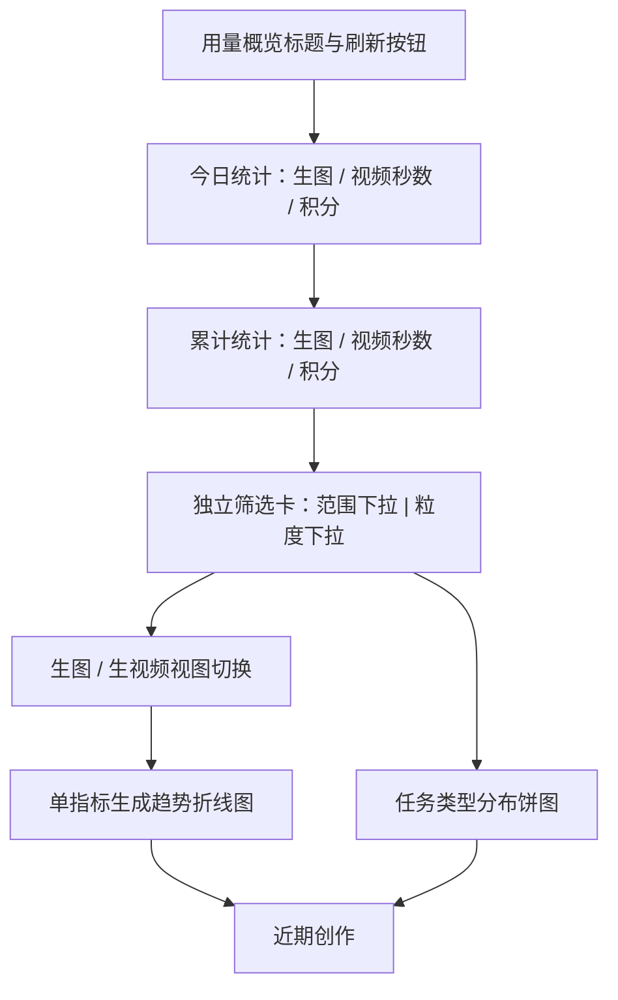

# 用户控制台统计重构 - Plan

## Goal Capsule

- **Objective:** 将普通用户控制台重做为分析优先首页，让用户快速了解今日与累计产出，并按有限时间范围查看生图、生视频趋势和任务类型分布。
- **Product authority:** 本文固定控制台的信息层级、统计口径、筛选行为、刷新行为、空状态和范围边界。
- **Open blockers:** 无产品范围阻塞项；查询结构、汇总策略和性能基准在实现规划阶段确定，但不得改变本文口径。

---

## Product Contract

### Summary

用户控制台将成为分析优先的用量概览页，顶部展示不受筛选影响的今日与累计统计，下方通过统一筛选卡控制生成趋势和任务类型分布。
现有价格趋势卡从控制台首页迁移到“账单与用量”的“用量”页签。

### Problem Frame

产品尚未上线，当前控制台首页主要承担余额、累计图片、开始创作、价格趋势和近期创作展示，尚未形成面向用户的历史产出概览。
价格趋势回答的是计价问题，不适合作为控制台首页的核心分析内容；用户更需要看到已经产出多少图片和视频，以及这些活动如何随时间变化。

### Key Decisions

- **分析优先首页。** (session-settled: user-directed — chosen over action-first and balanced-overview layouts: the dashboard should first answer how the account has been used.) 折线图是下方分析区域的主体，摘要数据位于其上方，近期创作位于辅助区域。
- **成功产物而非请求数。** (session-settled: user-approved — chosen over counting created or attempted requests: image outputs, video seconds, and consumed credits are more meaningful to ordinary users.) 请求数量不出现在今日、累计或趋势统计中。
- **图像和视频分视图展示。** (session-settled: user-approved — chosen over combining different units on one series: image count and video seconds are not directly comparable.) 折线图默认展示生图数量，并支持切换到生视频秒数。
- **积分不进入时间范围图表。** (session-settled: user-directed — chosen over an image/video plus credit-consumption dual trend: removing ledger correlation keeps the chart query bounded and avoids slow-query risk.) 积分只出现在顶部今日与累计摘要中。
- **筛选只控制下方图表。** (session-settled: user-directed — chosen over filtering the whole page: today and lifetime totals must remain stable context.) 时间范围同时作用于折线图和任务类型分布，粒度决定折线图的时间分桶与可选范围族。
- **小时与天使用不同范围族。** (session-settled: user-directed — chosen over one shared range list: each granularity needs useful defaults and bounded point counts.) 页面默认按小时与近 24 小时；切换按天后默认近 7 天。
- **刷新代替开始创作。** (session-settled: user-directed — chosen over a creation call to action: this page is an analytics surface.) 刷新重新加载全页统计并保留筛选状态，加载期间图标旋转且按钮不可重复触发。
- **价格趋势迁入用量页签。** (session-settled: user-directed — chosen over keeping pricing on the dashboard: pricing belongs with billing and usage information.) 卡片功能暂时保持完整，不在本次重设计其内容。

### Actors

- A1. **已登录普通用户：** 查看本人统计、调整图表范围、切换生图或生视频视图、手动刷新数据，并访问近期创作。
- A2. **FluxMedia 统计能力：** 按当前用户、应用时区和已确认口径返回摘要与图表数据，拒绝越界范围。

### Requirements

**首页结构与摘要**

- R1. 控制台首页必须采用分析优先布局，依次呈现页面标题与刷新按钮、今日统计、累计统计、独立筛选卡、生成趋势、任务类型分布和近期创作。
- R2. 今日统计必须在同一行展示“今日生图数量”“今日生视频秒数”“今日消耗积分”三项，并按应用时区的当前自然日计算。
- R3. 累计统计必须在同一行展示“累计生图数量”“累计生视频秒数”“累计消耗积分”三项，并覆盖账户创建以来的完整历史。
- R4. 今日与累计统计不得随下方时间范围、粒度或生图/生视频视图变化。
- R5. 当前无数据时，六项摘要必须显示数值 0，不得隐藏统计区域。

**产出与积分口径**

- R6. 生图数量必须只统计成功完成的可计费图片产物数量，一次生成操作产生多张成品图时按实际成品图数量累计。
- R7. 生视频秒数必须只统计成功完成的视频产物时长，并以秒为单位累计。
- R8. 今日生图、今日生视频和下方图表必须按生成操作的创建时间归属到应用时区对应的自然日、小时或日期。
- R9. 今日消耗积分必须统计今日创建的计费操作最终产生的非负净消耗，退款应修正原计费操作而不是在退款发生时形成负数。
- R10. 累计消耗积分必须反映账户完整历史的总扣费减总退款，结果不得小于 0。
- R11. 积分统计必须以积分账本为财务真相，且不得因读取展示记录而改变财务口径。

**筛选卡与范围规则**

- R12. 筛选器必须作为独立整行卡片呈现，左侧为范围下拉，右侧为粒度下拉，并保持参考 UI 的单层白色卡片、圆角、轻阴影和标签同行结构。
- R13. 页面首次加载必须默认选择“按小时”和“近 24 小时”。
- R14. 按小时粒度必须提供“近 24 小时”“近 48 小时”和“自定义”范围，其中自定义允许选择开始与结束日期时间。
- R15. 按小时自定义范围不得超过连续 7 天，超出时必须阻止查询并给出可理解的范围提示。
- R16. 按天粒度必须提供“近 7 天”“本月”“本季度”“本年”和“自定义”范围，其中自定义允许选择开始与结束日期。
- R17. 按天自定义范围不得超过连续 366 个自然日，超出时必须阻止查询并给出可理解的范围提示。
- R18. 从按小时切换到按天时必须重置为“近 7 天”，从按天切换到按小时时必须重置为“近 24 小时”。
- R19. “近 24 小时”和“近 48 小时”必须是截至查询时刻的滚动时间窗；“近 7 天”必须包含应用时区的今天及之前 6 个自然日。
- R20. “本月”“本季度”和“本年”必须从应用时区对应当前日历周期的起点统计至查询时刻。
- R21. 自定义小时范围必须按所选开始与结束时刻查询，自定义天范围必须覆盖所选日期的完整应用时区自然日。

**折线图与任务类型分布**

- R22. 折线图必须支持“生图”和“生视频”两个互斥视图，默认选择“生图”。
- R23. 生图视图必须按所选粒度展示成功图片产物数量，生视频视图必须按所选粒度展示成功视频秒数。
- R24. 折线图不得展示积分消耗曲线，且绘图区必须横向充分利用卡片宽度，仅保留坐标与标签所需边距。
- R25. 所选范围内没有活动的时间桶必须以 0 呈现，使趋势轴连续而不是省略空桶。
- R26. 任务类型分布必须使用尺寸清晰的饼图展示所选范围内成功生图任务与成功生视频任务的占比，并按生成操作创建时间归属。
- R27. 范围下拉必须同时控制折线图和任务类型分布；粒度必须控制折线图分桶以及可用范围族，饼图使用同一最终时间范围。
- R28. 图表无数据时必须保留卡片和当前筛选上下文，并显示明确的无数据状态，不得用空白区域代替。

**刷新、迁移与适配**

- R29. 页面标题区域必须使用带循环箭头图标的“刷新”按钮替代“开始创作”按钮。
- R30. 刷新必须重新加载今日统计、累计统计、折线图、任务类型分布和近期创作，同时保留当前粒度、范围和生图/生视频选择。
- R31. 刷新进行期间循环箭头必须持续旋转，按钮必须禁用；成功或失败结束后必须停止旋转并恢复可用状态。
- R32. 刷新失败时必须保留用户当前筛选状态并提供可理解的失败反馈，不得把已有数据静默替换为 0。
- R33. 现有价格趋势卡必须从控制台首页完整迁移到“账单与用量”的“用量”页签，并保留当前展示能力。
- R34. 近期创作必须保留在控制台首页，并在无历史数据时呈现明确空状态。
- R35. 页面必须在常见桌面与移动宽度下保持可读；桌面摘要每组一行三项，窄屏可换行但不得改变指标顺序或含义。

**查询边界与接口约束**

- R36. 下方图表查询必须只处理当前用户在已验证时间范围内的生成记录，不得执行无界历史扫描。
- R37. 累计统计必须采用可支持重度用户的有界或汇总读取方式，不得在每次页面刷新时依赖扫描用户全部明细历史。
- R38. 新增统计查询能力必须先作为统一接口层 operation 暴露，再由控制台页面通过薄适配调用；权限、输入校验和错误映射由统一网关处理。
- R39. 统计查询必须只返回当前登录用户的数据，并在服务端验证粒度、范围类型、时间边界和最长跨度。

### Layout Map

### Key Flows

- F1. **首次查看控制台**
  - **Trigger:** A1 打开控制台首页。
  - **Actors:** A1、A2。
  - **Steps:** 页面加载今日与累计摘要；筛选初始化为按小时和近 24 小时；下方默认展示生图趋势与同一范围的任务类型分布；近期创作正常展示或进入空状态。
  - **Outcome:** 用户无需操作即可看到当前自然日、完整历史和最近 24 小时活动。
  - **Covered by:** R1-R13、R22-R28、R34。
- F2. **切换粒度与范围**
  - **Trigger:** A1 修改粒度或范围。
  - **Actors:** A1、A2。
  - **Steps:** 粒度切换时应用对应默认范围；自定义范围通过服务端边界校验；仅折线图和饼图使用新范围重新加载。
  - **Outcome:** 顶部摘要保持不变，下方两个图表保持同一时间范围。
  - **Covered by:** R4、R12-R28、R36、R39。
- F3. **切换生成类型**
  - **Trigger:** A1 在折线图中切换“生图”或“生视频”。
  - **Actors:** A1、A2。
  - **Steps:** 保留范围与粒度；折线图在图片数量和视频秒数之间切换；饼图继续使用相同范围。
  - **Outcome:** 图表单位清晰，不把图片数量与视频秒数绘制在同一序列中。
  - **Covered by:** R22-R27。
- F4. **手动刷新**
  - **Trigger:** A1 点击刷新按钮。
  - **Actors:** A1、A2。
  - **Steps:** 按钮进入禁用与旋转状态；全页数据重新请求；保留范围、粒度和生成类型选择；完成后恢复按钮，失败时给出反馈并保留已有数据。
  - **Outcome:** 用户明确知道刷新正在进行，且不会重复触发或丢失上下文。
  - **Covered by:** R29-R32。

### Acceptance Examples

- AE1. **Covers R2-R5, R8-R10.** 给定应用时区为 Asia/Shanghai 且用户今日没有成功产物或净积分消耗，当用户打开控制台时，今日三项均显示 0，累计三项仍显示完整历史值。
- AE2. **Covers R6-R8, R23, R25.** 给定一条今日创建并完成的生图操作产出 4 张可计费成品图，当按小时查看近 24 小时时，对应创建小时增加 4，其余无活动小时仍显示 0。
- AE3. **Covers R7-R8, R22-R23.** 给定一条昨日创建、今日完成的 5 秒视频，当用户切换到按天生视频视图时，该 5 秒归入昨日而不是今日。
- AE4. **Covers R9-R11.** 给定今日创建的计费操作扣除 100 积分后退款 100，当摘要刷新时，今日消耗积分为 0，且任何展示值都不会成为负数。
- AE5. **Covers R13-R18.** 给定页面当前为按小时近 48 小时，当用户切换到按天时，范围自动变为近 7 天；切回按小时时，范围自动变为近 24 小时。
- AE6. **Covers R15, R17, R39.** 给定用户提交超过 7 天的小时范围或超过 366 个自然日的天范围，系统拒绝查询并提示缩短范围，顶部摘要和已有图表数据不被清空。
- AE7. **Covers R24-R28.** 给定所选范围内没有成功任务，折线图显示连续 0 值或明确空状态，饼图显示无数据状态，筛选卡仍可操作。
- AE8. **Covers R29-R32.** 给定用户点击刷新，按钮图标立即旋转且按钮禁用；请求结束后恢复，当前筛选和生成类型选择保持不变。
- AE9. **Covers R33.** 给定用户访问控制台首页，页面不再出现价格趋势卡；访问“账单与用量”的“用量”页签时仍能看到完整价格趋势卡。

### Success Criteria

- 用户可以在一次页面浏览中区分今日、累计和所选时间范围三种统计上下文。
- 所有图像数量、视频秒数和积分消耗与已确认口径一致，退款不会产生负数展示。
- 小时查询最多产生 168 个时间桶，天查询最多产生 366 个时间桶。
- 重度用户的默认、最大自定义和累计读取均通过代表性数据量的查询计划与性能基准，不出现无界明细扫描或逐任务查询。
- 空数据、加载、刷新失败和窄屏布局均保持筛选上下文与指标含义清晰。

### Scope Boundaries

- 不展示今日或累计请求数量。
- 不展示积分消耗折线、退款曲线或按时间范围过滤的积分图表。
- 不提供超过 7 天的小时粒度或超过 1 年的天粒度。
- 不提供“全部历史”图表范围。
- 不在本次重设计价格趋势卡内容，只迁移其位置。
- 不重做控制台侧边栏、账单页的账单功能或近期创作详情交互。

### Dependencies / Assumptions

- 应用时区是自然日、日历周期和图表分桶的唯一时间边界。
- 图片数量以成功生成记录中的可计费成品图数量为准；历史记录缺少该数量时，可按已有单产物事实回退。
- 视频秒数以成功视频生成记录记录的时长为准。
- 积分账本是消费与退款的财务真相，生成记录中的积分字段不能替代账本对账。
- 现有用户与创建时间索引支持有限时间范围的生成记录查询；累计统计仍需规划适合重度用户的读取策略。
- 产品尚未上线，首版先以统计正确、交互清晰和查询可控作为成功信号，上线后再依据真实使用数据评估进一步指标。

### Outstanding Questions

**Deferred to Planning**

- 累计统计采用按用户汇总、增量聚合还是其他可重建读取方式，需结合一致性与性能基准确定。
- 今日非负净积分如何以可索引方式关联扣费、退款与原计费操作，需在不扫描 JSON 的前提下确定。
- 刷新与筛选查询的缓存、并发去重和失效策略需在不破坏手动刷新语义的前提下确定。

### Sources / Research

- `apps/web/src/app/[locale]/(dashboard)/dashboard/page.tsx`：当前控制台首页结构与价格趋势专属数据加载。
- `apps/web/src/app/[locale]/(dashboard)/dashboard/billing/page.tsx`：现有“账单”和“用量”页签结构。
- `packages/database/src/schema.ts`：图片、视频、积分账本字段及用户时间索引。
- `apps/web/src/app/[locale]/(dashboard)/dashboard/admin/status/page.tsx`：现有图片产物数量回退口径与相邻时间范围查询模式。
- `packages/database/drizzle/0035_generation_read_indexes.sql`：生成记录规模与索引背景。
- `packages/database/drizzle/0036_credits_transaction_user_created_at_idx.sql`：积分账本规模与用户时间索引背景。
- `docs/plan/2026-05-31-agent-integration-architecture.md`：统一接口层、权限与传输适配约束。
