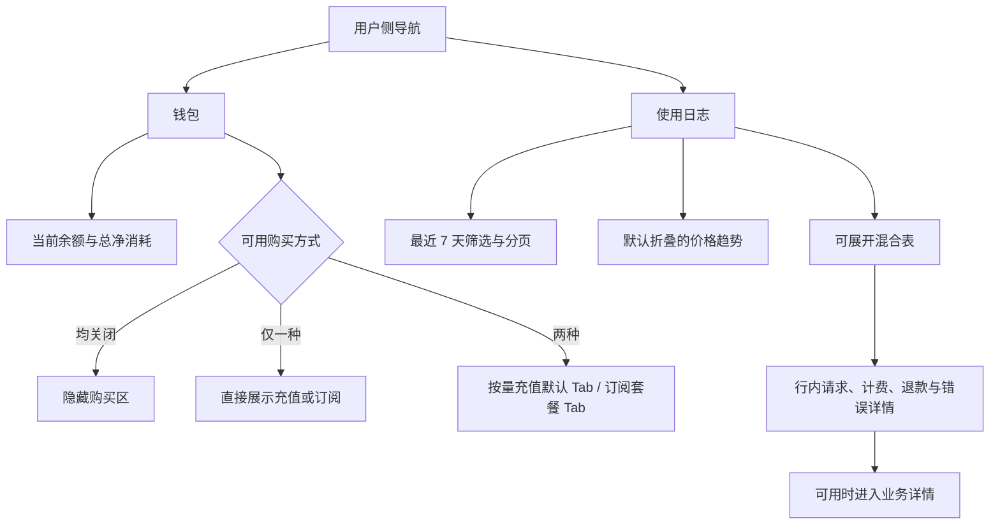
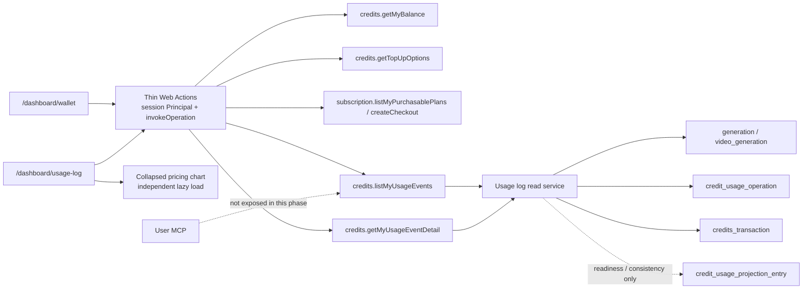

# 钱包与使用日志重构 - Plan

> 独立“使用日志”用户界面及其退款行、请求级活动表要求已被 `docs/plans/2026-07-22-002-feat-unified-history-records-plan.md` 取代；本文的钱包、支付兼容和保留在 UOL 的计费用量能力仍有效。
>
> **API 密钥治理替代说明（2026-07-23）：** 本文关于 `relayOnly` 排除、拒绝和不可见性的设计前提已被 `docs/plans/2026-07-23-001-feat-api-key-management-moderation-plan.md` 取代。所有 API 密钥请求现统一走普通持久化与使用记录路径；正文中的相关表述仅保留为历史决策背景，不得指导新实现。

## Goal Capsule

- **Objective:** 将用户侧的“账单与用量”拆为独立的“钱包”和“使用日志”菜单，集中展示资产与购买，并让用户按业务请求核对积分消耗、退款和任务结果。
- **Product authority:** 本文固定两个页面的职责边界、购买区条件展示、日志记录粒度、展开与跳转行为、价格趋势位置和成功信号。
- **Execution profile:** 6 个依赖有序的实现单元；先完成统一契约和读模型，再接钱包、日志 UI、兼容路由与发布验证。
- **Authority:** Product Contract 固定用户行为；Planning Contract 固定实现边界；代码现状仅作为迁移起点。发生冲突时先停下并回到本文修订，禁止以旧实现覆盖已确认行为。
- **Stop conditions:** `credit_usage` 读模型未就绪、查询无法证明 `relayOnly` 不可见、支付回归改变履约语义或高历史量查询未通过性能门槛时不得发布。
- **Open blockers:** 无；历史 API 孤立记录的隐私优先规则、筛选范围和 User MCP 边界已在规划确认中解决。

---

## Product Contract

### Summary

FluxMedia 将取消“账单与用量”合并页，改为独立的钱包页和使用日志页。钱包页只负责余额概览与充值/订阅购买，使用日志页负责按单次业务请求展示消耗、退款、状态和业务上下文。

### Problem Frame

当前账单与用量通过同一路由的页签承载不同任务，用户需要在资产、购买、交易记录和用量分析之间切换。交易记录以账本字段为主，不能清晰说明某次业务请求消耗了什么，也不能把退款与原请求建立可读关联。

现有按金额充值入口还独立于订阅购买入口，而结账、支付和订阅履约暂未发现需要改变的具体问题。把页面组织与支付流程同时重做会扩大范围和回归风险。

### Key Decisions

- **独立页面职责。** (session-settled: user-directed — chosen over keeping billing and usage as tabs: asset management and request-level usage answer different user questions.) 钱包和使用日志使用两个独立菜单入口。
- **钱包集中式布局。** (session-settled: user-directed — chosen over side-by-side purchase modules and a lightweight wallet landing page: the wallet should keep balance, purchase choice and purchase presentation together.) 钱包页采用集中式概览与购买区。
- **钱包不展示交易记录。** (session-settled: user-directed — chosen over enriching the old transaction table or keeping a combined ledger: the old transaction surface is replaced by the usage log.) 钱包页不展示消费、退款或充值流水列表。
- **购买区按能力条件展示。** (session-settled: user-directed — chosen over always showing unavailable purchase options: users should only see enabled purchase methods.) 充值和订阅均关闭时隐藏购买区；只启用一种时直接展示该内容；两者均启用时使用 Tab。
- **按量充值默认。** (session-settled: user-directed — chosen over account-adaptive and subscription-first defaults: pay-as-you-go is the first purchase option when both methods are enabled.) 两种方式同时可用时默认打开按量充值 Tab。
- **净消耗概览。** (session-settled: user-directed — chosen over gross spend and split totals: the overview should show effective historical spend after refunds.) “总消耗”按历史扣费减退款计算，展示值不得为负数。
- **使用日志按业务请求记录。** (session-settled: user-directed — chosen over ledger-event rows and aggregate-only views: users need both credit-spend auditing and activity tracking.) 每次来自 Web 或非 `relayOnly` API 的生图、生视频稳定逻辑业务操作占一条记录；API 仅作为来源渠道。业务退款另占一条并关联原请求。
- **退役链路不进入新设计。** (session-settled: user-directed — chosen over adding first-class usage-log support for paths scheduled for removal: Chat and Agent should not expand the new surface.) Chat（Codex/Web）和 Agent 链路后续废除，本计划不为其新增一等业务类型、详情入口或活跃链路；既有历史财务事实仅通过无跳转的历史兜底展示。
- **可展开混合表。** (session-settled: user-directed — chosen over an audit-only table and an activity timeline: the default list should support batch reconciliation while expansion provides context.) 使用日志采用可展开混合表；价格趋势位于该页并默认折叠。
- **购买呈现与支付履约分离。** (session-settled: user-directed — chosen over deferring the purchase surface and changing the payment flow: the wallet should improve discovery while the existing checkout remains stable.) 钱包重做充值/订阅展示，但复用现有结账与支付流程。

<!-- ce-section: work-relationships -->
### How This Work Fits Together

本计划拥有钱包与使用日志的用户侧信息架构和交互范围。它与用户控制台统计重构共享价格趋势能力，并将价格趋势的用户入口从旧的合并页签移动到使用日志页；控制台统计指标与图表口径仍由原计划负责。

- **Shares:** 使用日志与现有积分账本、计费用量投影共享消费与退款事实。
- **Supersedes:** 原“账单与用量”合并页的用户入口和交易记录呈现。
- **Resolved by planning:** 生图、生视频按业务类型展示，外部 API 作为来源渠道；未知及待退役类型使用无跳转历史兜底。具体映射见 KTD4。

### Layout Map



### Actors

- A1. **已登录普通用户：** 查看余额和净消耗，选择充值或订阅，筛选使用日志，展开记录并在可用时进入业务详情。
- A2. **FluxMedia 计费与业务记录能力：** 返回当前用户的余额、净消耗、业务请求日志、退款关联、状态和可展示的错误说明。

### Requirements

**页面与钱包概览**

- R1. 用户侧导航必须提供独立的“钱包”和“使用日志”入口，不再通过“账单与用量”页签承载两类内容。
- R2. 钱包页必须展示当前可用余额和历史总净消耗。
- R3. 总净消耗必须以积分账本中的扣费减退款为口径，退款不得使展示值低于 0。
- R4. 钱包页不得展示消费、退款或充值交易记录列表。
- R5. 钱包页不得展示价格趋势；价格趋势只出现在使用日志页。

**购买区条件与呈现**

- R6. 当充值和订阅均关闭时，钱包页不得展示购买区、空购买卡片或不可用按钮。
- R7. 当仅启用充值或仅启用订阅时，钱包页必须直接展示唯一可用内容，不得增加无意义的 Tab 层级。
- R8. 当充值和订阅同时启用时，钱包页必须以 Tab 展示“按量充值”和“订阅套餐”，并默认打开按量充值。
- R9. 按量充值内容必须提供预设快捷金额、金额输入和支付按钮，点击支付后沿用现有按金额充值结账流程。
- R10. 订阅内容必须按可购买套餐逐张展示，并沿用现有套餐可见性、资格校验和结账流程。
- R11. 购买区的页面重排不得改变现有支付、订阅履约、幂等和回调处理语义。

**使用日志列表**

- R12. 使用日志必须作为独立页面展示用户的业务请求历史。
- R13. 每次来自 Web 或非 `relayOnly` API 的生图、生视频逻辑业务操作必须形成一条日志记录；API 只作为来源渠道，不作为与生图、生视频并列的业务类型。记录单位必须是已经持久化稳定 `operationType + operationId` 或权威任务 ID 的业务操作，同一操作的客户端重试、补扣或内部子阶段不得重复形成请求行，创建并持久化稳定业务事实前发生的鉴权或参数校验失败不得进入使用日志。
- R14. 业务退款必须按退款发生时间单独形成一条日志记录，并关联可识别的原业务请求；退款行的业务类型和状态均固定为“退款”，退款不得在钱包页另行展示。
- R15. 默认折叠的列表行必须展示时间、业务类型、业务摘要、状态和积分变化；退款行必须以原请求的可识别信息生成摘要，并展示正向积分变化。
- R16. 列表必须支持最近 7 天、30 天、90 天的时间范围，以及业务类型和状态筛选，并提供稳定的分页控件；时间筛选只作用于使用日志表格，不改变钱包或价格趋势，用户必须能够通过业务类型“退款”或状态“退款”筛出退款行。
- R17. 使用日志首次打开必须显示应用时区的今天及前 6 个自然日记录，按事件时间从新到旧排序，每页显示 20 条。
- R18. 列表必须支持展开单条记录。请求行展开后至少提供请求 ID、来源渠道、模型或接口、实际用量、原始扣费、关联退款合计、净消耗、创建与完成时间以及可展示的业务入口，其中净消耗等于 `max(0, 原始扣费 - 关联退款合计)`。退款行展开后至少提供退款 ID、原请求可识别标识、退款积分、创建时间以及可用时的原请求入口，不得用空值占位展示不适用的模型、用量或净消耗字段。
- R19. 左侧展开控制只负责行内详情；业务名称或明确的业务详情入口负责跳转，避免整行点击造成误导航。
- R20. 当原业务存在可访问的详情时，日志必须提供进入该详情的入口；没有详情页时仍必须展示日志详情，不得出现失效链接。
- R21. 生图或生视频失败时，展开详情必须展示简洁、面向用户的错误说明；错误说明不得暴露原始第三方错误、密钥、完整提示词或内部 metadata。
- R22. 使用日志必须保留成功、失败和退款状态，并使积分变化方向清晰可辨；请求行的积分变化表示该请求自身的负向扣费，退款行表示该次退款的正向变化。

**价格趋势与页面状态**

- R23. 价格趋势卡必须位于使用日志页，并默认折叠；展开后保留现有价格趋势内容，不在本次重做图表口径。
- R24. 钱包和使用日志必须分别提供加载、空数据和失败状态；失败时不得静默把已有余额或日志替换为 0。
- R25. 使用日志的筛选、展开和分页操作必须保留当前用户的时间范围、类型和状态上下文。

**查询与可追溯性**

- R26. 使用日志列表查询必须限定当前用户，并采用有界分页，不得执行无界历史扫描。
- R27. 列表加载不得为每一行逐条探测业务详情；业务详情必须在用户展开或跳转时按需加载。
- R28. 日志必须通过稳定业务操作标识把业务请求、扣费和独立退款关联起来，且不依赖解析幂等键猜测业务身份。能够证明为非 `relayOnly` 的历史退款或账本事件无法关联原请求时仍必须显示，并明确标记为“未关联历史记录”；无法证明为非 `relayOnly` 的历史 API 孤立记录必须按 R30 隐藏，不得伪造业务身份和跳转入口。
- R29. 新增页面能力必须沿用项目统一接口层、权限校验和当前用户数据隔离约束。

**迁移、隐私与可访问性**

- R30. `relayOnly` 纯中转 API 请求不得新增使用日志、业务详情、持久化事件或可关联的用户活动记录；该路径仅保留既有扣费、内容审核和额度计数语义。
- R31. Chat（Codex/Web）与 Agent 链路不得作为新使用日志的一等业务类型或新增详情入口；后续链路下线另行实施，既有历史财务事实仅按 R28 的无跳转历史兜底展示。
- R32. 旧 `/dashboard/billing` 与 `tab=billing` 入口必须迁移到钱包，`tab=usage` 入口必须迁移到使用日志；支付完成回跳必须进入钱包并保留 `pay` 等结果上下文，不得因拆页打断既有购买闭环。
- R33. 钱包和使用日志的 Tab、筛选、分页、展开控制及业务详情入口必须支持完整键盘操作，具有可感知名称与清晰焦点状态；动态加载、失败、筛选结果和展开状态必须向辅助技术传达。

### Key Flows

- F1. **打开钱包**
  - **Trigger:** A1 从导航进入钱包。
  - **Actors:** A1、A2。
  - **Steps:** 页面加载当前余额与历史总净消耗；根据充值和订阅开关决定购买区状态；两者均启用时默认选中按量充值。
  - **Outcome:** A1 在一次浏览中理解资产状态，并能进入可用的购买路径。
  - **Covered by:** R1-R11、R24、R32-R33。
- F2. **切换购买方式**
  - **Trigger:** A1 在两种方式均启用时切换 Tab。
  - **Actors:** A1、A2。
  - **Steps:** 页面切换充值快捷金额/输入与套餐卡；提交后复用现有支付或订阅结账；购买区不承担支付履约状态机。
  - **Outcome:** A1 能比较并发起购买，既有结账行为保持不变。
  - **Covered by:** R8-R11、R33。
- F3. **核对一次使用**
  - **Trigger:** A1 打开使用日志并筛选记录。
  - **Actors:** A1、A2。
  - **Steps:** 页面返回有界日志列表；A1 查看默认字段；点击展开控制查看详细计费和业务信息；需要时从明确入口进入业务详情。
  - **Outcome:** A1 能同时核对积分去向和业务活动，不需要回到账本表猜测来源。
  - **Covered by:** R12-R20、R25-R33。
- F4. **查看失败与退款**
  - **Trigger:** A1 展开失败请求或其关联退款记录。
  - **Actors:** A1、A2。
  - **Steps:** 系统展示简易失败说明；退款作为独立记录展示并指向原请求；原请求和退款的积分变化均可辨识。
  - **Outcome:** A1 能理解失败结果和余额返还关系，且不接触敏感上游信息。
  - **Covered by:** R14、R18-R22、R28、R33。

### Acceptance Examples

- AE1. **Covers R6-R8.** Given 充值和订阅均关闭、仅启用充值、仅启用订阅以及两者均启用四种配置，when A1 打开钱包，then 分别看到无购买区、充值直出、订阅直出和默认按量充值 Tab，页面不显示不可用购买入口。
- AE2. **Covers R2-R4.** Given 用户有扣费 100、退款 30 和当前余额 500，when A1 打开钱包，then 显示当前余额 500、总净消耗 70，且钱包没有交易记录列表。
- AE3. **Covers R9-R11.** Given 两种购买方式均启用，when A1 切换充值或订阅并提交购买，then 页面使用对应的快捷金额/套餐卡，支付跳转和履约结果仍遵循现有流程。
- AE4. **Covers R13-R16、R30-R31.** Given 用户有生图、生视频、非 `relayOnly` API、`relayOnly` API 以及待退役的 Chat/Agent 请求，when A1 按类型和 7/30/90 天范围筛选，then 已持久化的生图和生视频操作各占一条记录，API 来源作为渠道展示且同一操作的重试不重复成行，`relayOnly` 请求不产生持久化日志，Chat/Agent 不新增一等类型或可用详情入口。
- AE5. **Covers R14、R18-R22、R28.** Given 一次生图扣费 40 后业务退款 20，when A1 查看使用日志，then 原请求行显示 -40、展开详情显示原始扣费 40、关联退款 20 和净消耗 20，退款独立显示 +20 且可通过业务类型或状态“退款”筛出，二者可互相定位，钱包不出现退款行。
- AE6. **Covers R19-R21.** Given 一次生图失败且不存在可进入的业务详情页，when A1 展开该行，then 看到简易错误说明和日志详情，点击整行不会误导航，也不会显示原始第三方错误。
- AE7. **Covers R17、R23-R25.** Given A1 首次打开使用日志，when 页面加载完成，then 列表显示最近 7 天的最新 20 条记录且价格趋势卡默认折叠，筛选、展开和分页失败时保留当前上下文并显示可理解的状态反馈。
- AE8. **Covers R26-R31.** Given 用户有大量历史请求、部分普通历史退款无法关联原请求且部分历史 API 孤立记录无法判定是否为 `relayOnly`，when A1 加载或翻页使用日志，then 查询只读取当前用户的有限范围，列表加载不逐条探测业务详情，普通未关联退款以无跳转的“未关联历史记录”展示，隐私属性不明的 API 孤立记录不出现在响应中。
- AE9. **Covers R32.** Given A1 访问旧 `/dashboard/billing`、旧账单/用量 Tab 或完成支付回跳，when 路由处理请求，then 账单入口进入钱包、用量入口进入使用日志，支付回跳进入钱包并保留支付结果上下文。
- AE10. **Covers R33.** Given A1 只使用键盘或辅助技术，when 操作购买 Tab、日志筛选、分页、展开和详情入口，then 所有操作均可完成，焦点清晰，加载、失败、结果变化和展开状态可被感知。

### Success Criteria

- 用户能够明确区分钱包中的资产与购买任务，以及使用日志中的业务活动与积分变化。
- 用户无需查看账本字段即可回答“哪次业务消耗了多少积分、是否退款、结果如何”。
- 充值和订阅的可见性与运行时开关一致，支付与订阅履约回归不受页面重排影响。
- 单用户 100,000 个请求事件和 25,000 个退款事件的 90 天基准数据上，首屏与深游标列表查询的预热 p95 不超过 250ms，详情查询 p95 不超过 120ms；执行计划不得对核心历史表执行无界顺序扫描或逐行详情查询。
- 生图/生视频失败、退款、无数据和详情缺失场景均有清晰且不泄露敏感信息的反馈。

### Scope Boundaries

- 钱包不提供交易、订单、消费或退款历史列表。
- 本次不重构充值支付、订阅结账、支付回调、履约、幂等或退款业务逻辑。
- Chat（Codex/Web）和 Agent 链路的实际下线属于后续独立工作；本计划只确保新使用日志不扩展这些待退役链路。
- `relayOnly` 纯中转 API 继续遵守不新增业务日志或用户活动持久化记录的隐私边界。
- 本次不展示完整提示词、生成内容、原始第三方错误、内部 metadata 或敏感凭据。
- 价格趋势只迁移到使用日志并默认折叠，不重做其图表口径和内容。
- 本次不增加日志导出、复杂聚合报表、按天趋势分析或新的计费产品。

### Dependencies / Assumptions

- 充值和订阅的可用状态能够从现有运行时配置可靠读取，并且页面展示状态与结账资格保持一致。
- 积分账本是余额、扣费和退款的财务真相；计费用量投影用于把业务操作与账本变化关联。
- 应用时区是 7/30/90 天自然日范围、日志事件时间和页面日期文案的统一时间边界。
- 现有余额读取路径需要补齐总净消耗的退款口径或等价读取能力；当前用户余额 Action 尚未直接返回累计退款字段。
- 生图使用图片数量、生视频使用视频秒数；API 是来源渠道而非与生图、生视频竞争的重复业务类型。未知或待退役历史类型使用无跳转日志详情兜底。
- 现有价格趋势卡可以保持内容不变，仅改变其所在的用户页面和默认折叠状态。

### Planning Resolutions

- 请求行由权威图片/视频任务与计费用量投影共同构造；退款行由积分账本驱动。两类事件在数据库中有界合并并使用快照化 keyset cursor。
- 钱包扩展本人余额 operation 返回累计毛消耗、累计退款和非负净消耗；不从 generation 行重算财务数据。
- 充值复用现有按金额 UOL 与结账组件；订阅新增本人可购买套餐读取 operation。订阅结账 Action 的名称和客户端提交行为保持不变，内部实现按 U3 改为调用 UOL 的薄适配器。
- 当前没有稳定单任务详情路由的业务只提供行内详情；不得为满足跳转文案伪造链接。

### Sources / Research

- `apps/web/src/app/[locale]/(dashboard)/dashboard/billing/page.tsx`：当前账单/用量合并页和价格趋势位置。
- `apps/web/src/app/[locale]/(dashboard)/dashboard/billing/billing-tabs-nav.tsx`：当前 URL 驱动页签导航。
- `apps/web/src/app/[locale]/(dashboard)/dashboard/credits/buy/buy-credits-view.tsx`：现有充值与订阅购买展示、快捷金额和结账入口。
- `packages/shared/src/credits/top-up.ts`：按金额充值配置与可用性。
- `packages/shared/src/credits/packages.ts`：运行时积分包和套餐可见性。
- `packages/shared/src/config/payment-runtime.ts`：订阅价格运行时开关。
- `packages/shared/src/uol/operations/credits.ts`：当前余额、批次和交易查询 operation。
- `packages/database/src/schema.ts`：余额、账本交易、计费用量投影和用户时间索引。
- `packages/shared/src/credits/usage-read-model.ts`：计费操作与退款关联的读模型规则。
- `docs/plans/2026-07-21-001-feat-user-dashboard-analytics-plan.md`：价格趋势和用户统计的既有产品口径。

---

## Planning Contract

### Product Contract preservation

规划保留 Product Contract 的页面职责、购买区条件、请求级日志、退款独立成行、支付复用、待退役链路和无障碍要求。根据 2026-07-22 的写计划前确认，仅有以下产品级收窄：

- 时间筛选仅作用于使用日志表格，首期提供 7、30、90 天，不影响钱包或价格趋势。
- 生图和生视频是业务类型，API 是来源渠道；同一外部 API 生图或生视频不会重复成两行。
- `relayOnly` 隐私优先于孤立财务记录完整性。无法证明为非 `relayOnly` 的历史 API 孤立记录不进入日志。
- UOL 是 Web 的统一接口层，但本期新增钱包和日志读取能力不授权给 User MCP。

这些变更已同步写入 R13、R16、R28、AE4 与 AE8；其余 Product Contract unchanged。

### Key Technical Decisions

#### KTD1. 新路由固定为钱包与使用日志

- 钱包使用 `/dashboard/wallet`，使用日志使用 `/dashboard/usage-log`。
- `/dashboard/billing` 保留为兼容重定向：`tab=usage` 去使用日志，其余值去钱包。
- 旧 billing URL 带合法 `pay` 或 `purchase` 购买上下文时优先进入钱包并保留白名单上下文；只有不带购买上下文时才根据 `tab` 选择钱包或使用日志。
- `/dashboard/credits/buy` 重定向到 `/dashboard/wallet?purchase=top-up`；支付订单结果页继续独立存在。
- 旧入口只做路由迁移，不保留合并页或隐藏 Tab 实现。

#### KTD2. 本人财务和活动读取必须经过 session-only UOL

- 扩展 `credits.getMyBalance` 输出 `balance`、`totalSpent`、`totalRefunded`、`totalNetSpent`、`status` 和 `asOf`。它继续执行注册奖励与过期批次维护，因此保持 `readOnly: false`、`hasMaintenanceWrite: true`、`sideEffects: ["billing"]`。
- 新增 `credits.listMyUsageEvents` 与 `credits.getMyUsageEventDetail`。两者使用 `access: { kind: "user" }`、`readOnly: true`、自然幂等且无副作用。
- 新增 `subscription.listMyPurchasablePlans`，返回当前会话用户可结账的套餐与资格，不创建新的结账状态机。
- 补齐既有 `subscription.createCheckout` 的 app-level 绑定，并把它收窄为 `user` Principal。其输出使用 redirect/POST form 联合类型表达 Creem 与 Epay 现有提交方式，Web Action 只负责调用 `invokeOperation`。
- 以上本人操作均不接受 `userId`，只从 `Principal` 取身份。详情不存在或不属于本人时统一返回不可区分的 `not_found`。
- 新操作不加入 `packages/shared/src/mcp/user-tool-factory.ts` 的白名单。站内未来 Agent 可进程内复用 UOL，但外部 User MCP 需另做隐私授权评审。

#### KTD3. 业务任务是请求行权威事实，账本是金额与退款权威事实

- 图片请求从 `generation` 读取，视频请求从 `video_generation` 读取；这两张表决定请求是否存在、状态、模型、用量和完成时间。
- `credit_usage_operation` 只补充请求的毛扣费、累计退款和净消耗，不作为全部活动的唯一来源。零扣费但已有权威任务行的一等 image/video 请求仍可展示。
- `credits_transaction` 是退款事件全集，也是每笔交易金额、发生时间和直接 operation 归属的权威来源；每笔 `type=refund` 以自己的 `created_at` 独立成行，并用账本自身的 `operationType + operationId` 关联请求。
- `credit_usage_projection_entry` 是 consumption/refund 账本贡献的幂等投影与对账证据，不作为 UI 关联的第二权威来源。不得根据 `netConsumed` 差额虚构退款事件，也不得解析 `sourceRef` 猜测身份。
- `user_output_usage_event` 可补充成功图片数量或视频秒数，但不得替代权威任务状态。

#### KTD4. 业务类型、来源渠道和状态使用单一映射注册表

共享纯函数把数据库事实规范化为稳定机器值，页面只负责本地化：

| 数据事实 | `businessType` | `sourceChannel` | 状态映射 | 实际用量 |
|---|---|---|---|---|
| `image_generation`，模式为 generate/edit | `image` | `web` 或 `api` | pending → processing；completed → succeeded；failed → failed | 图片张数 |
| `video_generation` | `video` | `web` 或 `api` | pending/running → processing；completed → succeeded；failed → failed | 视频秒数 |
| 退款交易 | `refund` | 继承可识别原请求，否则 unknown | refund | 退款积分 |
| Chat、Agent、waterfall、editable-file 或未知历史 operation | `historical` | 可识别时保留，不能识别则 unknown | 可识别状态或 unknown | 仅安全财务字段 |

首期一等业务类型只有 `image`、`video` 和 `refund`；API 只作为来源渠道，其他可安全展示的财务事实统一为 `historical`。Chat/Agent 等待退役任务只有存在对应财务事实时才可形成无跳转 historical 行，零扣费任务不进入日志。一个 operation 只能命中一条映射规则。唯一分类规则位于 shared；Web 只能把数据库行适配为共享映射输入，不得复制业务分类。`sourceChannel=api` 通过权威任务字段或同 operation 的消费交易 metadata 批量解析；未来非 `relayOnly` 图片写入同时把 `externalApiKeyId` 写入已有 generation metadata，以覆盖零扣费的正常生图请求。不得把 API key 名称、完整 operationType 或 metadata 直接当用户文案。

#### KTD5. `relayOnly` 在服务端数据源层 fail closed

- 图片 `relayOnly` 路径当前不写 `generation`，因此不会进入图片请求分支。
- 现有视频 handler 会忽略 `relayOnly` 并持久化 `video_generation`；异步视频无法在不保存任务状态的前提下完成真正纯中转，因此 U2 必须先在创建视频任务前拒绝 `relayOnly`，返回稳定能力错误。该边界未封闭前不得开放使用日志。
- U2 为新增非中转图片/视频任务写入不可变的用户活动可见性证据；历史图片可由“relay 路径从不写 generation”的现有不变量证明，历史 API 视频只有带不可变非 relay 标记时才显示。API key 当前开关、API key 是否仍存在和“没有 API 证据”都不能回推历史隐私属性。
- 财务兜底分支只有命中明确站内 operation allowlist 或关联到可证明非 relay 的任务时才显示；其余孤立 operation 一律排除。
- 退款分支使用原 operation 的消费贡献判断 API 证据；同样无法证明为非 `relayOnly` 时排除。
- 可由明确站内 operation 证明的普通历史退款仍显示为 `historical`/“未关联历史记录”；“无 API 证据”本身不是站内证明。
- relay 排除发生在各 SQL 分支排序和 `limit + 1` 之前；列表、详情、页长、`nextCursor`、筛选结果和日志不得透露被排除记录是否存在。

#### KTD6. 列表使用快照化混合 keyset cursor

- 服务端按用户时区把 `7d | 30d | 90d` 转换为 `[开始日 00:00, 次日 00:00)` 半开区间，覆盖 DST 的 23/25 小时自然日。
- 请求事件使用任务/operation 创建时间，退款事件使用交易发生时间。每行按自己的 `eventAt` 进入范围；原请求不在范围内不妨碍范围内退款出现。
- 图片、视频、historical 和退款各分支先应用用户、时间、类型/状态、`asOf` 与 keyset 谓词，按本分支可索引顺序最多读取 `limit + 1`；随后再以 `UNION ALL`/等价归并统一按 `(eventAt DESC, eventKindRank DESC, stableId DESC)` 取最终页面，避免先扫描或排序完整时间窗口。Web 页面固定每页 20 条；UOL 默认值为 20，并以 50 作为防御性上限。
- cursor 是版本化、带域分离 HMAC 的 base64url 载荷，包含主体绑定、`asOf`、最后排序键和筛选指纹，复用 `BETTER_AUTH_SECRET` 且不引入新密钥。跨用户/筛选复用、签名或载荷损坏、旧版本 cursor 返回 `validation_error`，不回退到不受限首页。
- 解析先执行长度和 base64url 格式上限，再验证精确 schema、HMAC/主体、筛选指纹、`asOf` 不晚于首次服务端快照及排序键边界。所有值通过 Drizzle 参数绑定进入 SQL，禁止拼接 `sql.raw`；cursor/eventRef 不进入错误消息、日志或监控标签。
- 首次查询固定 `asOf`；后续页排除 `eventAt > asOf` 的新事件，保证不可变事件身份的稳定排序并隔离翻页后产生的新退款。请求状态是可变事实，状态筛选按每次读取时的当前值计算，不宣称完整成员快照；刷新会开启新分页会话。返回 `nextCursor`，不执行昂贵总数查询。

#### KTD7. 列表摘要与展开详情分离

- `credits.listMyUsageEvents` 只返回事件引用、时间、业务类型、来源渠道、安全摘要、状态、积分方向和下一页 cursor。
- `credits.getMyUsageEventDetail` 接受带域分离 HMAC、主体绑定和版本的事件引用，验证后再次按当前用户查询，返回 request/refund discriminated union；签名或主体不匹配与资源不存在均不泄露目标是否存在。
- 请求详情返回模型或接口、结构化实际用量、毛扣费、关联退款、净消耗、创建/完成时间和可选 `resourceRef`；退款详情只返回退款 ID、金额、时间和可识别原 operation。
- 列表查询不得逐行调用详情服务。详情展开一次只增加固定 O(1) 数据库读取，失败只影响当前行。
- Web 通过受控 route resolver 把 `resourceRef` 映射到已有详情入口。当前不存在稳定单任务路由时省略链接，不使用画廊首页冒充详情页。

#### KTD8. 错误脱敏在服务端完成

- `generation.error`、`video_generation.error` 和上游 metadata 不直接进入 UOL 输出。
- 允许展示的失败原因收窄为稳定机器码，例如 `moderation_blocked`、`provider_unavailable`、`timeout` 与 `processing_failed`；未知错误统一映射为通用失败。
- 页面从 i18n 文案解释机器码，不能在客户端截断原始错误。
- list/detail 查询只 select 契约所需窄列，禁止 spread 完整 generation、video 或 transaction row。新增 app-level binding 在返回前显式执行对应 output schema 解析；不能把 TypeScript 类型或尚未全局执行的 UOL output 声明当作运行时防线。
- UOL 响应、Web Action、日志、监控和审计均不返回或记录 prompt、storage key、签名 URL、API key、完整账本 metadata、cursor/eventRef、业务 ID或第三方响应。原始错误只可进入纯分类器，不能成为 `OperationError.message/details` 或 logger 参数；可观测性只使用 operation 名、稳定错误码、结果数与耗时等低基数标签。

#### KTD9. 钱包概览与购买能力分开失败

- 余额快照读取 `credits_balance` 的 `totalSpent` 与 `totalRefunded`，返回 `totalNetSpent = max(0, totalSpent - totalRefunded)`；不从 generation 或交易列表重算。
- 充值能力继续使用 `credits.getTopUpOptions`，只有全局开关、启用币种和已配置 provider 均成立时为可用。
- 订阅能力使用 `subscription.listMyPurchasablePlans`，只有 provider 支持订阅、provider 配置完整、存在有效价格且用户具备结账资格时为可用。
- 余额失败不能显示 0；购买能力读取失败不能解释为“两种均关闭”。两块使用独立错误边界与重试。

#### KTD10. 钱包只重排购买呈现，不复制支付状态机

- 充值面板从现有购买页抽取可复用组件，继续提交 `amountMinor` 和同一 `clientRequestId`；快捷金额只做填充，并按运行时最小/最大金额过滤。
- 订阅卡复用现有 Pricing 数据；现有结账 Action 中的数据库、报价和 provider 逻辑抽成唯一 checkout service，绑定到既有 `subscription.createCheckout`。薄 Web Action 只构造 session Principal 并调用 UOL，redirect/POST form 结果保持与 Creem/Epay 现状一致。
- 钱包不处理支付确认、回调或履约。充值成功继续进入现有订单结果页；订阅 provider 的成功/失败回跳改到钱包提示区。
- success/cancel/return 目标由服务端统一 helper 生成并限定为同源钱包路径，不接受任意客户端 URL。回跳参数使用白名单解析，展示后通过 replace 清理；浏览器回跳不得触发发放或履约。

#### KTD11. 复用 analytics readiness，并为混合查询补稳定索引

- 使用日志依赖 `credit_usage` 读模型版本 1 处于 `ready`。未就绪时返回稳定 `not_ready`，不得回退扫描全历史账本。
- 不修改 0050/0051 的统计口径、在线双写、回填或 reconcile 规则。
- 新迁移按下列查询—索引矩阵增加 keyset 索引；现有 operation 主键与 projection 关联索引继续承担 operation lookup，不复制关联索引：

| 分支 | 固定谓词与关联 | 分支排序 | 0054 索引 |
|---|---|---|---|
| 图片请求 | `generation.user_id`、时间/`asOf`/cursor，可选 status；按 operation 主键左连计费汇总 | `created_at, id` | `(user_id, created_at DESC, id DESC)`；状态筛选用 `(user_id, status, created_at DESC, id DESC)` |
| 视频请求 | `video_generation.user_id`、时间/`asOf`/cursor，可选 status；按 operation 主键左连计费汇总 | `created_at, id` | `(user_id, created_at DESC, id DESC)`；状态筛选用 `(user_id, status, created_at DESC, id DESC)` |
| historical 财务 | `credit_usage_operation.user_id`、时间/`asOf`/cursor，并通过隐私判定 | `operation_created_at, operation_type, operation_id` | `(user_id, operation_created_at DESC, operation_type DESC, operation_id DESC)` |
| 退款 | `credits_transaction.user_id`、`type=refund`、时间/`asOf`/cursor；用账本 operation 字段关联 | `created_at, id` | `(user_id, created_at DESC, id DESC) WHERE type='refund'` |

- 大表索引先在目标环境用 `CREATE INDEX CONCURRENTLY` 建立；手写迁移保留普通 `IF NOT EXISTS`，用于新库和已预建索引的线上库，遵循 0035/0036 的既有部署模式。

### High-Level Technical Design



列表与详情共享同一映射注册表和隐私判定器，但不共享查询形状。列表优先使用窄字段和索引排序；详情按单个事件读取业务字段。钱包三个读取能力并行加载，任一可选购买能力失败不抹掉已成功的资产快照。

### System-Wide Impact

- **财务不变量：** `credits_transaction` 继续是唯一财务真相；`totalSpent` 保持毛消费，`totalRefunded` 保持关联退款累计，页面不写账本。
- **隐私：** `relayOnly` 排除发生在 UOL 数据服务，Web、未来站内 Agent 或其他传输不会得到不同结果。
- **权限：** 新日志接口只接受 `user` Principal；不接受 `apiKey`、管理员代查或输入 `userId`。
- **性能：** 90 天上限、分支先限流的 keyset cursor、`limit + 1` 和列表/详情拆分把最终归并成本限制在页面大小；readiness、时区与主数据查询保持固定 O(1)，不随 20 行增长。
- **路由：** 支付 provider 的回调安全语义不变，只调整浏览器可见目标地址。
- **Agent：** UOL 注册满足统一接口架构，但 User MCP 白名单保持不变，不新增 Chat/Agent 活跃链路。

### Assumptions

- 0050/0051 已随用户控制台统计计划部署，并在开放使用日志前完成 `credit_usage` backfill、reconcile 与 finalize。
- `generation.metadata.mode` 足以排除待退役图片模式；U2 需为新增非中转图片/视频写入不可变可见性证据。历史 API 视频缺少该证据时 fail closed，不能只依赖 `video_generation.api_key_id` 或 API key 当前配置。
- 当前图片和视频没有稳定的单任务详情路由，因此首期以行内详情为主；后续新增 route resolver 不需要改变 UOL 事件契约。
- 应用时区由现有用户时区服务提供；数据库时间保持 UTC，不新增第二套时区配置。
- 现有充值订单、订阅结账、Epay/Creem 回调和履约幂等已是复用目标，不在本计划中重写。

### Sequencing and Tail Ownership

```text
U1 契约与 UOL
├── U2 使用日志查询、隐私与索引
└── U3 钱包资产与购买能力
    U2 + U3 ──> U4 两个页面与交互
U1 ──────────> U5 导航、旧路由和支付回跳迁移
U2 + U3 + U4 + U5 ──> U6 性能、浏览器与发布门槛
```

每个单元完成后按仓库约定独立提交。U6 拥有上线尾部：确认读模型 ready、索引已安全建立、支付回跳矩阵通过、性能基准记录完成后，才允许移除旧合并页实现。

### Risks and Mitigations

| 风险 | 影响 | 缓解 |
|---|---|---|
| 历史 API 孤立记录与 `relayOnly` 无法区分 | 活动泄露或错误显示 | KTD5 fail closed；只显示可证明非 relay 的历史兜底 |
| relayOnly 视频当前仍会持久化任务 | prompt 与活动存在性泄露 | 创建视频任务前拒绝 relay-only；历史 API 视频只凭不可变非 relay 证据展示 |
| 绑定误返回完整 DB 行 | prompt、metadata 或原始错误穿透 | 窄列 select、binding output parse、响应/日志 canary 测试 |
| 混合 UNION 在大用户上退化 | 首屏慢 SQL、深分页抖动 | 90 天上限、复合索引、keyset、`EXPLAIN (ANALYZE, BUFFERS)` 发布门槛 |
| 请求状态在翻页时变化 | 状态筛选成员可能变化 | 明确状态为读取时事实，不承诺成员快照；刷新开启新分页会话，详情返回最新状态 |
| 购买卡片展示但无法结账 | 用户进入死路 | 有效能力读取与 checkout 使用同一运行时 provider/价格来源，服务端仍做最终校验 |
| 支付回跳迁移误触发履约 | 重复发放或状态错误 | return route 保持只读，所有履约仍只在 webhook/既有订单服务 |
| 旧链接遗漏 | 用户落到删除页面 | U5 用仓库全量搜索清单和重定向矩阵覆盖内部入口、书签与 locale |

---

## Implementation Units

### U1. 定义钱包与使用日志的共享契约和 UOL 操作

**Goal:** 先固定稳定机器契约、筛选/cursor 规则、本人权限与 Agent 暴露边界，使 Web 和数据层实现围绕同一接口工作。

**Requirements:** R2-R3、R13-R18、R22、R25-R29、R33；KTD2、KTD4、KTD6-KTD8。

**Dependencies:** 无。

**Files:**

- `packages/shared/src/credits/usage-log-contract.ts`（新建）
- `packages/shared/src/credits/usage-log-contract.test.ts`（新建）
- `packages/shared/src/credits/usage-log-token.ts`（新建）
- `packages/shared/src/credits/usage-log-token.test.ts`（新建）
- `packages/shared/src/uol/operations/credits.ts`
- `packages/shared/src/uol/operations/subscription.ts`
- `packages/shared/src/uol/operations/credits-usage-log.test.ts`（新建）
- `packages/shared/src/uol/tests/access.test.ts`
- `packages/shared/src/mcp/tool-factory.test.ts`
- `apps/web/src/app/api/mcp/user/route.test.ts`（新建）
- `packages/shared/package.json`

**Approach:**

1. 定义 `UsageLogRange`、`UsageBusinessType`、`UsageSourceChannel`、`UsageStatus`、结构化用量、request/refund 行联合类型、安全失败码、详情联合类型和分页输出 Zod schema。
2. 实现 cursor/eventRef 的版本化 HMAC 编解码、主体绑定与筛选指纹；复用 `BETTER_AUTH_SECRET` 并使用不同域标签，验证比较采用常量时间语义。Date 只在服务层使用，UOL 边界全部输出 ISO 8601 字符串。
3. 定义单一分类/状态映射纯函数。Chat、Agent、waterfall、editable-file 和未知 operation 映射为 `historical`，不能进入一等类型枚举。
4. 扩展 `credits.getMyBalance` 输出累计退款与非负净消耗，并把 access 收窄为 `user`；保留维护写声明。
5. 注册 `credits.listMyUsageEvents`、`credits.getMyUsageEventDetail` 与 `subscription.listMyPurchasablePlans` stub，收紧既有 `subscription.createCheckout` 契约，明确本人输入均不含 `userId`。
6. 保持 User MCP 白名单不变，并用测试证明新操作不会出现在 `tools/list`。
7. 为新增/扩展本人操作固定窄 output schema；app-level binding 返回前必须 parse，后续全局 UOL output enforcement 需另做全 registry 兼容性审计，不在本计划内顺带改造。

**Test Scenarios:**

- 7/30/90 天和非法范围；cursor/eventRef 版本、签名篡改、跨用户/筛选复用、同毫秒排序键。
- 图片、视频、退款、historical 映射互斥；API 生图仍是 `image`，零扣费 Chat/Agent 不形成 historical 行。
- pending/running/completed/failed/refund/unknown 映射稳定。
- 原始错误和 metadata 无法通过 schema 输出。
- `credits.getMyBalance` 净消耗在退款后为非负，且仍声明维护写。
- output canary 夹带 prompt、metadata、storageKey、externalApiKeyId 或原始错误时，真实 invoke/Action 输出全部剥离。
- UOL 输入无 `userId`；`apiKey` Principal 调用本人操作被拒绝；User MCP `tools/list` 不暴露且直接 `tools/call` 返回统一 method-not-found，binding spy 不执行。

**Verification:**

- `pnpm --filter @repo/shared test -- src/credits/usage-log-contract.test.ts src/credits/usage-log-token.test.ts src/uol/operations/credits-usage-log.test.ts src/uol/tests/access.test.ts src/mcp/tool-factory.test.ts`
- `pnpm --filter @repo/web test -- src/app/api/mcp/user/route.test.ts`
- `pnpm --filter @repo/shared typecheck`

### U2. 实现隐私安全的混合日志查询、详情与索引

**Goal:** 用现有业务任务和财务读模型构造恒定查询次数的请求/退款列表，并在数据库源头排除 `relayOnly` 与跨用户数据。

**Requirements:** R12-R22、R24-R31；AE4-AE8；KTD3-KTD8、KTD11。

**Dependencies:** U1。

**Files:**

- `apps/web/src/features/usage-log/service.ts`（新建）
- `apps/web/src/features/usage-log/row-adapters.ts`（新建，仅数据库行适配）
- `apps/web/src/features/usage-log/row-adapters.test.ts`（新建）
- `apps/web/src/features/usage-log/service.test.ts`（新建，mock DB、DB-free）
- `apps/web/src/features/usage-log/actions.ts`（新建，薄 Web 适配）
- `apps/web/src/features/usage-log/actions.test.ts`（新建）
- `apps/web/src/server/uol-bindings.ts`
- `apps/web/src/features/image-generation/operations.ts`
- `apps/web/src/features/external-api/handlers/video-generations.ts`
- `apps/web/src/features/image-generation/video-operations.ts`
- `packages/database/src/schema.ts`
- `packages/database/drizzle/0054_usage_log_keyset_indexes.sql`（新建，手写）
- `packages/database/drizzle/meta/_journal.json`

**Approach:**

1. 把 `assertAnalyticsReady` 拆成可单独校验 `credit_usage` 的 helper；list/detail 先检查版本 1 `ready`，不就绪返回 `not_ready`。
2. 在查询前先封闭所有 `relayOnly` 可达 handler；异步视频在建任务前拒绝 relay-only，并为未来非中转图片/视频写入不可变活动可见性证据。实现请求分支时，图片和视频权威任务左连接 `credit_usage_operation`；历史 API 视频与财务兜底仅纳入可证明非 relay 且确有财务事实的 operation，不能因存在零扣费 Chat/Agent 任务而生成 historical 行。
3. 实现退款分支：从当前用户、时间范围内的 `credits_transaction(type=refund)` 出发，直接使用账本 operation 字段关联原请求；projection 只参与 readiness/一致性诊断，投影缺失时仍以账本事实裁决普通历史退款。
4. 每个 SQL 分支先应用用户、范围、类型、状态、`asOf`、keyset 和 `limit + 1`，再做最终归并。列表主数据只执行一次查询，不逐行读取业务表或 API key；readiness、时区和主查询的总往返保持固定 O(1)。
5. 实现详情查询，事件引用解析后直接按 `principal.userId + event kind + stable ID` 读取；跨用户与不存在统一 `not_found`。
6. 对图片/视频失败运行服务端 allowlist 错误映射；historical 只返回财务字段。所有查询使用显式窄列，绑定输出执行 schema parse，原始 prompt、错误和 metadata 不进入响应或日志。
7. 非 `relayOnly` 图片持久化 generation 时增加已有 metadata 内的 `externalApiKeyId`；relay-only 分支仍不写 generation 或新事件。
8. 增加 KTD11 索引声明和 0054 手写迁移，手动登记 journal；不使用 `drizzle-kit generate`。
9. 在 `uol-bindings.ts` 绑定 list/detail，并提供只做输入解析、session Principal 和 `invokeOperation` 的 Web Action；初始 Server Component 与客户端分页/展开不得旁路 service。

**Test Scenarios:**

- 同一 operation 的初扣、补扣、多次部分退款只形成一条请求行和多条退款行。
- 全额退款后请求行仍显示负向毛扣费，详情净消耗为 0，退款行分别为正向金额。
- 退款在范围内而原请求在范围外时仍出现；普通孤立退款显示 historical。
- 图片 `relayOnly` 有账本和 projection 但没有 generation 时，list/detail 均不可发现；视频 `relayOnly` 在任务写入前被拒绝且不产生 video/log/cursor 差异；历史 API 视频或孤立 operation 无不可变非 relay 证据时 fail closed。
- 仅有 relay 事件或 relay 事件夹在可见事件之间时，rows、页长与 nextCursor 与“数据库中不存在 relay 事件”的基线一致。
- Chat/Agent 只有存在财务事实时才得到 historical；零扣费任务不形成日志行，且任何兜底行都无原始错误、prompt 或跳转。
- 两用户拥有相同 operationId、eventRef 或 cursor 时仍完全隔离。
- 同毫秒请求/退款、深 cursor、翻页期间新增退款保持不可变事件排序；状态筛选按读取时事实变化，不宣称成员快照。
- readiness、时区与列表数据库调用次数固定 O(1)；主列表查询一次，展开一行只增加固定 O(1) 详情读取，不随页面行数增长。
- 原始错误与 metadata 含 canary 时，invoke、Action、logger 和监控 spy 均不包含 canary、cursor/eventRef 或业务 ID。

**Verification:**

- `pnpm --filter @repo/web test -- src/features/usage-log/row-adapters.test.ts src/features/usage-log/service.test.ts src/features/usage-log/actions.test.ts`
- `pnpm --filter @repo/database typecheck`
- `pnpm --filter @repo/web typecheck`
- 在测试数据库执行 0054 后检查索引存在，且重复执行迁移 SQL 不报错。

### U3. 建立钱包资产快照和有效购买能力

**Goal:** 钱包能可靠区分资产读取、充值能力和订阅能力，并只展示当前用户真正可以发起的购买方式。

**Requirements:** R2-R11、R24、R29；AE1-AE3；KTD2、KTD9-KTD10。

**Dependencies:** U1。

**Files:**

- `apps/web/src/features/wallet/actions.ts`（新建）
- `apps/web/src/features/wallet/wallet-page-data.ts`（新建）
- `apps/web/src/features/wallet/wallet-page-data.test.ts`（新建）
- `apps/web/src/features/payment/subscription-purchase-options.ts`（新建）
- `apps/web/src/features/payment/subscription-purchase-options.test.ts`（新建）
- `apps/web/src/features/payment/subscription-checkout.ts`（新建，从既有 Action 抽取唯一实现）
- `apps/web/src/features/payment/subscription-checkout.test.ts`（新建）
- `apps/web/src/features/payment/actions.ts`
- `apps/web/src/server/uol-bindings.ts`
- `packages/shared/src/uol/operations/subscription.ts`
- `packages/shared/src/uol/operations/credits.ts`

**Approach:**

1. 新建 session Principal 薄 Action：分别调用 `credits.getMyBalance`、`credits.getTopUpOptions` 与 `subscription.listMyPurchasablePlans`，禁止直接读 DB。
2. `subscription-purchase-options.ts` 复用 runtime payment config、provider readiness、当前订阅和升级报价规则，输出安全套餐卡数据与 `canCheckout`/稳定不可购买原因。
3. 钱包 loader 并行读取三块数据，但返回独立结果；余额失败阻止概览伪造，单个购买能力失败只影响购买模块。
4. 顶充有效性以 `enabled && currencies.some(providers.length > 0)` 为准；订阅有效性以 provider 可用且至少一个 `canCheckout` 套餐为准。
5. 服务端最终 checkout 校验保持原样。页面快照过期时显示现有安全业务错误，不在客户端强行切换 provider。
6. 将现有订阅 checkout 逻辑原样抽到唯一 service，并绑定 `subscription.createCheckout`；输出联合类型覆盖 Creem redirect 和 Epay POST form。原 Action 改为 session-only UOL 薄适配，支付、报价、回调、履约与重试语义不变。

**Test Scenarios:**

- 充值/订阅均关闭、仅充值、仅订阅、双开四种能力快照。
- 配置存在但 provider 密钥不完整时能力关闭；读取异常与主动关闭是不同状态。
- `totalSpent=100`、`totalRefunded=30` 返回净消耗 70；异常数据退款大于毛消费时展示防御性 0，不吞掉原始字段。
- Creem、Epay、`alipay_f2f`、`none` 的订阅能力与现有 checkout 支持一致。
- 当前订阅、同级套餐、升级套餐、顶级套餐和 provider 在加载后变化。
- Action 只构造本人 user Principal，输出与直接 UOL 调用一致。
- Creem redirect 与 Epay POST form 经 UOL/Action 返回相同业务结果；任意客户端 success/cancel URL 被拒绝或替换为服务端同源钱包目标。

**Verification:**

- `pnpm --filter @repo/web test -- src/features/wallet/wallet-page-data.test.ts src/features/payment/subscription-purchase-options.test.ts src/features/payment/subscription-checkout.test.ts`
- `pnpm --filter @repo/shared test -- src/credits/usage-read-model.test.ts`
- `pnpm --filter @repo/web typecheck`

### U4. 实现钱包和使用日志页面交互

**Goal:** 按草图职责落地两个独立页面，提供条件购买区、可筛选分页表、按需展开详情和独立折叠价格趋势。

**Requirements:** R1-R25、R33；F1-F4；AE1-AE7、AE10；KTD7-KTD10。

**Dependencies:** U2、U3。

**Files:**

- `apps/web/src/app/[locale]/(dashboard)/dashboard/wallet/page.tsx`（新建）
- `apps/web/src/app/[locale]/(dashboard)/dashboard/wallet/loading.tsx`（新建）
- `apps/web/src/app/[locale]/(dashboard)/dashboard/usage-log/page.tsx`（新建）
- `apps/web/src/app/[locale]/(dashboard)/dashboard/usage-log/loading.tsx`（新建）
- `apps/web/src/features/wallet/components/wallet-overview.tsx`（新建）
- `apps/web/src/features/wallet/components/wallet-purchase-section.tsx`（新建）
- `apps/web/src/features/payment/components/top-up-purchase-panel.tsx`（新建/从现有页面抽取）
- `apps/web/src/features/payment/components/subscription-plan-card.tsx`（新建/从 Pricing 抽取）
- `apps/web/src/features/usage-log/components/usage-log-table.tsx`（新建）
- `apps/web/src/features/usage-log/components/usage-log-filters.tsx`（新建）
- `apps/web/src/features/usage-log/components/usage-log-detail-row.tsx`（新建）
- `apps/web/src/features/usage-log/components/pricing-trend-collapsible.tsx`（新建）
- `apps/web/src/app/[locale]/(dashboard)/dashboard/credits/buy/buy-credits-view.tsx`
- `apps/web/src/features/marketing/components/pricing-section.tsx`
- `apps/web/src/features/billing/components/image-pricing-chart-card-lazy.tsx`

**Approach:**

1. 钱包 Server Component 加载资产与购买能力；购买面板保持必要的 client boundary，避免整页变成 Client Component。
2. 按四种能力矩阵渲染：均关闭时不渲染购买区；单开直出；双开渲染可键盘操作 Tab 并默认 top-up。
3. 抽取现有充值输入/二维码提交和订阅卡 presenter，保持 `amountMinor`、`clientRequestId`、价格选择、checkout Action 名称和客户端提交行为不变；Action 内部实现按 U3 改为 UOL 薄适配，旧页面在 U5 改为重定向后删除重复 UI。
4. 使用日志组件只导入并调用 U2 已完成的薄 Action，不在页面单元重开传输适配层。`range`、`businessType`、`status` 和 cursor 的导航状态按 KTD6 处理；筛选变化清空 cursor 与展开项，浏览器前进/后退恢复上下文。
5. 表格默认展示时间、业务类型、摘要、状态、积分变化；展开按钮独立于详情链接，使用 `aria-expanded`、`aria-controls` 和独立 detail row。
6. 详情使用按需 Action/UOL 调用并缓存到当前页面会话；单行失败显示行内重试，不清空列表。
7. 价格趋势折叠卡初始不挂载 `ImagePricingChartCardLazy`；展开后才加载，图表与日志使用独立错误边界。
8. 积分正负使用符号和文本，不只依赖颜色；加载、筛选结果、翻页和展开状态通过 live region 宣布，翻页后焦点回到结果标题。

**Test Scenarios:**

- 钱包四种能力布局、默认 Tab、快捷金额过滤、手工输入失败保留、重复提交禁用。
- 余额失败不显示 0；购买能力失败显示可重试错误而不是隐藏区。
- 使用日志账户全空、当前筛选空、not_ready、查询失败、详情失败五种状态。
- 7/30/90 切换重置 cursor；下一页、浏览器返回和同时间事件稳定。
- 请求/退款展开字段不同，不渲染不适用的占位字段。
- 图片/视频失败只显示安全文案；historical 无链接；无业务详情路由时不渲染失效链接。
- 仅键盘完成 Tab、筛选、分页、展开和关闭；屏幕阅读器可感知动态状态。
- 首屏网络/模块记录不加载 Recharts；展开价格趋势后才加载，图表失败不影响日志。

**Verification:**

- `pnpm --filter @repo/web test -- src/features/wallet src/features/usage-log`
- `pnpm --filter @repo/web lint`
- 使用浏览器在 zh/en、桌面/移动宽度下完成 AE1、AE5、AE6、AE7、AE10。

### U5. 迁移导航、旧路由、内部链接和支付回跳

**Goal:** 所有新旧入口稳定落到钱包或使用日志，支付完成后的浏览器闭环不再依赖旧合并页。

**Requirements:** R1、R11、R24-R25、R32-R33；AE9；KTD1、KTD10。

**Dependencies:** U1；最终启用依赖 U4。

**Files:**

- `packages/shared/src/config/nav.ts`
- `apps/web/src/features/dashboard/components/sidebar.tsx`
- `apps/web/src/features/dashboard/components/main-wrapper.tsx`
- `apps/web/messages/zh.json`
- `apps/web/messages/en.json`
- `apps/web/src/app/[locale]/(dashboard)/dashboard/billing/page.tsx`
- `apps/web/src/app/[locale]/(dashboard)/dashboard/billing/billing-tabs-nav.tsx`（删除）
- `apps/web/src/features/billing/billing-page-data.ts`（替换为重定向解析器）
- `apps/web/src/features/billing/billing-page-data.test.ts`（替换为重定向矩阵测试）
- `apps/web/src/features/wallet/redirects.ts`（新建，共享白名单与目标构造）
- `apps/web/src/features/wallet/redirects.test.ts`（新建）
- `apps/web/src/app/[locale]/(dashboard)/dashboard/credits/buy/page.tsx`
- `apps/web/src/app/api/payments/epay/return/route.ts`
- `apps/web/src/features/payment/actions.ts`
- `apps/web/src/app/[locale]/(dashboard)/dashboard/credits/payment/[orderId]/payment-result-view.tsx`
- `apps/web/src/features/image-generation/components/create-page-client.tsx`

**Approach:**

1. 导航把 “Billing & Usage” 替换成 “Wallet” 和 “Usage Log”，同步 sidebar 翻译键、main wrapper 路径标题及中英文 metadata。
2. 写唯一纯重定向 helper：`tab=usage` 去 usage-log；无 tab、billing、非法 tab 或带 `pay` 的账单入口去 wallet；只透传白名单 `pay/success/purchase` 参数。billing page、Epay return 与订阅 success URL 共用该目标构造，不各自复制规则。
3. 旧 billing page 只做鉴权和 redirect，不再加载 BillingSection、CreditUsageSection 或价格卡。
4. `/dashboard/credits/buy` 改为 wallet top-up 重定向；删除旧购买 UI 前确保充值组件已由 U4 抽取。
5. 更新创作页余额不足 CTA、支付结果页“查看/重试”、原购买页返回入口等所有仓库内旧链接。
6. Epay 订阅回跳和 Creem 默认 success URL 改到钱包并保留安全状态；Epay 充值仍先到订单结果页，结果页后续按钮进入钱包。
7. 回跳状态只展示，不在 route 或页面触发履约；未知查询参数忽略，提示展示后清理 URL。
8. `pay` 只接受 `success|processing|pending|fail|canceled`，`purchase` 只接受 `top-up|subscription`，其他值不反射到文案、链接或日志。success/cancel/return 不接受绝对 URL、协议相对 URL、反斜杠、任意 scheme、CRLF 或编码跨域变体。

**Test Scenarios:**

- locale 下旧 billing：无 tab、billing、usage、非法 tab、`pay=success|processing|pending|fail`。
- `tab=usage&pay=success` 时支付上下文优先到钱包，不把支付提示丢到日志页。
- `/dashboard/credits/buy` 书签、创作页充值 CTA 和支付结果按钮均到钱包正确购买态。
- Epay 充值、Epay 订阅、Creem 订阅的成功、处理中、失败和取消目标地址。
- 重复回放 return URL 不产生积分或订阅履约副作用。
- 恶意 success/cancel URL 与 `pay` HTML 载荷被拒绝或忽略；手工访问 `wallet?pay=success` 只展示非权威提示，不改变余额、订单或订阅状态。
- zh/en 导航和页面标题无缺失 key，移动侧栏有两个独立入口。

**Verification:**

- `pnpm --filter @repo/web test -- src/features/billing/billing-page-data.test.ts src/features/wallet/redirects.test.ts src/features/payment/epay-fulfillment.test.ts src/features/payment/subscription-upgrade.test.ts`
- `rg -n '/dashboard/billing|tab=billing|tab=usage|/dashboard/credits/buy' apps/web/src packages/shared/src` 仅剩兼容路由、测试和有意保留说明。
- 浏览器验证旧 URL、支付状态提示与返回/前进行为。

### U6. 完成查询性能、回归和发布门槛

**Goal:** 用可重复的高历史量基准、完整质量门和浏览器验收证明新页面可以安全替代旧合并页。

**Requirements:** 全部 R1-R33；全部 AE1-AE10；KTD11。

**Dependencies:** U2、U3、U4、U5。

**Files:**

- `apps/web/scripts/verify-usage-log-query-plan.mjs`（新建）
- `apps/web/scripts/usage-log-query-fixture.mjs`（新建）
- `apps/web/package.json`
- `docs/CI-CD.md`（增加索引预建、readiness 与回滚检查）
- `docs/plans/2026-07-22-001-feat-wallet-usage-log-plan.md`（只记录实现中发现且经确认的契约修订，不写进度）

**Approach:**

1. 提供显式 `--confirm-seed` 的测试数据脚本，只允许非生产数据库，构造单用户 100,000 请求、25,000 退款及系统总量至少 1,000,000 事件；脚本不得删除或覆盖真实数据。
2. 查询验证脚本执行默认 7 天、最大 90 天、refund-only、failed-only、同毫秒高基数和深 cursor 场景的 `EXPLAIN (ANALYZE, BUFFERS)`，输出结构化摘要。
3. 预热后每个场景至少运行 30 次：列表 p95 ≤ 250ms，详情 p95 ≤ 120ms；逐分支和最终归并节点不得出现无界 Seq Scan、全量 Sort、退化 Materialize、大量 `Rows Removed by Filter` 或与 20 行结果成比例增长的逐行子查询。
4. 目标环境先并发预建 0054 索引，再部署包含 `IF NOT EXISTS` 的迁移；发布门必须核对索引名称、键顺序、偏谓词及 `pg_index.indisvalid/indisready`，避免中断的同名并发索引被 `IF NOT EXISTS` 误判为完成。确认 `credit_usage` ready 后才开放新导航。
5. 执行支付、隐私、权限、路由、无障碍和双语浏览器回归。日志/钱包失败时确认旧财务和支付服务仍可独立工作。
6. 若性能或 readiness 失败，保留旧 URL 重定向代码但不开放新导航；不得绕过门槛回退到无界账本查询。

**Test Scenarios:**

- 基准数据量、首屏、深 cursor、最大范围、退款筛选和并发新退款。
- `credit_usage` building/failed/ready 三种状态与上线门禁。
- relay-only、Chat/Agent、跨用户 eventRef/cursor 的 UOL 原始响应检查。
- relay-only 视频拒绝、output/log canary、User MCP 直接 `tools/call` 拒绝与恶意支付回跳。
- 充值双击、响应丢失重试、支付成功但履约延迟、订阅 provider 变化。
- 两个新页面在 zh/en、移动/桌面、键盘/辅助技术下的关键流。
- 旧合并页代码、未使用翻译、重复购买组件和实验性查询均已删除。

**Verification:**

- `pnpm test`
- `pnpm typecheck`
- `pnpm lint`
- `pnpm build`
- `pnpm --filter @repo/web usage-log:verify-query-plan -- --range=all`
- 按 `docs/CI-CD.md` 完成目标环境索引、readiness、支付回跳和回滚检查清单。

---

## Verification Contract

### Requirement Traceability

| 行为 | 主要证明单元 | 自动化证据 | 浏览器/运行证据 |
|---|---|---|---|
| 钱包余额与购买能力矩阵 | U1、U3、U4 | 余额契约、provider/资格、四态渲染测试 | AE1-AE3 |
| 请求级列表、退款和净额 | U1、U2、U4 | 映射、混合分页、部分/全额退款测试 | AE4-AE8 |
| relayOnly 与 Chat/Agent 边界 | U1、U2、U6 | UOL 原始响应零暴露、MCP 白名单测试 | 隐私检查 |
| 时间筛选、cursor 和性能 | U1、U2、U6 | DST/cursor/同毫秒/深分页测试 | query-plan 基准 |
| 价格趋势折叠和失败隔离 | U4 | 页面状态纯逻辑测试 | 首屏 chunk 与失败边界 |
| 导航、旧路由和支付回跳 | U5、U6 | 重定向矩阵、支付回归测试 | AE9 |
| 键盘与辅助技术 | U4、U6 | ARIA 状态的组件逻辑检查 | AE10 |

### Automated Gates

1. 单元开发时先运行各 U-ID 的 targeted Vitest 与 typecheck。
2. 涉及 SQL 的测试保持 DB-free：金额、映射、cursor、权限和 query builder 用纯函数或 mock DB 测试；真实 PostgreSQL 行为由 U6 的隔离数据库脚本验证。
3. 合并前从仓库根运行：

   ```bash
   pnpm test
   pnpm typecheck
   pnpm lint
   pnpm build
   ```

4. `packages/shared` 与 `apps/web` 不得新增 `any`、skip、弱化断言或吞异常。
5. 迁移必须是 `0054_*.sql + meta/_journal.json` 手写组合，`git diff --check` 和从空库迁移均通过。

### Database and Performance Gates

- `credit_usage` readiness 必须为 version 1 / ready；reconcile 差异为 0。
- 0054 的目标索引在生产部署前已并发建立，迁移执行为 no-op；新库仍能靠迁移完整创建。
- 100,000 请求 + 25,000 退款的单用户 90 天数据上，列表预热 p95 ≤ 250ms，详情 p95 ≤ 120ms。
- 首屏、深 cursor、refund-only、failed-only 和同毫秒场景都不得全表扫描或全量排序。
- readiness、时区与列表总往返固定 O(1)，主列表数据查询一次；展开一个事件固定 O(1) 详情读取，不随页面 20 行增长。

### Security and Privacy Gates

- list/detail 输入不含 `userId`；只有 `user` Principal 可调用。
- 用户 A 重放用户 B 的 cursor/eventRef 得到 validation error 或不可区分的 not_found。
- cursor/eventRef 有长度、格式、版本、HMAC、主体、筛选、`asOf` 和排序键验证，且只通过参数绑定进入 SQL。
- `relayOnly` 不出现在 list/detail、筛选结果、页长、nextCursor、计数、日志或 User MCP；relay-only 视频在任务写入前拒绝，历史属性不明 API 视频/孤立记录 fail closed。
- Chat/Agent/historical 响应不含详情链接、prompt、原始错误、storage key 或内部 metadata。
- 支付 return route 保持只读，履约仍只发生在既有 webhook/订单服务。
- User MCP 的 `tools/list` 与直接 `tools/call` 均不能到达本人钱包/日志 operation；`apiKey` Principal 直接 invoke 同样被拒绝。
- 含敏感 canary 的 DB 错误/metadata 在 UOL、Action、logger、监控与审计出口全部不可见。

### Browser Acceptance

- 使用 `compound-engineering:ce-test-browser` 或等价浏览器工具，在 zh/en 各完成一次 F1-F4。
- 桌面和移动宽度验证导航、四种购买能力、筛选、下一页、返回、展开和价格趋势折叠。
- 仅键盘完成购买 Tab、筛选、分页和展开；检查焦点可见、live region、`aria-expanded` 与动态错误提示。
- 验证旧 billing/buy URL、Epay/Creem 回跳及支付结果页后续按钮。

### Failure Injection

- 分别注入余额读取失败、购买能力失败、日志 not_ready/timeout、详情失败和图表加载失败，确认错误边界独立且不伪造 0/关闭/空列表。
- 在第 1 页后插入更新的退款，使用原 cursor 继续翻页，确认快照无重复漏项；刷新后新退款可见。
- 在页面加载后关闭 provider 或修改价格，确认提交由服务端安全拒绝并保留用户输入。

---

## Definition of Done

### Global

- Product Contract、KTD 与实际行为一致；没有 launch-blocking open question。
- 钱包和使用日志是两个独立菜单与路由，旧 billing/buy 入口均有兼容迁移。
- 财务真相、支付履约、退款幂等和 `relayOnly` 隐私不变量未被改变。
- 全量 test、typecheck、lint、build 通过，浏览器验收和性能报告已保存于实现记录或提交说明。
- 所有新增文件、函数和复杂财务/隐私/分页逻辑都有符合项目规范的职责与 WHY 注释。
- 所有 abandoned attempts、重复组件、旧 Tab 内容、未使用翻译和实验性 SQL 已从最终 diff 删除。

### Per Unit

- **U1:** 契约、cursor、映射和 UOL 元数据稳定；User MCP 不暴露新操作。
- **U2:** 请求/退款查询、详情、隐私排除、本人隔离和 0054 索引全部通过测试。
- **U3:** 余额、充值、订阅三块能力使用 UOL 且错误状态独立；服务端购买资格与 UI 一致。
- **U4:** 两页达到四态购买、可展开混合表、URL 筛选、折叠图表和无障碍要求。
- **U5:** 导航、双语、旧 URL、内部 CTA 与所有 provider 回跳完成迁移且无履约副作用。
- **U6:** readiness、并发建索引、性能阈值、全量质量门和浏览器验收全部通过。

### Release and Rollback

- 发布前记录 0054 索引、`credit_usage` readiness、query-plan 基准和支付回跳检查结果。
- 新导航开放后监控 UOL `not_ready`、timeout、validation error、列表延迟和支付回跳失败率；日志不得包含筛选摘要、业务 ID、原始错误或 metadata。
- 回滚只隐藏新导航并恢复旧入口重定向目标；不得回滚已安全建立的索引，不得恢复无界交易表作为使用日志。
