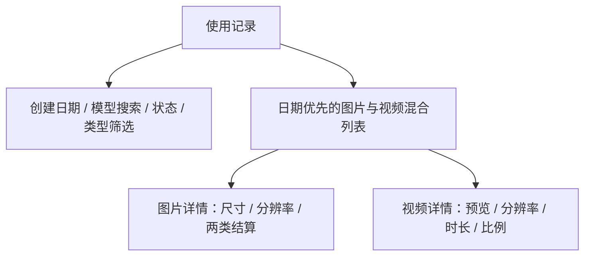

# 统一使用记录筛选 - Plan

## Goal Capsule

- **Objective:** 用现有 `/dashboard/history` 路由统一承载图片和视频使用记录，并提供可核对创建时间、模型、状态、类型和分辨率结算的筛选与详情。
- **Product authority:** 本文固定使用记录页的信息架构、筛选行为、列表字段、图片与视频详情以及旧使用日志入口的迁移；钱包和底层计费用量接口不属于本计划。
- **Open blockers:** 无；退款不进入使用记录列表，旧图片缺少可靠分辨率档位快照时显示缺省值。

---

## Product Contract

### Summary

FluxMedia 移除独立“使用日志”菜单与页面，把图片和视频业务记录统一到“使用记录”。页面沿用 `/dashboard/history` 兼容旧链接，并提供创建日期、模型、状态和产物类型筛选以及日期、分辨率和结算信息。

### Problem Frame

“使用日志”和原“历史记录”同时承载生成活动会让用户在两个页面之间判断哪一处才是业务记录入口。原页面只显示图片，缺少组合筛选，日期位于末列且会被截断，图片详情也无法区分像素尺寸与固定计价分辨率档位。

### Key Decisions

- **统一名称为使用记录。** (session-settled: user-directed — chosen over maintaining a separate usage-log page or retaining the History label: image and video generation activity should have one user-facing surface.) 独立使用日志入口移除，原历史路由保留兼容，但所有用户可见名称使用“使用记录”。
- **不展示退款行。** (session-settled: user-directed — chosen over carrying billing refunds into the generation records: this surface represents persisted image and video tasks.) 使用记录列表只展示图片与视频生成记录，不把退款或账本事件混入业务记录。
- **日期优先且完整。** (session-settled: user-directed — chosen over keeping date as a truncated trailing column: users need the full creation timestamp for reconciliation.) 创建日期是列表第一列，在桌面和移动端均完整展示，不使用省略号隐藏内容。
- **尺寸与分辨率并存。** (session-settled: user-directed — chosen over renaming the existing size field: pixel dimensions and fixed billing tiers are different facts.) 图片详情保留像素尺寸，并独立展示实际分辨率档位及请求到实际的分辨率结算。
- **移除价格趋势。** (session-settled: user-directed — chosen over retaining pricing context on the records page: pricing is not part of reviewing generated outputs.) 使用记录页不加载或展示价格趋势。

<!-- ce-section: work-relationships -->
### How This Work Fits Together

本计划只拥有使用记录用户界面和本人历史读取行为，并取代原钱包与使用日志计划中的独立使用日志界面。

- **Shares:** 历史详情读取既有图片与视频任务事实，积分金额仍以已经记录的结算快照为准。
- **Can proceed independently of:** 钱包余额、充值、订阅和支付履约继续按原计划运行。
- **Preserves:** 计费用量 UOL 可继续供内部接口使用，但不再拥有独立用户菜单。

### Layout Map

### Actors

- A1. **已登录用户：** 查询并核对自己的图片和视频使用记录。
- A2. **历史读取能力：** 按当前用户、用户时区和稳定分页边界返回安全的生成记录与模型选项。

### Requirements

**入口与列表**

- R1. 用户导航只保留“使用记录”作为图片与视频业务记录入口，不再显示“历史记录”或“使用日志”。
- R2. 旧使用日志地址、旧账单 `usage` 入口和 `/dashboard/history` 必须兼容进入使用记录，不产生失效书签。
- R3. 使用记录列表必须按创建时间从新到旧混合展示图片和视频，并保留处理中、已完成和失败记录。
- R4. 创建日期必须位于列表第一列，在所有断点完整展示且不得使用截断省略。
- R5. 列表行必须展示预览或类型占位、提示词、类型、模型、规格、积分、状态和简易失败说明。

**筛选与分页**

- R6. 使用记录页必须支持可选的创建开始日和结束日筛选，日期按用户时区解释且结束日包含全天。
- R7. 模型筛选必须使用当前用户真实使用模型的可搜索下拉选择，并按精确模型值查询。
- R8. 状态筛选必须支持处理中、已完成和失败，类型筛选必须支持图片和视频。
- R9. 筛选组合必须共同生效；筛选变化从首屏重新查询，前后分页必须保留全部筛选条件。
- R10. 查询必须限定当前用户并采用有界稳定分页，不得因深页、总数统计或模型模糊搜索扫描无界历史。

**详情与结算**

- R11. 图片记录必须继续打开图片详情，并在基本信息中同时展示像素尺寸和实际分辨率档位。
- R12. 图片“积分计算详情”必须保留尺寸结算，并新增请求分辨率到实际分辨率的独立结算字段。
- R13. 新图片记录必须保存请求与实际分辨率档位快照；旧记录缺少可靠快照时显示缺省值，不按当前价格反推历史档位或金额。
- R14. 视频详情必须展示视频预览、模型、分辨率、时长、宽高比、积分、状态以及创建和完成时间。
- R15. 图片或视频失败时必须显示简短可理解的错误说明，不得暴露第三方原始响应、SQL、内部路径、凭据或完整 metadata。

**页面状态**

- R16. 无使用记录、筛选无结果、查询失败和分页边界必须提供不同且可理解的反馈。
- R17. 使用记录页不得加载或展示价格趋势及其占位状态。
- R18. 筛选、分页和行详情必须支持键盘操作、清晰焦点与可感知名称。

### Key Flows

- F1. **筛选使用记录**
  - **Trigger:** A1 打开使用记录页或修改筛选。
  - **Actors:** A1、A2。
  - **Steps:** A1 选择日期、模型、状态或类型并查询；A2 按用户时区和当前用户返回最新一页；翻页保留筛选。
  - **Outcome:** A1 在单一页面找到目标图片或视频任务。
  - **Covered by:** R1-R10、R16、R18。
- F2. **核对图片结算**
  - **Trigger:** A1 打开图片记录。
  - **Actors:** A1、A2。
  - **Steps:** 详情展示基本信息、像素尺寸、实际分辨率档位、尺寸结算和分辨率结算；旧记录无档位快照时显示缺省值。
  - **Outcome:** A1 能区分输出尺寸与计价档位，且不会看到按当前规则伪造的历史数据。
  - **Covered by:** R11-R13、R15。
- F3. **查看视频或失败任务**
  - **Trigger:** A1 打开视频记录或失败记录。
  - **Actors:** A1、A2。
  - **Steps:** 视频详情按状态展示预览与规格；失败任务展示脱敏后的简易错误。
  - **Outcome:** A1 能理解任务结果和扣费上下文，而不接触内部错误信息。
  - **Covered by:** R14-R16、R18。

### Acceptance Examples

- AE1. **Covers R1-R5.** Given 用户拥有同一时段的图片和视频成功、处理中与失败任务，when 打开使用记录页，then 记录按创建日期倒序混排，日期位于第一列且完整可见，导航中不再出现历史记录或使用日志。
- AE2. **Covers R6-R10.** Given 用户选择本地日期范围、搜索并选择一个历史模型、状态“失败”和类型“视频”，when 查询并前后翻页，then 只返回范围内完全匹配的本人失败视频，分页保留全部筛选且无重复遗漏。
- AE3. **Covers R11-R13.** Given 新图片请求以 1K 发起并按 2K 输出，when 打开详情，then 基本信息分别显示像素尺寸和 2K，积分详情同时显示尺寸结算与 `1K → 2K` 分辨率结算。
- AE4. **Covers R13.** Given 旧图片只有像素尺寸而没有档位快照，when 打开详情，then 尺寸正常显示，分辨率显示缺省值且原结算积分保持记录值。
- AE5. **Covers R14-R16.** Given 视频生成失败且持久化错误包含上游或数据库细节，when 查看列表和详情，then 页面显示本地化的简易失败说明，不显示原始细节或不可用视频控件。
- AE6. **Covers R2、R17-R18.** Given 用户访问旧使用日志书签或只使用键盘，when 进入使用记录并操作筛选和详情，then 旧入口完成兼容迁移、所有控件可操作，且页面没有价格趋势及其数据请求。

### Scope Boundaries

- 钱包继续只负责余额和购买，不新增交易或退款列表。
- 使用记录不展示退款、充值、订阅订单或账本流水。
- 本次不改变图片和视频生成、扣费、退款、支付或订阅履约语义。
- 本次从使用记录页移除价格趋势，不新增记录导出、聚合报表或全文提示词搜索。
- Chat、Agent 和 relay-only 链路的退役或隐私策略由各自计划负责。

### Sources / Research

- `docs/plans/2026-07-22-001-feat-wallet-usage-log-plan.md`
- `apps/web/src/app/[locale]/(dashboard)/dashboard/history/page.tsx`
- `apps/web/src/features/image-generation/components/history-client.tsx`
- `apps/web/src/features/image-generation/components/image-lightbox.tsx`
- `packages/database/src/schema.ts`
