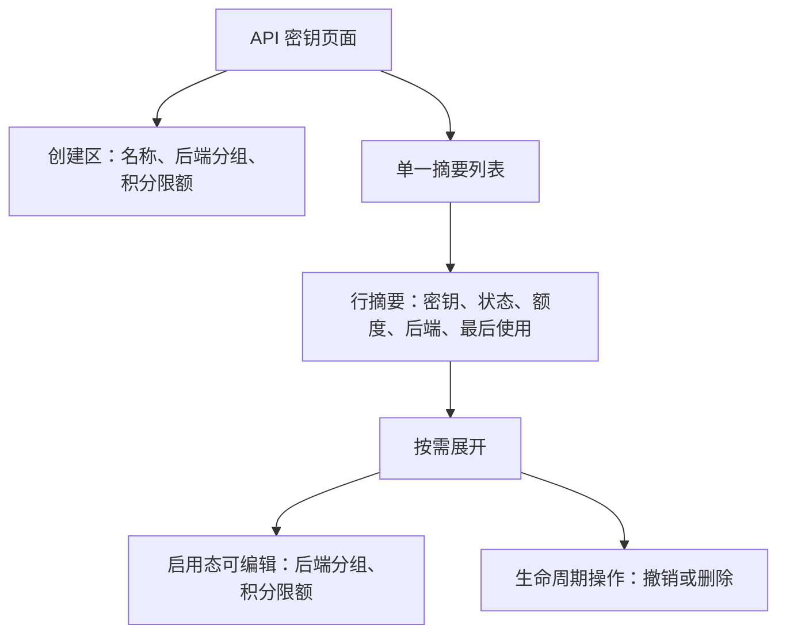
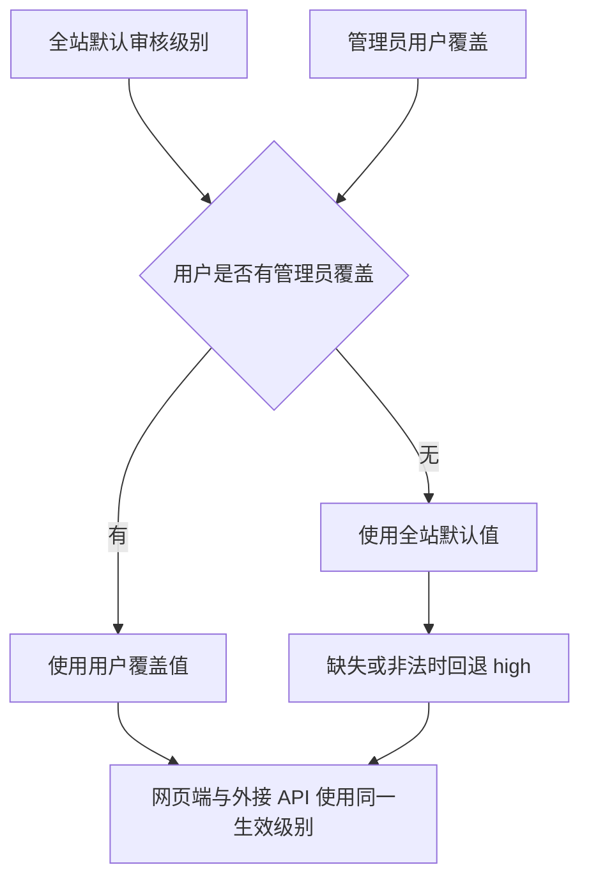
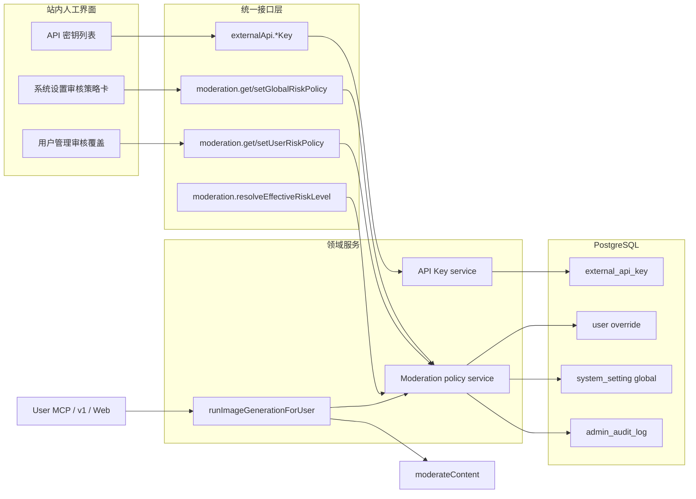
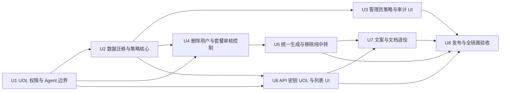

# API 密钥管理与审核级别治理 - Plan

## Goal Capsule

- **Objective:** 将用户侧“外接 API”管理收敛为易扫描的“API 密钥”列表，彻底移除纯中转能力，并把审核级别改为全站默认值与管理员用户覆盖。
- **Product authority:** Product Contract 固定页面行为、用户可管理范围、审核权威来源、管理员权限、审计要求和旧输入处理；Planning Contract 固定接口、数据、迁移和发布边界。
- **Execution profile:** 8 个依赖有序的实现单元；先封闭 UOL 权限与数据模型，再接管理员策略、生成管线、API 密钥列表，最后完成文档和发布验证。
- **Authority:** 本文高于旧纯中转计划和当前代码中的套餐、用户与 Key 级审核行为。实现发现冲突时必须停下修订本文，不得保留第二权威源。
- **Stop conditions:** 生产预检发现任意 `relay_only=true`、旧实例未排空、审核策略可被用户/MCP 绕过、审计与策略写入不能原子提交，或网页与外接路径解析结果不一致时不得发布。
- **Tail ownership:** U8 负责迁移预检、跨路径验证、浏览器验收、文档收尾和发布后确认；前序单元不得把这些尾项留给未命名的后续工作。
- **Open blockers:** 无；线上不存在历史纯中转数据，列表形态、`high` 回退、权限层级、旧字段拒绝和必填变更原因均已确认。

---

## Product Contract

### Summary

FluxMedia 将“外接 API”菜单和页面统一命名为“API 密钥”，并采用摘要列表与行内展开管理密钥。审核级别由全站默认值和可选的管理员用户覆盖共同决定；默认、缺失和非法配置均回退到最宽松的 `high`，用户、API 密钥和外部 Agent 不再拥有审核级别或纯中转控制权。

### Problem Frame

当前 API 密钥以独立卡片纵向展示多项控制，密钥增加后难以快速比较状态、额度和后端分组。菜单名称“外接 API”也宽于页面实际承担的 API 密钥管理职责。

审核级别同时存在套餐默认与上限、用户自选值和部分 API 密钥覆盖值，不同请求路径可能得到不同来源的结果。多层控制让平台难以证明实际生效策略，也允许用户改变本应由平台治理的审核边界。

纯中转还是一条贯穿认证、套餐能力、生成历史、对象存储、MCP 和外接 handler 的分叉。只隐藏页面开关无法关闭该能力，反而会留下用户看不到但仍可调用的隐私语义旁路。

### Key Decisions

- **摘要列表与行内展开。** (session-settled: user-directed — chosen over a dense table and always-expanded rows: the selected layout balances scanability with responsive editing.) 默认行只展示识别和使用摘要，用户按需展开后修改仍允许管理的设置。
- **纯中转统一移除。** (session-settled: user-directed — chosen over retaining a legacy compatibility state: production has no relay-only records.) 所有现有和新建 API 密钥均按普通持久化模式运行，不提供纯中转状态、标识、输入或隐藏接口。
- **单一审核治理层级。** (session-settled: user-directed — chosen over per-plan, user self-service, and per-key thresholds: moderation policy must be centrally controlled.) 全站默认审核级别是基础值，管理员用户覆盖是唯一更高优先级来源。
- **旧自选审核值失效。** (session-settled: user-directed — chosen over preserving prior user selections as administrator overrides: previous self-service choices must not survive the permission change.) 上线后所有用户先继承全站默认值，只有管理员之后明确设置的覆盖值生效。
- **`high` 是系统回退。** (session-settled: user-directed — chosen over the existing strict `low` fallback: missing or invalid global policy must use the most permissive level.) 全站初始默认、配置缺失和非法值都解析为 `high`。
- **保留旧 URL。** (session-settled: user-approved — chosen over a route rename: bookmarks and historical links should continue working while visible naming changes.) `/dashboard/external-api` 保持有效，用户可见名称统一为“API 密钥”。
- **管理员分层写入。** (session-settled: user-approved — chosen over super-admin-only user overrides and observer writes: global policy is more sensitive while user exceptions follow target-role protection.) `super_admin` 管理全站默认和任意用户覆盖，普通 `admin` 只能管理权限更低用户的覆盖，`observer_admin` 只读。
- **治理变更必须说明原因。** (session-settled: user-directed — chosen over reason-less audit entries: administrators need visible context for policy changes.) 修改全站默认以及设置、修改或清除用户覆盖都必须填写原因。
- **旧治理输入出现即拒绝。** (session-settled: user-approved — chosen over silently ignoring deprecated fields: old clients must not believe relay or per-key moderation remains active.) 旧客户端即使提交 `relayOnly: false` 也收到明确错误，不得成功后静默剥离字段。

### API Key Page Layout

### Moderation Authority Map

### Actors

- A1. **已登录用户：** 创建、查看、展开、配置额度与后端分组，并撤销或删除自己的 API 密钥。
- A2. **`super_admin`：** 配置全站默认审核级别，为任意用户设置或清除覆盖，并查看全局和用户审计记录。
- A3. **`admin` / `observer_admin`：** 普通 `admin` 管理权限更低用户的覆盖；`observer_admin` 只能读取其现有权限允许看到的策略结果。
- A4. **FluxMedia 请求管线：** 为网页端和受审核的外接 API 生成请求解析同一生效审核级别，并保证任何用户输入不能改变结果。

### Requirements

**命名与列表布局**

- R1. 用户侧菜单、页面标题、metadata 和语义等价的中英文文案必须统一使用“API 密钥”命名；现有 `/dashboard/external-api` URL 必须保持可访问。
- R2. API 密钥页必须使用单一列表容器展示密钥，默认不得把每个密钥渲染为独立抬升卡片。
- R3. 每个摘要行必须展示密钥名称、脱敏标识、启用状态、积分使用与限额、当前后端分组、最后使用时间和可用操作。
- R4. 用户展开启用态摘要行后只能编辑后端分组与积分限额；撤销态展开区只读并只允许删除。
- R5. 创建区只能接受密钥名称、后端分组和积分限额，并继续一次性展示新建密钥明文；明文不得再次查询、记录到日志或进入 Agent 工具结果。
- R6. 列表在窄屏下必须使用可纵向阅读的摘要与展开区，不得依赖横向滚动才能完成创建、查看或管理操作。

**纯中转控制**

- R7. 所有现有和新建 API 密钥必须走对应普通路径的历史、对象存储、使用记录和续承行为，不得存在纯中转运行分支。
- R8. 用户通过页面、Server Action、UOL、User MCP 或其他用户可调用传输创建与更新 API 密钥或发起生成时，不得提供或接受纯中转能力；废弃字段出现即返回校验错误。
- R9. API 密钥列表、创建区、套餐能力矩阵、用户文档和活动待办不得展示纯中转开关、状态标识或可用性说明。

**审核级别权威来源**

- R10. 平台必须提供一个仅由 `super_admin` 维护的全站默认审核级别，允许值为 `low`、`medium` 和 `high`；初始值、缺失值和非法值均回退到 `high`。
- R11. 每个用户可以拥有一个 nullable、仅由管理员维护的审核级别覆盖值；未设置或清除覆盖时必须继承当前全站默认值。
- R12. 管理员必须能够查看用户的全站默认、覆盖值、生效值及来源，并能在权限允许时设置、修改或清除覆盖。
- R13. 清除用户覆盖值后，该用户的网页端和外接 API 下一次请求必须读取当前全站默认值，不得受进程缓存延迟影响。
- R14. 普通用户的个人设置不得展示审核级别控件，用户资料提交出现审核级别字段时必须拒绝且不得修改任何资料。
- R15. API 密钥创建、列表和编辑不得展示审核级别；创建或编辑提交出现 Key 级审核字段时必须拒绝。
- R16. 网页端与所有受内容审核的外接图像生成路径必须使用同一解析规则：管理员用户覆盖优先，否则使用全站默认值。
- R17. 套餐不得决定审核级别默认值、可选范围或最大值；套餐只保留本文未改变的审核启停与结算能力。
- R18. 上线前由用户本人选择的用户级审核值和 API 密钥级审核值不得迁移为管理员覆盖，也不得影响新规则下的生效审核级别。

**权限、反馈与追溯**

- R19. `super_admin` 可以修改全站默认和任意用户覆盖，普通 `admin` 只能修改权限严格低于自己的目标用户，`observer_admin` 和普通用户不得执行策略写入。
- R20. 修改全站默认、设置用户覆盖或清除覆盖时必须填写 1–300 字符的原因并得到明确成功、无变化或失败反馈；失败不得留下部分生效状态。
- R21. 全站默认和用户覆盖的每次实际变更必须可查看操作者、目标、原因、变更前后值、时间和请求标识；策略写入与审计记录必须原子提交。
- R22. 套餐说明、用户设置说明、API 密钥说明和管理员界面文案必须与集中式审核治理一致，不得继续承诺用户可选择审核级别。
- R23. API 密钥明文和审核策略写操作只能由站内人工会话使用，不得出现在 Admin MCP、User MCP 或外部 Agent 的工具列表中；伪造直接工具调用也必须被拒绝。
- R24. 通用系统设置更新、环境变量导入和默认初始化不得绕过专用审核策略 operation 改写全站默认；只有受控初始化可以补入 `high` 默认值。

### Key Flows

- F1. **创建并管理 API 密钥**
  - **Trigger:** A1 进入“API 密钥”页面。
  - **Actors:** A1。
  - **Steps:** A1 在创建区填写名称、后端分组和积分限额；系统一次性返回新密钥；列表增加摘要行；A1 按需展开并管理允许的设置。
  - **Outcome:** A1 能快速扫描多个密钥并完成管理，不接触纯中转或审核级别控制。
  - **Covered by:** R1-R9、R23。
- F2. **配置全站审核级别**
  - **Trigger:** A2 在系统设置页修改全站默认审核级别。
  - **Actors:** A2、A4。
  - **Steps:** A2 选择档位并填写原因；系统校验 `super_admin` 权限，在同一事务内保存策略和审计；未设置用户覆盖的后续请求读取新默认值。
  - **Outcome:** 平台审核边界可以从一个权威入口统一调整并追溯。
  - **Covered by:** R10-R11、R16-R17、R19-R24。
- F3. **设置或清除用户覆盖**
  - **Trigger:** A2 或有权的 A3 在用户管理中调整某个用户的审核级别。
  - **Actors:** A2、A3、A4。
  - **Steps:** 管理员查看当前生效值与来源，选择覆盖值或继承全局并填写原因；系统校验目标角色层级，在同一事务内更新与审计。
  - **Outcome:** 管理员能处理个别用户策略，同时不创建新的用户自助入口。
  - **Covered by:** R11-R16、R19-R24。
- F4. **解析请求审核级别**
  - **Trigger:** A1 从网页端、v1 API 或 User MCP 发起受审核的图像生成请求。
  - **Actors:** A1、A4。
  - **Steps:** A4 以可信 `userId` 查询管理员覆盖和全站默认；存在合法覆盖时使用覆盖，否则使用合法全站值，缺失或非法时使用 `high`。
  - **Outcome:** 同一用户在网页端和所有受审核的外接图像路径得到相同审核级别语义。
  - **Covered by:** R10-R18、R24。
- F5. **拒绝旧治理输入**
  - **Trigger:** 旧客户端提交纯中转、用户审核或 Key 审核字段，或调用已移除的更新 operation。
  - **Actors:** A1、A4。
  - **Steps:** 入口使用 strict schema 拒绝废弃字段；已删除 operation 返回不存在；系统不得执行创建、资料更新或策略变更。
  - **Outcome:** 客户端不会误以为旧隐私或审核设置仍然有效。
  - **Covered by:** R8、R14-R15、R23-R24。

### Acceptance Examples

- AE1. **Covers R1-R6.** Given 用户拥有多个启用或撤销的 API 密钥，when 用户打开“API 密钥”页面，then 页面以摘要列表展示各密钥，启用态展开后只出现后端分组与积分限额，撤销态只读，并在 375px 宽度下无需横向滚动即可完成操作。
- AE2. **Covers R7-R9.** Given 线上不存在纯中转密钥，when 用户创建或使用任意 API 密钥，then 页面与用户可调用接口都没有纯中转输入，请求沿用普通路径的历史、存储、续承和使用记录语义。
- AE3. **Covers R10-R13、R16.** Given 全站设置缺失或值非法且用户没有覆盖，when 用户分别通过网页端和外接 API 发起受审核请求，then 两条路径都使用 `high`；`super_admin` 将全站值改为 `low` 后，两条路径的下一次请求都使用 `low`。
- AE4. **Covers R11-R13、R20-R21.** Given 用户当前有管理员覆盖值 `medium`，when 有权管理员填写原因并清除覆盖，then 界面显示该用户继承全站默认，后续请求使用当前默认值，并产生一条包含原因与前后值的审计记录。
- AE5. **Covers R14-R18.** Given 用户和 API 密钥在上线前保存过自选审核值，when 新规则生效，then 新覆盖列均为空，旧值不影响请求，套餐差异也不改变生效档位。
- AE6. **Covers R19-R21.** Given 普通用户、`observer_admin`、普通 `admin` 和 `super_admin` 尝试修改策略，when 请求到达 UOL，then 前两者不能写，普通 `admin` 只能修改权限更低用户覆盖，`super_admin` 可修改全局与任意用户覆盖，审计失败时策略值不变。
- AE7. **Covers R22.** Given 用户查看套餐、个人设置、API 密钥页和相关文档，when 搜索审核级别与纯中转说明，then 不会看到用户可控制这些策略的承诺或入口。
- AE8. **Covers R8、R14-R15、R23-R24.** Given 旧客户端提交 `relayOnly: false`、用户审核字段或 Key 审核字段，或 Admin MCP 尝试调用策略写工具，when 请求到达系统，then 输入得到稳定拒绝，MCP 工具列表不含这些操作，直接 `tools/call` 也不能绕过。
- AE9. **Covers R3-R6.** Given API 密钥列表加载失败、创建响应丢失、复制失败、撤销竞态和删除竞态，when 用户继续操作，then 页面区分失败与空状态，不自动重试创建，允许手选明文，并以真实数据库状态反馈撤销或删除结果。

### Success Criteria

- 用户能够在一个摘要列表中比较多个 API 密钥，并只在展开后看到仍允许编辑的字段。
- 仓库中不存在可由用户、API Key Principal、MCP 或套餐改变审核阈值的有效输入链路。
- 同一用户在网页端、User MCP `image.generate` 和全部受审核 v1 图像入口解析出相同的 `{ effectiveLevel, source }`。
- 每次实际策略变更恰好产生一条可检索审计记录；审计写入失败时策略不改变。
- 迁移在 `relay_only=true` 预检非零时自动停止，且不会把任何旧用户或 Key 级审核值转为管理员覆盖。

### Scope Boundaries

- 不改变内容审核是否启用、审核供应商选择、代理方式、fail-closed、安全错误处理或审核计费语义。
- 不改变 API 密钥的后端分组、积分限额、鉴权、使用计数和管理员重新启用语义；仅收紧用户侧撤销后编辑与删除竞态反馈。
- 不新增纯中转历史兼容状态；如果部署预检发现纯中转数据，必须停止发布并回到本文重新确认迁移行为。
- 不把审核策略写操作开放给 Admin MCP、User MCP 或外部 Agent；未来开放需先解决真实管理员主体、审批和持久审计。
- 不重做管理员用户管理的其他资料、套餐、积分、角色或封禁流程。
- 不把本次审核审计扩展为所有系统设置的统一审计改造。
- `low`、`medium`、`high` 继续影响阿里云风险阈值；OpenAI provider 的 `flagged` 行为保持不变，管理员文案不得承诺三档改变所有 provider。

### Dependencies / Assumptions

- 生产环境不存在 `relay_only=true` 的 API 密钥记录；迁移仍必须以数据库预检验证该前提。
- 发布流程能够在破坏性迁移期间排空旧 Web 实例，避免旧代码与已删除字段同时运行。
- `admin_audit_log` 继续作为管理员审计真相；本计划复用其 actor、target、reason、before、after、metadata 和时间字段。
- 全站审核设置必须存在数据库权威行；运行时 resolver 不依赖通用多实例缓存。
- API 密钥创建明文无法恢复；提交成功但响应丢失时，用户只能撤销或删除该 Key 后重新创建。

### Sources / Research

- `apps/web/src/features/settings/components/external-api-key-section.tsx:60`：当前 Key 卡片、纯中转和 Key 级审核控件。
- `apps/web/src/features/settings/components/settings-profile-view.tsx:113`：当前用户自助审核控件与套餐选项。
- `apps/web/src/features/settings/actions/external-api-key.ts:71`：当前 Key 生命周期、权限与旧治理写入口。
- `apps/web/src/features/image-generation/operations.ts:1292`：当前用户/请求/套餐审核解析和纯中转管线分支。
- `packages/shared/src/subscription/services/plan-capabilities.ts:41`：当前套餐审核矩阵和 `externalApi.relay` 能力位。
- `packages/shared/src/uol/operations/external-api.ts:337`：尚未接线且契约与页面行为不一致的 API 密钥 operations。
- `packages/shared/src/mcp/tool-factory.ts:89`：Admin MCP 自动投影规则。
- `packages/shared/src/support/actions/admin-users.ts:371`：现有管理员审计模式与非原子写入风险。
- `packages/database/src/schema.ts:59`、`packages/database/src/schema.ts:1687`：旧用户与 API Key 审核/纯中转字段。
- `docs/plan/2026-05-30-relay-only-api-key.md`：被本计划取代的纯中转设计。

---

## Planning Contract

### Product Contract preservation

规划保留 Product Contract 的列表形态、纯中转退役、集中式审核治理、旧值失效和全路径一致性。写计划前确认新增并已同步到 Product Contract 的产品约束如下：

- 保留 `/dashboard/external-api`，仅修改所有用户可见名称。
- 全站初始值、缺失值和非法值均回退到最宽松的 `high`。
- `super_admin` 管全局和任意用户，普通 `admin` 只管更低角色用户，`observer_admin` 只读。
- 纯中转或旧审核字段只要出现就拒绝，不对 `relayOnly: false` 做静默兼容。
- 全局与用户覆盖变更都要求填写原因，并在对应管理员页面显示完整审计上下文。
- 策略写入和 API 密钥明文保持 human-only，不扩展到 MCP 或外部 Agent。

除以上已同步项外，Product Contract unchanged。

### Key Technical Decisions

#### KTD1. 可见命名改变，路由和领域名保持稳定

- `/dashboard/external-api`、`external-api` 领域名和 OpenAI 兼容 v1 API 路由保持不变，避免把 UI 改名扩大为接口迁移。
- 导航、顶栏、页面 metadata、页面标题和设置旧 Tab 文案改为“API 密钥”/“API Keys”。
- 管理后台“外接 API 后端”等确实描述外接服务的术语不改名；只改 API Key 管理入口。

#### KTD2. API 密钥页使用一个列表容器和独立 disclosure 状态

- 复用 `billing-section.tsx` 的有边框容器与 `divide-y` 行语言，使用 `@repo/ui/components/collapsible` 实现每行独立、可多开的展开状态。
- 桌面摘要使用网格对齐；窄屏隐藏表头并给每个值增加可见标签，操作按钮不得触发行展开。
- 加载、加载失败、空列表和有数据四种状态互斥；失败必须提供重试，不能落入空列表。
- 撤销需要确认；撤销态不再显示编辑控件。删除以单条条件删除的返回行判断结果，不能先查后删并忽略 0 行竞态。

#### KTD3. API 密钥生命周期先接入 session-only UOL

- `externalApi.listKeys`、`createKey`、`updateKeyGroup`、`updateKeyQuota`、`revokeKey`、`deleteKey` 使用 `access: { kind: "user" }`，身份只取 session Principal，不接受客户端 `userId`。
- operation 输入与页面真实字段对齐，所有对象使用 strict schema；创建输出只在本次调用返回完整 Key，任何审计和日志只记录 Key ID 与脱敏标识。
- app service 继续以 `principal.userId + keyId` 限定所有权，并对更新操作要求 `is_active=true`；删除要求 `is_active=false` 且检查 `returning`。
- Server Actions 仅构造 Principal、调用 `invokeOperation`、映射用户反馈和 `revalidatePath`；数据库、套餐和分组校验移动到 service 与 UOL binding。

#### KTD4. 纯中转能力从类型、数据和运行时同时删除

- 删除 `external_api_key.relay_only`、`externalApi.relay` 能力位、`Principal.apiKey.relayOnly`、`RunImageGenerationInput.relayOnly` 和 `image.generate.relayOnly`。
- 删除 `externalApi.updateKeyRelay`、relay policy、handler 拒绝分支、历史/存储/续承跳过分支和相关测试。
- 正常请求继续保留第一方 Authorization 转发防护、SSRF 防护和 base64/URL 响应兼容；只删除 relay 专用行为，不弱化通用安全代码。
- `generation.usage_log_visible` 等既有历史证据列保留；新请求无条件按普通可见路径写入，不因退役能力回写或猜测历史隐私状态。

#### KTD5. 审核策略使用专用全站设置和独立 nullable 用户覆盖

- 新全站键固定为 `CONTENT_MODERATION_BLOCK_RISK_LEVEL`，允许 `low | medium | high`，数据库初始值与代码回退均为 `high`。
- 用户新增 `moderationBlockRiskLevelOverride`，映射 `moderation_block_risk_level_override`，允许三档或 `NULL`；`NULL` 表示继承。
- 不复用旧 `user.moderation_block_risk_level`，防止旧客户端在切换窗口把自助值写成管理员覆盖。
- `ModerationBlockRiskLevel`、枚举和值解析从订阅配置迁到 `packages/shared/src/moderation/policy-contract.ts`，避免类型归属继续暗示套餐权威。

#### KTD6. UOL 使用显式角色集合和 human-only 标记封闭权限

- `AccessRequirement` 增加通用 `{ kind: "roles"; roles: AppUserRole[] }`，该分支只接受角色集合内的 user Principal，明确拒绝 system、API Key、cron、webhook 和 proxy Principal；内部解析继续使用独立的 `{ kind: "system" }` operation。
- 全局读写 operation 只允许 `super_admin`；用户策略读取允许 `observer_admin | admin | super_admin`，并复用管理员用户详情的目标可见性校验；写入只允许 `admin | super_admin`，随后再执行目标角色层级校验。
- `OperationDefinition` 增加显式 `agentExposure: "human-only"` 覆盖项；Admin/User MCP 工厂和直接 `tools/call` 统一拒绝该类 operation。
- 新审核策略 operations 和 API 密钥管理 operations 都标记 human-only。既有 User MCP `image.generate` 仍可调用，但其 schema 不再含治理字段。
- 不修改旧 `access.kind="admin"` 的全局语义；本计划的新写操作不得复用会放行 `observer_admin` 的旧语义。

#### KTD7. 策略写入、目标校验和审计位于同一底层事务

- 全站更新事务锁定 `CONTENT_MODERATION_BLOCK_RISK_LEVEL` 权威行，读取真实前值，写入新值并插入 `adminAuditLog`；迁移保证该行存在且通用设置入口不能删除。
- 用户覆盖事务以 `SELECT ... FOR UPDATE` 锁定目标用户，同时读取角色和前值；使用 `canActOnTargetRole` 阻止普通 `admin` 操作同级或更高角色。
- 两类写入都要求 trim 后 1–300 字符原因，审计记录 before/after、actor、target、operation、requestId、actorRole，并在 metadata 保存不可变的 targetUserId 与变更时 targetRole。
- 并发写采用锁内 last-write-wins；每个成功事务的 `before` 必须是锁后真实前态。相同值返回 `changed: false`，不制造审计噪声。
- 事务由 policy service 自己持有，UOL 和 Server Action 不再包外层事务；审计插入失败必须回滚策略写入。

#### KTD8. 生效策略解析直接读数据库并在纯函数中归一

- `resolveEffectiveModerationPolicy(userId)` 一次查询取得用户覆盖和全站设置；合法覆盖优先，覆盖为空时读取合法全站值，缺失或非法值回退 `high`。正常全站值来源记为 `global`，缺失或非法配置的应急回退来源记为 `fallback_high`。
- resolver 不复用 system-settings L1/Redis 缓存，保证管理员保存后下一次请求可见；当前生成管线本就查询用户审核值，因此查询数量不增加。
- DB-free 的 `resolveModerationPolicyValues` 纯函数负责 `{ globalDefault, userOverride, effectiveLevel, source }` 计算和非法值回退，覆盖正常、缺失和非法输入单测。
- 数据库连接、查询超时或其他读取异常必须上抛并终止生成，不得转换为 `high`；`high` 回退只处理成功读取后的缺失或非法配置值。每次 `fallback_high` 都写结构化日志和指标，生产正常值应为 0。
- 管理员读取 operation 与生成管线调用同一 resolver，避免 UI 显示值和运行时值分叉。

#### KTD9. 图像管线是唯一审核解析点，代理只接收可信生效值

- `runImageGenerationForUser` 只按可信 `userId` 调 resolver，不再接受调用方审核值；网页、v1 handlers、Agent images 和 User MCP 共享该结果。
- `moderateContent` 删除 `userPlan` 和 `userModerationBlockRiskLevel`，改为必须接收内部命名的 `effectiveBlockRiskLevel`；缺失或非法值直接失败，只有 resolver 可以对成功读取后的缺失或非法配置回退 `high`。Aliyun 不再调用套餐归一 helper。
- 审核代理需要跨进程透传时，只允许通过 proxy-secret 鉴权的 system operation 传 `effectiveBlockRiskLevel`；先验证代理身份，再用 enum schema 严格校验，用户会话和 API Key auth 均不得提供或覆盖该字段。
- OpenAI provider 继续按 `flagged` 判断，审核启停、fail-closed、代理选择和计费不变。

#### KTD10. 套餐矩阵只删除审核阈值和纯中转能力

- 从 `PlanCapabilityMatrix`、默认 JSON、解析器、快照和设置面板删除 `moderation` 中决定审核级别默认值、允许范围和最大值的阈值配置。
- 删除 `externalApi.relay`，保留 `moderation.blocking` 与 `moderation.onlyFailureSettlement`，因为审核启停和失败结算不在本次范围。
- 迁移清理数据库内已有 `PLAN_CAPABILITY_MATRIX` JSON 的旧审核阈值字段和 `features.externalApi.relay`，同时保留 `moderation.blocking` 与 `moderation.onlyFailureSettlement`，避免设置面板或导出继续传播第二权威源。
- 套餐页不再出现审核档位可选范围或纯中转能力，但 API Key 管理、外接接口和其他能力门槛保持不变。

#### KTD11. 废弃字段使用 strict schema 和 operation 删除共同拒绝

- `updateProfileSchema`、API Key 创建/更新 operation 和 `image.generate` 输入对象使用 `.strict()`；所有 v1 handler 在兼容业务 schema 解析前复用原始请求体守卫。顶层出现 `moderationBlockRiskLevel`、`relayOnly`、snake_case 别名或等价旧字段时，无论值为 `true`、`false`、`null` 或非法类型都返回稳定 `validation_error`。
- `externalApi.updateKeyModeration` 与 `externalApi.updateKeyRelay` 从 registry 删除；调用旧名称返回 `not_found`，不实现成功 no-op。
- 通用 `settings.update`、Server Action 批量设置和 env import 显式拒绝/跳过专用审核键；专用 operation 是唯一人工写入口。
- 错误信息说明字段已废弃且由管理员策略控制，但不得泄露全站或用户实际审核值给普通用户。

#### KTD12. 迁移使用一次维护窗口完成破坏性切换

- 手写 `0056_api_key_moderation_governance.sql` 并登记 `_journal.json`，不运行 `drizzle-kit generate`。
- 0056 先断言 `relay_only=true` 数量为 0，再插入全站 `high`、新增 nullable 用户覆盖与 CHECK、从套餐 JSON 清理审核阈值字段和 `externalApi.relay` 并保留两个审核 feature gate，最后删除两个旧审核列和 `relay_only`。U2 的可独立提交部分保持 additive-only；旧列类型声明、全部运行时消费者和 DROP COLUMN 必须在 U4-U6 完成后作为同一发布尾部共同落地。
- 为全局 action 审计和用户审计查询补 `(action, created_at)`、`(target_user_id, created_at)` 索引。
- 发布时先停止/排空旧实例，再执行迁移和新代码；迁移后禁止回滚到读取旧列的二进制，只能恢复数据库备份或前向修复。

#### KTD13. 审计可见性在两个管理员入口就地完成

- 系统设置“内容审核”区域使用专用策略卡展示当前全站值、三档含义、必填原因和最近全局变更。
- 用户管理详情展示 `{ globalDefault, userOverride, effectiveLevel, source }`，提供覆盖/继承选择与必填原因；无权限时控件只读。
- 用户审计 Tab 补出 before/after、actor、reason、requestId 和时间；全局策略卡显示相同字段。actor 或 target 外键日后置空时，界面分别回退到 metadata 中的 actorUserId、targetUserId 与 targetRole 快照，审计仍可检索和追溯。

### High-Level Technical Design

运行时序列：传输层只提供可信身份和业务输入；生成管线解析一次审核策略；代理若被使用只接收该可信生效值；Key 或请求参数不再参与选择。

### System-Wide Impact

- **Data lifecycle:** 删除三列和一个套餐能力位，新增 nullable 管理员覆盖；全局设置与审计成为新权威数据。
- **Authorization:** 新增角色集合型 UOL requirement 和 human-only operation 标记；API Key Principal 不能管理 API 密钥或审核策略。
- **Agent/tool parity:** `image.generate` 继续可由 User MCP 调用，但 JSON Schema 不再暴露 `relayOnly`；所有策略与 Key 管理工具在两类 MCP 中均不可见且不可直接调用。
- **Request behavior:** 所有 API Key 请求从可选不落库分支收敛到普通历史、存储和续承路径；计费与额度逻辑继续复用原路径。
- **Moderation behavior:** 套餐、用户资料和 Key 行不再影响阈值；每个生成请求新增一次强一致策略查询，但替代现有用户审核值查询，不增加查询数量。
- **Operations:** 破坏性迁移要求维护窗口，旧版本不能与新 schema 并行；发布前的 relay 数据断言是硬门。
- **Documentation:** 旧纯中转计划被本文取代；依赖 relay 语义的历史计划仅保留历史背景并标记现行行为已变更。

### Assumptions

- 单次维护窗口可接受；不设计双写或多版本兼容字段。
- `high` 作为最宽松阈值是明确产品选择，实施不得自动改回现有 `low` 安全默认。
- 管理员界面继续使用中文文案；用户侧 API 密钥页面维护中英文翻译。
- 全局默认设置仅在数据库中维护，不接受环境变量作为运行时覆盖源。
- 现有 `admin_audit_log` 的容量足以承载策略变更；新增索引后不需要新审计表。

### Sequencing and Tail Ownership

- U1 与 U2 的新增契约和 additive-only 数据改动是其他单元的基础，不得从 UI 删除控件开始实施。
- U3 和 U6 可在 U2 完成后并行；U4 必须与 U5 在同一发布窗口完成，避免旧控制消失但运行时仍读取旧值。
- U2 中旧 schema 声明与 0056 破坏性 DDL 的尾部不得独立提交或部署；必须等待 U4-U6 清除全部消费者，并由 U8 在同一维护窗口执行。
- U8 拥有生产预检、维护窗口、迁移后验证、浏览器验收和最终全仓质量门。

### Risks and Mitigations

| 风险 | 影响 | 缓解 |
|---|---|---|
| Zod 默认剥离旧字段 | 旧客户端误判纯中转或审核设置仍生效 | 所有受影响对象 strict，测试 `relayOnly: false/true` 和旧审核字段 |
| Admin MCP 通过专用或通用设置 operation 绕过 | 无真实管理员审计的策略写入 | human-only 标记 + 通用设置保留键拒绝 + `tools/list/call` 双测试 |
| `observer_admin` 被旧 `admin` access 放行写入 | 只读角色可改变审核边界 | 新 operation 使用 roles requirement，不复用旧 admin 语义 |
| 策略写成功、审计失败 | 无法追溯已生效变更 | service 内单事务，故障注入验证回滚 |
| 多实例缓存返回旧全局值 | “下一请求生效”不成立 | resolver 直接查 DB，不走通用 settings cache |
| 旧实例在迁移后运行 | 查询已删除列导致错误或重新制造旧值 | 维护窗口排空实例，迁移后禁止旧版本回滚 |
| relay 代码只删主路径 | responses 续承、Agent 或 MCP 仍能绕过 | 类型删除 + 全仓 `rg` 清零 + 五类 v1 路径 parity 测试 |
| 创建响应在提交后丢失 | 用户无法再次看到明文且可能重复创建 | 不自动重试；页面说明撤销/删除后重建，列表能识别新增 Key |
| 审核档位文案过度承诺 | 管理员误以为 OpenAI provider 也按三档判断 | 明确三档是 Aliyun 阈值，OpenAI `flagged` 逻辑不变 |
| resolver 读取异常被当成配置缺失 | 数据库故障时全站静默放宽到 `high` | 配置值缺失才回退；连接、超时和查询错误直接终止生成并告警 |
| 删除旧列早于消费者清理 | 中间提交无法 typecheck 或运行时查询已删除字段 | U2 additive-only 先落地，U4-U6 清理消费者后再合入声明删除与 0056 |

---

## Implementation Units

### U1. 建立 UOL 角色要求和 human-only Agent 边界

- **Goal:** 先让新审核策略和 API 密钥管理 operation 能声明精确角色与不可投影边界，堵住 MCP 直接调用。
- **Requirements:** R19、R23-R24；F2-F5；AE6、AE8。
- **Dependencies:** 无。
- **Files:**
  - `packages/shared/src/uol/types.ts`
  - `packages/shared/src/uol/access.ts`
  - `packages/shared/src/uol/tests/access.test.ts`
  - `packages/shared/src/mcp/tool-factory.ts`
  - `packages/shared/src/mcp/user-tool-factory.ts`
  - `packages/shared/src/mcp/tool-factory.test.ts`
  - `apps/web/src/app/api/mcp/admin/route.test.ts`（新增）
  - `apps/web/src/app/api/mcp/user/route.test.ts`
- **Approach:**
  1. 在 `AccessRequirement` 增加 `roles` 分支，角色数组使用 `AppUserRole`；`assertAccess` 只允许列出的 user Principal，system、API Key、cron、webhook 和 proxy Principal 全部返回 `forbidden`。内部 resolver 单独使用既有 `system` requirement。
  2. 在 `OperationDefinition` 增加 `agentExposure?: "human-only"`。MCP 工厂在 access、域和 allowlist 判断前先排除 human-only；抽出单一 predicate，`tools/list` 和 `tools/call` 都通过生成后的同一列表校验。
  3. 为测试注册 roles/human-only operation，覆盖 `user`、`apiKey`、`observer_admin`、`admin`、`super_admin` 和 `system`。
  4. 保持既有 operation 未声明 `agentExposure` 时的可见性不变，避免本次扩展为全 registry 暴露策略迁移。
- **Test Scenarios:**
  - `observer_admin` 可通过只读 roles requirement，不能通过写 roles requirement。
  - 普通 `admin` 和 `super_admin` 可通过写 roles requirement；API Key Principal 不可通过。
  - system Principal 不能执行全局或用户策略读写 operation，只能调用显式 system-only resolver。
  - human-only operation 不出现在 Admin/User MCP `tools/list`。
  - 伪造已知 tool name 的 `tools/call` 返回不可用，且 execute 未被调用。
  - 既有 `image.generate` 和已授权 MCP 工具列表不因新字段意外消失。
- **Verification:**
  - `pnpm --filter @repo/shared exec vitest run --config vitest.config.ts src/uol/tests/access.test.ts src/mcp/tool-factory.test.ts`
  - `pnpm --filter @repo/web exec vitest run src/app/api/mcp/admin/route.test.ts src/app/api/mcp/user/route.test.ts`
  - `pnpm --filter @repo/shared typecheck`

### U2. 新增审核策略数据模型、强一致 resolver 和原子写服务

- **Goal:** 建立全站 `high` 默认、nullable 管理员用户覆盖和事务审计的唯一数据权威。
- **Requirements:** R10-R13、R18-R21、R24；F2-F4；AE3-AE6。
- **Dependencies:** U1。
- **Files:**
  - `packages/database/src/schema.ts`
  - `packages/database/drizzle/0056_api_key_moderation_governance.sql`（新增）
  - `packages/database/drizzle/meta/_journal.json`
  - `packages/shared/src/moderation/policy-contract.ts`（新增）
  - `packages/shared/src/moderation/policy-contract.test.ts`（新增）
  - `packages/shared/src/moderation/policy-service.ts`（新增）
  - `packages/shared/src/moderation/policy-service.test.ts`（新增）
  - `packages/integration-tests/package.json`（新增）
  - `packages/integration-tests/vitest.config.ts`（新增）
  - `packages/integration-tests/src/moderation-policy-service.test.ts`（新增）
  - `packages/shared/src/system-settings/definitions.ts`
  - `packages/shared/src/system-settings/index.ts`
  - `packages/shared/src/system-settings/index.test.ts`
  - `packages/shared/package.json`
- **Approach:**
  1. 新建 policy contract，定义 `MODERATION_BLOCK_RISK_LEVELS`、Zod enum、`ModerationBlockRiskLevel`、`HIGH` 回退和纯函数 resolver；从订阅配置移走相同类型的权威定义。
  2. schema 先新增 `user.moderationBlockRiskLevelOverride` nullable text 与三档 CHECK，并给 `adminAuditLog` 增加目标/动作时间索引声明；旧用户审核列、Key 审核列和 `relayOnly` 的类型声明暂留到 U4-U6 清除消费者后再删除。
  3. 手写完整 0056 迁移但只在 U8 执行：事务开头对 `external_api_key.relay_only=true` 执行阻断断言；缺失或非法的全站设置写入 `high`，仅保留现有合法 `low`、`medium`、`high`；新增空覆盖，不搬迁旧值；从套餐 JSON 清理审核阈值字段和 `externalApi.relay` 并保留两个审核 feature gate；最后删除旧列。
  4. 新 policy service 实现全局读取、用户读取、生效解析、全局写和用户覆盖写。读取 DB 结果先过 contract 归一；写入锁行、检查角色层级、写审计并返回结构化前后值。
  5. 审计 metadata 保存 `requestId`、operation、actorUserId、actorRole、targetUserId 和 targetRole；reason 使用共享 1–300 字符 schema。提交后才失效 system settings cache，resolver 自身始终直读 DB。
  6. 将新设置定义为 moderation 类 select，但标记为专用写入；通用 `setSystemSettings` 对该键报错，env import 跳过，默认初始化只允许缺失时补 `high`。
  7. 新增独立 `@repo/integration-tests` PostgreSQL 测试目标，不接入 `packages/shared` 或 `apps/web` 的 DB-free Vitest；它以一次性数据库真实调用 policy service，验证行锁、审计原子性和并发删除。
  8. U4-U6 清除全部旧字段消费者后，再删除 schema 中的旧列声明；该提交必须通过全仓 typecheck，并与 0056 的生产执行保持同一发布边界。
- **Test Scenarios:**
  - 合法覆盖优先；空覆盖继承合法全局；缺失/非法全局回退 `high`；非法覆盖按空覆盖处理。
  - 正常全局 `high` 返回 `source: global`；缺失或非法配置返回 `source: fallback_high` 并产生结构化日志/指标。
  - 数据库连接失败、查询超时或 SQL 错误直接终止 resolver，不调用 `moderateContent`，也不伪装成 `high`。
  - 新用户覆盖默认 `NULL`，旧 `low/medium/high` 用户值均未迁移。
  - 迁移在任意 relay 行存在时抛错并不执行后续 DDL。
  - `admin` 不能操作同级、`super_admin` 或自己；`super_admin` 可操作全部目标。
  - 两个并发写按锁顺序提交，每条审计的 before 对应真实前态。
  - 审计插入故障使设置/覆盖回滚；缓存失效故障不改变 resolver 的 DB 真相。
  - 真实 PostgreSQL 集成测试覆盖并发全局写、并发用户写、审计插入失败和目标用户删除，断言锁后 before、事务回滚和连续审计链。
  - 通用设置、clear 和 env import 无法写入专用键。
- **Verification:**
  - `pnpm --filter @repo/shared exec vitest run --config vitest.config.ts src/moderation/policy-contract.test.ts src/moderation/policy-service.test.ts src/system-settings/index.test.ts`
  - `pnpm --filter @repo/database typecheck`
  - `pnpm --filter @repo/integration-tests test:moderation`
  - `pnpm turbo typecheck`
  - 在一次性测试数据库执行 `pnpm --filter @repo/database db:migrate`，确认 0056 成功和重复迁移无额外变更。

### U3. 暴露审核策略 operations，并接入两个管理员页面

- **Goal:** 让管理员通过专用 UOL operation 管理全局和用户策略，填写原因并查看完整审计。
- **Requirements:** R10-R13、R19-R24；F2-F3；AE3-AE4、AE6、AE8。
- **Dependencies:** U1、U2。
- **Files:**
  - `packages/shared/src/uol/operations/moderation.ts`
  - `packages/shared/src/uol/operations/moderation-policy.test.ts`（新增）
  - `packages/shared/src/system-settings/actions/index.ts`
  - `packages/shared/src/system-settings/components/system-settings-panel.tsx`
  - `packages/shared/src/support/actions/admin-users.ts`
  - `packages/shared/src/support/components/admin-users/admin-users-management.tsx`
  - `packages/shared/src/support/components/admin-users/moderation-policy-control.tsx`（新增）
- **Approach:**
  1. 注册 `moderation.getGlobalRiskPolicy`、`setGlobalRiskLevel`、`getUserRiskPolicy`、`setUserRiskLevelOverride` 和 system-only `resolveEffectiveRiskLevel`；前四个输入/输出复用 policy contract schema 并标记 human-only，system-only resolver 不复用 roles requirement。
  2. 全局 set 输入固定 `{ level, reason }`；用户 set 固定 `{ userId, level: level | null, reason }`，`null` 原子表达清除覆盖。输出包含 changed、before、after、effectiveLevel、source、updatedAt 和 auditLogId。
  3. 系统设置 Server Actions 使用 `superAdminAction` 取得真实会话角色，构造 user Principal 后调用 UOL；generic settings 保存时排除专用卡值。
  4. 内容审核分类顶部增加专用卡：展示当前全局值、三档含义、变更原因输入、保存状态和最近全局策略审计。保存成功后清空原因并刷新读模型。
  5. 用户详情通过 get operation 合并策略 DTO，并在 operation 内复用管理员用户详情的目标可见性校验；普通 `admin` 对更低角色显示可编辑 select 与“继承全站”选项，`super_admin` 对全部目标可编辑。无写权限时仍完整展示 globalDefault、userOverride、effectiveLevel 和 source，只隐藏或禁用编辑控件。
  6. 用户审计查询补 before/after/metadata，审计 Tab 以字段名展示策略前后值；target 外键为空时回退 metadata 的 targetUserId/targetRole，且不得把其他敏感 snapshot 原样 JSON dump 到页面。
- **Test Scenarios:**
  - 全局 operation 权限矩阵：只有真实 `super_admin` user Principal 可读写，MCP virtual principal 因 human-only 不可投影。
  - 用户读写矩阵覆盖 observer/admin/super_admin 和目标角色层级。
  - observer/admin 无法读取其既有管理员用户详情范围之外的目标策略；无写权限的可见目标仍展示完整策略构成。
  - 空原因、超过 300 字符、非法 level、目标不存在和无变化均返回明确状态。
  - 设置/清除覆盖后 UI 同时更新 override、effective 和 source。
  - 全局与用户审计列表显示 actor、reason、before/after、requestId、time；不显示密钥或不相关 metadata。
  - actor 或 target 用户删除后，审计仍可按 metadata 快照检索并显示原始主体 ID 与角色。
  - 保存失败保留用户输入，成功后清空原因；重复点击期间按钮禁用。
- **Verification:**
  - `pnpm --filter @repo/shared exec vitest run --config vitest.config.ts src/uol/operations/moderation-policy.test.ts`
  - `pnpm --filter @repo/shared typecheck`
  - 浏览器分别以 `admin`、`super_admin` 验证全局卡和用户覆盖控件的可见/只读/可写状态。

### U4. 删除用户自助审核和套餐审核权威

- **Goal:** 从用户资料、API Key 表单和套餐矩阵删除所有审核级别控制，只保留平台审核启停与结算能力。
- **Requirements:** R14-R18、R22、R24；F4-F5；AE5、AE7-AE8。
- **Dependencies:** U1、U2。
- **Files:**
  - `packages/shared/src/config/subscription-plan.ts`
  - `packages/shared/src/subscription/services/plan-capabilities.ts`
  - `packages/shared/src/subscription/services/plan-capabilities.test.ts`
  - `packages/shared/src/system-settings/components/system-settings-panel.tsx`
  - `packages/shared/src/system-settings/definitions.ts`
  - `packages/shared/src/system-settings/defaults.test.ts`
  - `apps/web/src/features/settings/schemas/update-profile.ts`
  - `apps/web/src/features/settings/schemas/update-profile.test.ts`（新增）
  - `apps/web/src/features/settings/actions/update-profile.ts`
  - `apps/web/src/features/settings/components/settings-profile-view.tsx`
  - `apps/web/src/app/[locale]/(dashboard)/dashboard/settings/page.tsx`
  - `apps/web/messages/zh.json`
  - `apps/web/messages/en.json`
- **Approach:**
  1. 删除订阅配置中的审核默认、最大值、允许集合和归一 helper；删除 capability matrix 的审核阈值配置和 `externalApi.relay`，保留 `moderation.blocking` 与 `moderation.onlyFailureSettlement` 两个审核 feature gates。
  2. 更新矩阵 parser 与 snapshot，使旧持久 JSON 的多余字段在读取时被忽略，但保存和默认 JSON 不再输出；迁移负责数据库持久值清理。
  3. 用户资料 schema 删除审核字段并改为 strict；action updateData 只允许 name/image；设置页面不查询、不传 props、不渲染审核 radio，也不再因审核选项加载套餐。
  4. API Key 组件和 actions 中的 Key 审核 UI/类型在 U6 统一删除；本单元先确保共享套餐类型不再提供 Key/用户自助依据。
  5. 删除中英文用户审核选项、升级提示和 Key 审核文案；管理员专用档位文案留在 U3 组件，不放回用户 namespace。
- **Test Scenarios:**
  - 各套餐 snapshot 均无审核级别默认值、允许范围或最大值配置，且 `moderation.blocking` 与 `moderation.onlyFailureSettlement` 仍正确。
  - 默认/运行时矩阵都无 `externalApi.relay`，旧 JSON 输入不会让该键重新出现在输出。
  - `updateProfileSchema` 对旧审核字段返回 unknown-key 错误，且 name/image 不发生部分更新。
  - 用户设置页面源码与渲染均无审核控件、套餐档位提示或旧字段查询。
- **Verification:**
  - `pnpm --filter @repo/shared exec vitest run --config vitest.config.ts src/subscription/services/plan-capabilities.test.ts src/system-settings/defaults.test.ts`
  - `pnpm --filter @repo/web exec vitest run src/features/settings/schemas/update-profile.test.ts`
  - `pnpm --filter @repo/web typecheck`

### U5. 统一生成审核解析并删除纯中转运行分支

- **Goal:** 让 Web、v1 和 User MCP 在单一图像管线按管理员策略审核，并让所有 API Key 请求走普通持久化路径。
- **Requirements:** R7-R8、R13、R16-R18、R23-R24；F4-F5；AE2-AE3、AE5、AE8。
- **Dependencies:** U1、U2、U4。
- **Files:**
  - `apps/web/src/features/image-generation/operations.ts`
  - `apps/web/src/features/image-generation/types.ts`
  - `apps/web/src/features/image-generation/moderation-policy.test.ts`（新增）
  - `apps/web/src/features/external-api/auth.ts`
  - `apps/web/src/features/external-api/relay-policy.ts`（删除）
  - `apps/web/src/features/external-api/relay-policy.test.ts`（删除）
  - `apps/web/src/features/external-api/relay-handlers.test.ts`（删除）
  - `apps/web/src/features/external-api/normal-persistence-handlers.test.ts`（新增）
  - `apps/web/src/features/external-api/deprecated-governance-fields.ts`（新增）
  - `apps/web/src/features/external-api/deprecated-governance-fields.test.ts`（新增）
  - `apps/web/src/features/external-api/images.ts`
  - `apps/web/src/features/external-api/handlers/image-generations.ts`
  - `apps/web/src/features/external-api/handlers/image-edits.ts`
  - `apps/web/src/features/external-api/handlers/chat-completions.ts`
  - `apps/web/src/features/external-api/handlers/responses.ts`
  - `apps/web/src/features/external-api/handlers/agent-images.ts`
  - `apps/web/src/features/external-api/handlers/video-generations.ts`
  - `apps/web/src/features/external-api/handlers/editable-file-generations.ts`
  - `apps/web/src/features/external-api/handlers/models.ts`
  - `apps/web/src/features/dashboard/output-usage-read-model.ts`
  - `apps/web/src/features/dashboard/output-usage-read-model.test.ts`
  - `apps/web/src/app/moderate/route.ts`
  - `apps/web/src/app/moderate/route.test.ts`（新增）
  - `packages/shared/src/moderation/index.ts`
  - `packages/shared/src/moderation/index.test.ts`
  - `packages/shared/src/moderation/risk.ts`
  - `packages/shared/src/moderation/risk.test.ts`
  - `packages/shared/src/uol/principal.ts`
  - `packages/shared/src/uol/operations/image-generation.ts`
  - `packages/shared/src/uol/operations/moderation.ts`
  - `packages/shared/src/uol/tests/access.test.ts`
  - `packages/shared/src/mcp/user-auth.ts`
  - `packages/shared/src/mcp/tool-factory.test.ts`
  - `apps/web/src/server/uol-bindings.ts`
  - `apps/web/src/app/api/mcp/user/route.ts`
  - `apps/web/src/app/api/mcp/user/route.test.ts`
- **Approach:**
  1. 从 Principal、MCP 鉴权、`image.generate` schema、binding 和生成 input 类型删除 `relayOnly`；`image.generate` schema 设为 strict，User MCP JSON Schema 不再出现该字段。
  2. 增加共享的原始请求体废弃字段守卫，generations、edits、chat completions、responses、agent images、video 和 editable-file handlers 在业务 schema 解析前调用；camelCase/snake_case 旧治理字段只要出现就稳定拒绝。
  3. 外接 API auth 只返回 userId、apiKeyId、plan 和额度信息，不再查询或返回 Key 审核/relay 字段；handlers 删除所有透传。
  4. `runImageGenerationForUser` 调用 U2 resolver 得到一次 `effectiveLevel`，并沿内部调用传给 `moderateContent`；移除 `getUserModerationBlockRiskLevel` 和所有请求级覆盖。
  5. `moderateContent` 和 proxy contract 必须接收 `effectiveBlockRiskLevel` enum，缺失或非法值直接失败；删除套餐二次钳制。代理路由先校验 proxy-secret，再接受该字段；普通用户会话和 API Key 请求不得注入或覆盖。
  6. 删除 generation insert、对象存储、退款、输出、responses/chat 续承和 usage projection 中的 relay 条件，统一执行普通分支；保留账本幂等 sourceRef 和现有计费规则。
  7. 删除视频/可编辑文件的 relay 拒绝入口，因为 auth 已不可能产生该状态；清理仅由 relay 服务的 helper 和注释。
  8. 全仓检查剩余 `relayOnly` 只允许存在于历史文档迁移说明，运行时代码、测试 fixture、Principal 和 schema 必须清零。
- **Test Scenarios:**
  - 同一 userId 在 Web、image generations、edits、chat completions、responses、agent images 和 User MCP 得到相同 effective/source。
  - 用户覆盖 `medium`、无覆盖全局 `low`、缺失/非法全局 `high` 三组 parity。
  - Key 行旧审核值、旧用户值和套餐 free/enterprise 均不改变 resolver 结果。
  - User MCP schema 无 relay/审核字段，提交旧字段失败；Principal fixture 不再需要 relay。
  - 七类 v1 handler 对 `relayOnly`、`relay_only` 和旧审核字段的 true、false、null 与非法类型都返回稳定 validation error。
  - `moderateContent` 缺少或收到非法 `effectiveBlockRiskLevel` 时不调用 provider；resolver 数据库读取失败也不得把 `high` 传入审核。
  - moderate proxy 在读取 `effectiveBlockRiskLevel` 前验证 proxy-secret；未认证、用户会话和 API Key 调用均不能注入或覆盖该值。
  - 外接成功请求写 generation、对象存储和 usage projection；失败退款继续按既有幂等键执行。
  - responses/chat 续承无条件按普通模式持久化；视频/可编辑文件不再依赖 relay policy。
  - 第一方 Authorization 不外发、SSRF 和 base64/URL 兼容回归继续通过。
- **Verification:**
  - `pnpm --filter @repo/shared exec vitest run --config vitest.config.ts src/moderation/index.test.ts src/moderation/risk.test.ts src/mcp/tool-factory.test.ts`
  - `pnpm --filter @repo/web exec vitest run src/features/image-generation/moderation-policy.test.ts src/features/external-api/deprecated-governance-fields.test.ts src/features/external-api/normal-persistence-handlers.test.ts src/features/dashboard/output-usage-read-model.test.ts src/app/moderate/route.test.ts src/app/api/mcp/user/route.test.ts`
  - `rg -n 'relayOnly|relay_only|userModerationBlockRiskLevel|moderationBlockRiskLevel' apps/web/src packages/shared/src packages/database/src` 的剩余命中逐条解释；运行时治理输入必须为 0。

### U6. 接线 API 密钥 operations 并重做摘要列表

- **Goal:** 用稳定 UOL 契约驱动 API 密钥创建、列表、编辑、撤销和删除，并完成响应式列表体验。
- **Requirements:** R1-R6、R8、R15、R23；F1、F5；AE1、AE8-AE9。
- **Dependencies:** U1、U2。
- **Files:**
  - `packages/shared/src/uol/operations/external-api.ts`
  - `packages/shared/src/uol/operations/external-api-key.test.ts`（新增）
  - `apps/web/src/features/external-api/key-management-service.ts`（新增）
  - `apps/web/src/features/external-api/key-management-service.test.ts`（新增）
  - `apps/web/src/server/uol-bindings.ts`
  - `apps/web/src/features/settings/actions/external-api-key.ts`
  - `apps/web/src/features/settings/actions/index.ts`
  - `apps/web/src/features/settings/components/external-api-key-section.tsx`
  - `apps/web/src/features/settings/components/external-api-key-list-state.ts`（新增）
  - `apps/web/src/features/settings/components/external-api-key-list-state.test.ts`（新增）
  - `apps/web/src/app/[locale]/(dashboard)/dashboard/external-api/page.tsx`
  - `packages/shared/src/config/nav.ts`
  - `apps/web/src/features/dashboard/components/sidebar.tsx`
  - `apps/web/src/features/dashboard/components/main-wrapper.tsx`
  - `apps/web/messages/zh.json`
  - `apps/web/messages/en.json`
- **Approach:**
  1. 重写六个 Key operation 契约以匹配真实字段和 session-only access，标记 human-only；删除 moderation/relay operation 定义。列表为每个 Key 通过 left join 返回 nullable 当前分组 `{ id, name, enabled, selectable }`，并单独返回当前用户可编辑的候选分组，避免组件发散查询或丢失已失效现值。
  2. 抽出 app service 承担 Key 生成/哈希、套餐能力、分组选择、额度归一和所有权条件；UOL binding 只把 Principal userId 传入。
  3. create schema 只含 name、generationGroupId、creditLimit 并 strict；明文只在返回 DTO 中存在，不写 Pino、UOL audit 参数或 admin audit snapshot。
  4. revoke 使用条件 update 并返回实际行；delete 使用 `id + userId + isActive=false` 单条 delete returning；group/quota 更新仅允许 active Key，0 行区分 not_found 与状态冲突。
  5. Actions 改为调用 UOL 的薄适配器。创建不做自动重试；响应丢失文案引导用户在列表识别、撤销并重建。
  6. 抽出纯列表状态 helper 管理独立展开、mutation 锁定和成功/失败归并，使用 DB-free Vitest 覆盖；组件改为创建区 + 单一列表容器，CollapsibleContent 只渲染允许字段。
  7. 撤销与删除分别确认，mutation 期间锁定对应行按钮；成功后以 operation 返回值局部更新，失败时刷新当前行状态。删除成功后焦点移到下一行摘要触发器；没有下一行时移到上一行，列表为空时移到创建区标题。
  8. 保留路由，更新导航和 metadata 的可见名称；旧 `?tab=external-api` 继续跳转到该 URL。
- **Test Scenarios:**
  - API Key Principal、普通未登录调用者不能调用六个 Key 管理 operation；session user 只能管理自己的 Key。
  - create/list DTO 不含 relay 或审核字段，strict schema 拒绝任意旧字段。
  - 一次性明文不出现在后续 list、日志和 MCP；复制失败时文本仍可手选。
  - 撤销重复、撤销后编辑、启用竞态删除和跨用户 keyId 返回准确错误，不出现假成功。
  - 当前分组被管理员禁用、删除或因套餐变化不再可选时，摘要仍显示可识别现值，编辑候选不允许重新选择该值。
  - 加载错误不显示空态；每行可独立展开；操作按钮不触发展开。
  - 375px 与 1440px 下完成创建、展开、保存、撤销、删除，无横向滚动。
  - 键盘删除首行、中间行、末行和最后一行后，焦点分别恢复到约定的相邻摘要或创建区。
- **Verification:**
  - `pnpm --filter @repo/shared exec vitest run --config vitest.config.ts src/uol/operations/external-api-key.test.ts`
  - `pnpm --filter @repo/web exec vitest run src/features/external-api/key-management-service.test.ts src/features/settings/components/external-api-key-list-state.test.ts`
  - `pnpm --filter @repo/web typecheck`

### U7. 清理产品文案、套餐承诺和纯中转历史指引

- **Goal:** 让用户文案、系统文档、套餐能力展示和项目记忆只把新的 API 密钥与审核治理描述为现行行为。
- **Requirements:** R1、R9、R22；F1-F2；AE1、AE7。
- **Dependencies:** U3、U4、U5、U6。
- **Files:**
  - `apps/web/messages/zh.json`
  - `apps/web/messages/en.json`
  - `apps/web/src/features/docs/system-docs.tsx`
  - `docs/plan/2026-05-30-relay-only-api-key.md`
  - `docs/plans/2026-07-21-001-feat-user-dashboard-analytics-plan.md`
  - `docs/plans/2026-07-22-001-feat-wallet-usage-log-plan.md`
  - `docs/MEMORY.md`
  - `docs/TODO.md`
- **Approach:**
  1. 将 API Key 管理入口、标题、空态、按钮和帮助文案统一为“API 密钥”/“API Keys”；保留描述 API 协议和后端时确有含义的“外接 API”。
  2. 删除纯中转套餐能力、用户承诺、测试待办和隐私开关说明；API 文档明确外接生成走普通历史/存储行为。
  3. 删除用户可选审核档位与套餐解锁说明；管理员文案说明 `low/medium/high` 的 Aliyun 阈值含义和 OpenAI provider 不按三档变化。
  4. 给旧 relay 计划加 `superseded_by` 并停止把它作为现行事实；在依赖该能力的 analytics/wallet 计划顶部加简短替代说明，不重写其历史决策主体。
  5. 更新 MEMORY 索引和 TODO，移除已经失效的纯中转实测项；历史提交、迁移说明和审计报告保留原始背景，不做全仓历史文本改写。
- **Test Scenarios:**
  - 用户页面与套餐区域搜索不到纯中转或用户自选审核承诺。
  - “外接 API 后端”“外接 API 请求”等领域术语未被误改成“API 密钥”。
  - 仓库既有 `CLAUDE.md` 与 `AGENTS.md` 镜像检查继续通过，本单元不修改其无关项目约束。
  - 旧计划明确指向本计划，当前 MEMORY/TODO 不再要求测试已移除能力。
- **Verification:**
  - `rg -n '纯中转|externalApi\.relay|用户.*审核级别|API Key.*审核级别' apps/web/messages apps/web/src/features/marketing apps/web/src/features/docs packages/shared/src/config docs/TODO.md docs/MEMORY.md`
  - `cmp -s CLAUDE.md AGENTS.md`
  - `pnpm --filter @repo/web typecheck`

### U8. 执行发布预检、全路径回归和浏览器验收

- **Goal:** 在维护窗口内安全完成破坏性迁移，并用自动化、数据库和浏览器证据证明所有入口一致。
- **Requirements:** R1-R24；F1-F5；AE1-AE9。
- **Dependencies:** U3、U5、U6、U7。
- **Files:**
  - `docs/CI-CD.md`
  - `docs/plan/2026-07-23-api-key-moderation-rollout.md`（新增，仅在现有 CI-CD 文档不足以承载步骤时）
  - `.github/workflows/deploy-production.yml`
  - 本计划前序单元的测试与实现文件。
- **Approach:**
  1. 在生产只读连接执行 relay 行数预检并保存结果；非零立即停止，不运行 0056。
  2. 修改生产部署工作流：进入维护状态后停止旧 Web 实例和写入，并验证容器与连接已排空；使用批准的加密存储和最小权限身份备份相关表，只记录 artifact ID、校验结果和操作者，不把数据或凭据写入终端/CI 日志；随后执行迁移并启动只包含新 schema 的版本。
  3. 迁移后验证旧列不存在、全站值合法或为 `high`、所有用户覆盖为空、套餐 JSON 无旧节点、审计索引存在。
  4. 以普通用户、observer、admin、super_admin 和 MCP 凭据执行权限矩阵；策略写入只使用真实会话管理员。
  5. 对 Web、User MCP、image generations、image edits、chat completions、responses 和 agent images 执行同用户策略 parity；对普通 API 请求验证历史、存储、用量和计费。
  6. 在 375px 与 1440px 浏览器宽度验收 API 密钥列表和两个管理员策略入口，覆盖键盘、焦点、加载、失败、确认和审计展示。
  7. 运行全仓质量门、独立 PostgreSQL 集成测试和生产构建；发布后确认全站配置行合法、`fallback_high` 指标为 0，并检查策略错误、数据库 timeout、MCP 拒绝和生成失败日志。新版本启动或健康检查失败时保持维护状态，禁止自动调用旧镜像恢复，只能恢复迁移前数据库备份与旧镜像或执行前向修复。
  8. 回滚窗口结束后按部署规范删除临时备份并验证删除结果，只保留不含数据内容的 artifact ID 与审计证据。
- **Test Scenarios:**
  - 预检为 1 时迁移停止且旧列仍在；预检为 0 时完整迁移成功。
  - 部署工作流在迁移前确认旧实例排空，迁移后任一启动/健康检查失败都不会重新启动旧 schema 镜像。
  - 备份使用加密受控存储，日志不含数据或凭据，回滚窗口结束后可证明已删除。
  - 全站设 `low`、用户覆盖 `medium`、清除覆盖、全局设 `high` 四个阶段的下一请求均符合预期。
  - 审计失败注入、目标并发删除和并发管理员写均无部分状态。
  - 旧客户端字段、旧 operation、Admin/User MCP 直接调用全部拒绝。
  - API Key 创建/复制/刷新、响应丢失提示、编辑、撤销、删除和列表错误恢复完整通过。
  - 所有普通外接请求都有历史/存储证据，且积分扣费、退款和额度计数无回归。
  - 全站设置行缺失或非法时测试环境产生 `fallback_high`；生产发布检查要求配置合法且该指标为 0。
- **Verification:**
  - `pnpm turbo typecheck`
  - `pnpm turbo lint`
  - `pnpm turbo test`
  - `pnpm --filter @repo/integration-tests test:moderation`
  - `pnpm --filter @repo/web build`
  - 按 Verification Contract 完成数据库、权限、安全和浏览器证据记录。

---

## Verification Contract

### Requirement Traceability

| Requirement | Primary units | Primary evidence |
|---|---|---|
| R1-R6 | U6、U7、U8 | 组件测试、i18n 检查、375px/1440px 浏览器验收 |
| R7-R9 | U2、U4、U5、U6、U7、U8 | 迁移预检/DDL、Key operation 清理、relay 类型/字段清零、普通持久化回归 |
| R10-R13 | U2、U3、U5、U8 | policy contract/service、管理员 UI、跨路径 parity |
| R14-R18 | U4、U5、U8 | strict schema、套餐矩阵测试、旧值失效验证 |
| R19-R21 | U1-U3、U8 | Principal 权限矩阵、事务故障注入、审计 UI |
| R22 | U4、U7 | 文案扫描、套餐与文档检查 |
| R23-R24 | U1-U3、U5-U6、U8 | MCP list/call 拒绝、generic settings 绕过测试 |

### Automated Gates

- **Focused shared tests:**
  - `pnpm --filter @repo/shared exec vitest run --config vitest.config.ts src/moderation/policy-contract.test.ts src/moderation/policy-service.test.ts src/moderation/index.test.ts src/uol/tests/access.test.ts src/uol/operations/moderation-policy.test.ts src/uol/operations/external-api-key.test.ts src/mcp/tool-factory.test.ts src/subscription/services/plan-capabilities.test.ts src/system-settings/index.test.ts`
- **Focused web tests:**
  - `pnpm --filter @repo/web exec vitest run src/features/image-generation/moderation-policy.test.ts src/features/external-api/deprecated-governance-fields.test.ts src/features/external-api/key-management-service.test.ts src/features/external-api/normal-persistence-handlers.test.ts src/features/settings/components/external-api-key-list-state.test.ts src/app/moderate/route.test.ts src/app/api/mcp/admin/route.test.ts src/app/api/mcp/user/route.test.ts`
- **Full repository gates:**
  - `pnpm turbo typecheck`
  - `pnpm turbo lint`
  - `pnpm turbo test`
  - `pnpm --filter @repo/web build`
- **PostgreSQL integration gate:**
  - `pnpm --filter @repo/integration-tests test:moderation`
- 不允许用 skip、弱化断言、删除失败场景或 `--no-verify` 制造通过。

### Database and Migration Gates

- 迁移前 `SELECT count(*) FROM external_api_key WHERE relay_only IS TRUE` 必须返回 0；证据记录时间、环境和结果，不记录连接凭据。
- 在空白数据库和从 0055 升级的测试数据库各执行一次迁移；检查 journal idx 56、schema 与 SQL 一致。
- 迁移后验证：旧三列不存在；`CONTENT_MODERATION_BLOCK_RISK_LEVEL` 为合法三档；所有 override 为 `NULL`；PLAN_CAPABILITY_MATRIX 不含 relay 或审核阈值节点，并保留两个审核 feature gate；两个审计索引存在。
- 以事务故障注入证明 audit insert 失败会回滚全局值和用户覆盖。
- 独立 PostgreSQL 集成目标真实验证全局/用户并发写、行锁顺序、审计失败回滚和目标并发删除；DB-free 单测不能替代该门禁。
- 迁移 SQL 必须可在一个 PostgreSQL 事务内失败回滚；不得使用 `drizzle-kit generate` 重写快照。

### Security and Agent Gates

- 普通 user、v1 API Key Principal、User MCP Key、observer、admin、super_admin、system 分别跑审核与 Key operation 权限矩阵。
- roles 型管理 operation 明确拒绝 system Principal；system 只能调用独立 resolver，不能执行全局或用户策略写入。
- Admin/User MCP `tools/list` 都不包含审核策略和 API Key 管理；伪造 `tools/call` 同样拒绝且无 execute 副作用。
- `image.generate` MCP JSON Schema 不含 `relayOnly`、审核级别或 userId 覆盖；旧字段出现返回 validation error。
- 所有 v1 handler 在兼容 schema 前拒绝 camelCase/snake_case 旧治理字段；`false`、`null` 和非法类型同样不得静默剥离。
- moderate proxy 必须先通过 proxy-secret 鉴权，未认证、用户会话和 API Key 请求均不能提交 `effectiveBlockRiskLevel`。
- `settings.update`、Server Action 批量设置、env import 和 defaults 初始化不能更改已有专用全站策略。
- API Key 明文只在创建响应出现一次，不进入 Pino、Sentry、admin audit、MCP response、测试快照或浏览器持久存储。
- 全仓检查用户可控治理字段：`rg` 命中必须限于迁移、历史文档或管理员专用 contract，不得存在运行时旁路。

### Browser Acceptance

- **API 密钥页，375px/1440px：** 导航与标题、创建三字段、一次性明文、复制/手选、错误重试、独立展开、启用态编辑、失效当前分组展示、撤销确认、撤销态只读、条件删除和删除后焦点恢复。
- **系统设置页：** `super_admin` 查看三档含义、必填原因、保存反馈和包含 requestId 的最近全局审计；admin/observer 无写入口。
- **用户管理页：** admin 只能修改更低角色，super_admin 可修改任意目标；覆盖、继承、effective/source，以及包含 requestId 的审计前后值同步更新。
- **可访问性：** disclosure 使用 button、`aria-expanded`/`aria-controls`，焦点清晰，操作按钮不冒泡触发展开，动态结果通过现有 toast/状态区域可感知。
- **失败终态：** 列表失败不伪装空态，策略失败保留 reason，创建响应丢失不自动重试，复制失败仍可手动选择明文。

### Cross-Path Moderation Matrix

| Policy state | Web | User MCP | v1 generations | v1 edits | chat | responses | agent images |
|---|---|---|---|---|---|---|---|
| global missing/invalid, no override | `high/fallback_high` | 同左 | 同左 | 同左 | 同左 | 同左 | 同左 |
| global `low`, no override | `low/global` | 同左 | 同左 | 同左 | 同左 | 同左 | 同左 |
| global `low`, override `medium` | `medium/user_override` | 同左 | 同左 | 同左 | 同左 | 同左 | 同左 |
| clear override, global `high` | `high/global` | 同左 | 同左 | 同左 | 同左 | 同左 | 同左 |

每个格子的测试同时断言传入 moderation provider 的 `effectiveBlockRiskLevel`，而不是只断言管理员读接口的 DTO。

### Failure Injection

- policy service 在 setting/user update 后、audit insert 时抛错：事务整体回滚。
- 两个管理员并发写同一全站行或用户行：最终值符合提交顺序，每条 audit before/after 连续。
- 目标用户在写前删除：operation 返回 not_found，不产生孤立 audit。
- Redis/cache 失效失败：下一 generation resolver 仍读 DB 新值。
- resolver 数据库断连、查询超时或 SQL 错误：生成失败且不调用 `moderateContent`，不得产生 `high` 回退。
- `moderateContent` 缺失或收到非法 `effectiveBlockRiskLevel`：直接失败且不调用 provider。
- API Key revoke/delete 之间被管理员重新启用：delete 返回状态冲突，不报告成功。
- Key 创建 DB 已提交但响应被中断：列表出现脱敏 Key，明文不可恢复，UI 不自动重试。

---

## Definition of Done

### Global

- Product Contract 中 R1-R24、F1-F5 和 AE1-AE9 均有自动化或浏览器证据，Requirement Traceability 无空项。
- 数据库只有全站设置与 nullable 管理员用户覆盖两个审核权威来源；旧用户、Key、套餐和请求级值已删除或不可达。
- 纯中转字段、能力位、operation、Principal 属性和运行时分支全部移除，生产预检证据为 0。
- 所有策略写入由真实会话管理员执行，原因必填，写入与审计原子，两个管理员入口可查看完整变更。
- `pnpm turbo typecheck`、`pnpm turbo lint`、`pnpm turbo test` 和 Web production build 全绿。
- `CLAUDE.md` 与 `AGENTS.md` 保持逐字一致；旧 relay 计划和当前 MEMORY/TODO 的现行状态已更新。
- 未留下实验代码、被注释代码、无效 feature flag、TODO 假完成或无法解释的旧治理字段命中。

### Per Unit

- **U1:** roles requirement 与 human-only gate 有 Principal 和 MCP list/call 测试，observer 不可写。
- **U2:** 0056 迁移、`high/fallback_high` 来源、读取异常 fail-closed、空覆盖、真实 PostgreSQL 事务锁和审计回滚均可验证。
- **U3:** 五个策略 operation 已注册，Actions 为薄适配器，目标读取权限明确，两个管理员页面要求原因并展示完整策略与审计。
- **U4:** 用户资料和套餐矩阵不再输出、接受或展示审核档位控制。
- **U5:** 所有生成入口只从 resolver 获得审核级别，API Key 请求无条件走普通持久化路径。
- **U6:** 六个 Key 管理 operation 已接线，列表响应式可用，失效当前分组和删除后焦点行为明确，旧治理输入和 Agent 调用被拒绝。
- **U7:** 用户文案、套餐、文档、MEMORY 和 TODO 与新行为一致，镜像说明文件同步。
- **U8:** 部署工作流排空旧实例，迁移后不回滚旧镜像；备份受控且按期销毁；数据库验证、权限矩阵、跨路径 parity 和两种 viewport 验收都有记录。

### Release and Rollback

- 发布前在批准的加密存储创建相关表备份并记录 artifact ID、校验结果、当前镜像/提交和操作者；不记录数据或凭据，relay 预检非零立即取消发布。
- 维护窗口内停止旧实例，执行 0056 后只启动新版本；健康检查和跨路径 smoke 通过后恢复流量。
- 迁移删除旧列后，部署工作流必须禁用旧应用镜像自动恢复。需要回退时保持维护状态，恢复迁移前数据库备份与旧镜像，或保持新 schema 做前向修复；回滚窗口结束后删除临时备份并验证删除。
- 发布后首次全局策略和用户覆盖变更必须核对策略值、下一请求生效值与单条 audit 三者一致。
