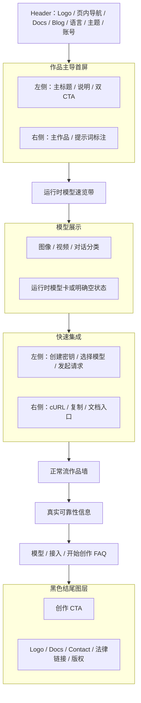
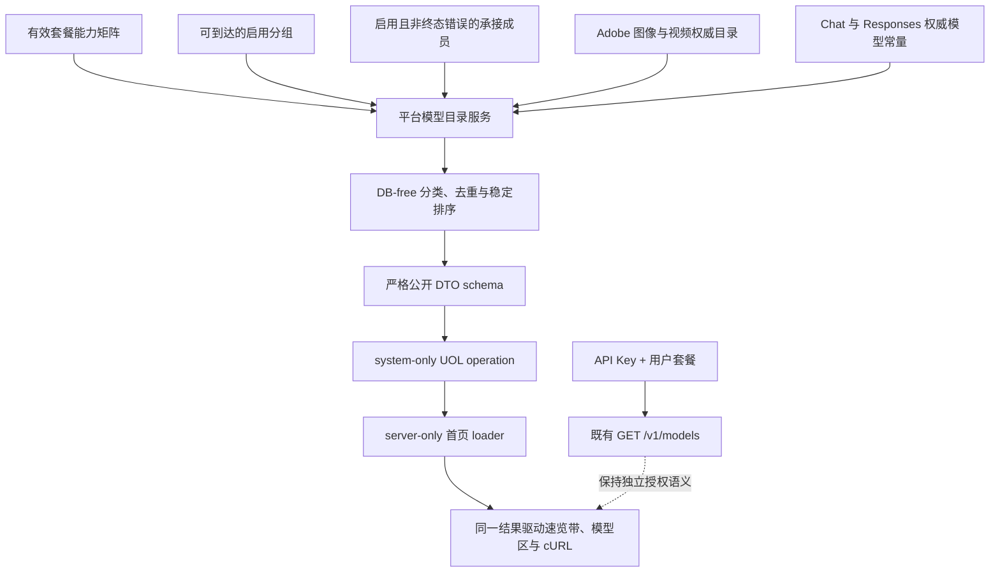
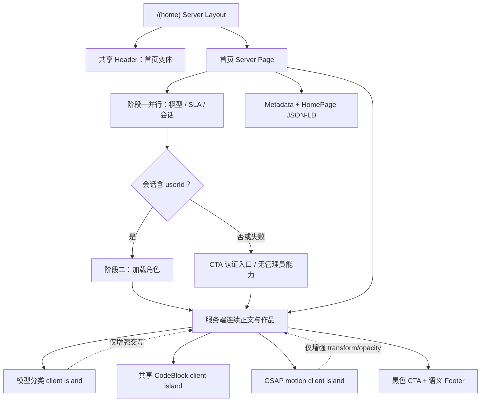
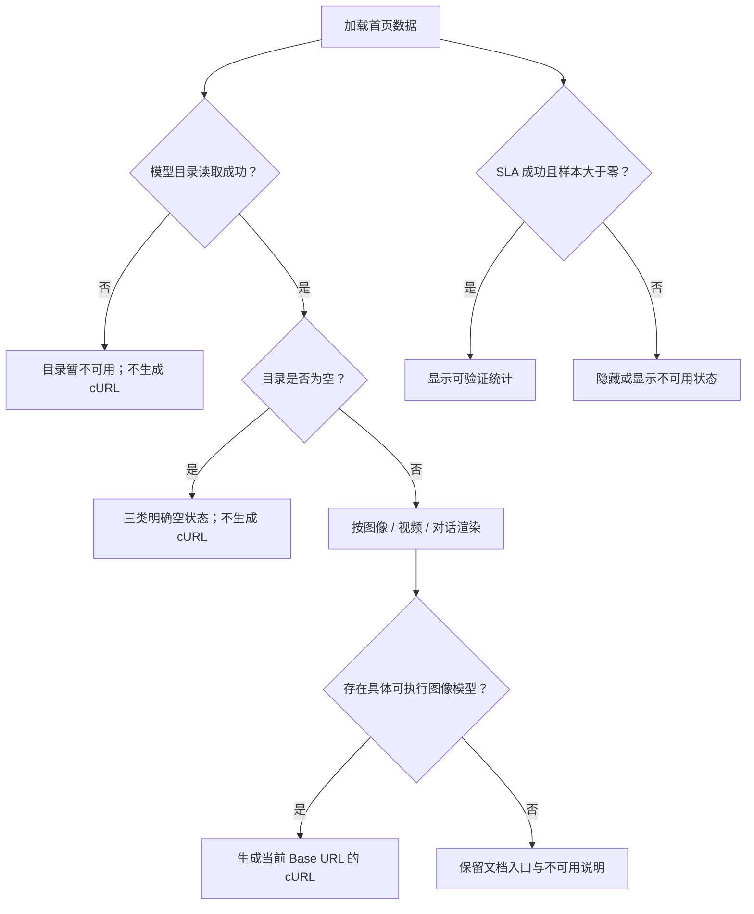
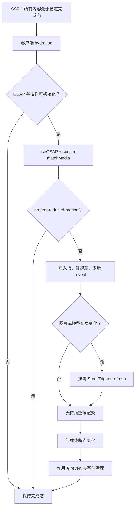

# 作品主导官网首页重构 - Plan

## Goal Capsule

- **Objective:** 将 FluxMedia 官网首页重构为作品主导、纸墨编辑风格的连续页面，用短促 GSAP 动效呈现当前系统实际支持的模型与既有 API 接入能力。
- **Product authority:** 本文固定首页的信息架构、视觉方向、运行时模型展示、快速集成、动效边界、CTA 与页脚；不改变创作台、模型调度、计费、订阅、积分或外部 API 的业务能力。
- **Open blockers:** 无；首屏采用“作品”方案，社媒链接暂不编写。

---

## Product Contract

### Summary

FluxMedia 首页改为以真实生成作品为视觉主角的连续营销页面。
页面保留纸墨、黑白编辑部、衬线排版与朱砂强调，通过短入场和轻滚动动效连接运行时模型、快速集成、作品、可靠性、FAQ 与创作入口。

### Problem Frame

当前首页仅十幕主舞台就占 2620vh，之后还有独立的 200vh 终幕和桌面端 240vh 定价廊道，并以章节导轨、固定 WebGL 画布和滚动驱动转场承载核心内容。
首页同时展示订阅套餐与额外积分包，却没有集中呈现当前部署实际启用的图像、视频和对话模型，也缺少可直接复制的首次 API 请求。
现有模型清单会随套餐能力和后端运行时配置变化，静态模型名和固定“可用”标签容易与真实能力不一致。

### Key Decisions

- **以作品作为首屏主角。** (session-settled: user-directed — chosen over product-interface and hybrid heroes: the generated result should establish the product value before controls.) Governs R1-R2、R14。
- **用连续轻动效替代章节式长滚动。** (session-settled: user-directed — chosen over the ten-scene pinned cinema: visitors should reach product information without an extended forced journey.) Governs R3、R18-R21。
- **不展示尚未开放的能力介绍。** (session-settled: user-directed — chosen over keeping the “把模型、作品和下一步放在一起” block: the homepage must not advertise unavailable product behavior.) Governs R5。
- **模型展示服从运行时事实。** (session-settled: user-directed — chosen over a static logo roster: the homepage should reflect what the current system supports.) Governs R6-R9。
- **首页不承载订阅与额外积分包。** (session-settled: user-directed — chosen over retaining the current pricing gallery: the homepage should focus on creation, models, and integration.) Governs R16、R22。
- **页脚与黑色 CTA 合为一个图层。** (session-settled: user-directed — chosen over a separate light footer layer: the ending should read as one composed artwork.) Governs R23-R24。
- **本轮不编写社媒入口。** (session-settled: user-directed — chosen over placeholder or conditionally hidden social links: no configured public destinations are available.) Governs R25。

### Layout Wireframe

宽屏首屏与快速集成采用左右构图，窄屏按“文案在前、作品或代码在后”改为单列；所有区域仍按图中纵向顺序处于正常文档流。

### Actors

- A1. **官网访客：** 浏览作品与模型，理解 FluxMedia 的创作方式，并选择进入创作台或阅读 API 文档。
- A2. **API 接入者：** 通过快速集成了解鉴权、模型选择和首次图片生成请求，并复制可执行示例。
- A3. **首页服务端：** 提供当前部署可公开展示的模型与可靠性事实，不向浏览器暴露后端凭据或内部配置。
- A4. **运行时配置管理员：** 启用、停用或调整模型后端与首页可靠性可见性，使官网展示随当前配置变化。

### Requirements

**视觉与连续结构**

- R1. 首屏必须以生成作品为视觉主角，以自然语言创作为主叙事，并提供“开始创作”和“查看作品”两个清晰入口；不得改回产品界面截图或界面与作品等权重的混合首屏。
- R2. 首页必须延续 FluxMedia 已选定的纸墨、黑白编辑部、衬线排版和朱砂强调语言，同时复用现有 Logo、Header、语言切换、主题切换与语义色彩体系，在浅色、深色和窄屏下保持可读。
- R3. 首屏之后的内容必须按 Layout Wireframe 进入正常文档流，不显示罗马数字、章节导轨或分章节舞台，也不得以固定画布或强制停留阻断自然浏览。
- R4. 页面必须提供完整的中英文内容与可索引的服务端正文；导航、按钮、图片替代文本、模型分类、复制反馈和错误状态均须本地化。
- R5. 首页不得出现“把模型、作品和下一步放在一起”整块内容，也不得以其他文案或布局继续宣传该尚未开放的能力。

**运行时模型展示**

- R6. 首页公开模型清单必须由现有模型目录来源在所有有效套餐中的可调用结果取并集，再受当前启用且非终态错误的承接路径约束；它表达“平台支持”而非匿名访客或任意账号已经获权，不得使用固定模型数组兜底。
- R7. 模型必须按来源确定类别：图像后端声明的未知模型仍归图像类，Adobe 已知视频目录归视频类，现有 Chat 与 Responses 模型归对话类；无法从权威来源确定类别的记录不得公开，卡片状态统一显示“平台支持”，供应商、规格或能力说明只有在运行时数据可证实时才能展示。
- R8. 模型分类必须可用鼠标和键盘切换并正确表达选中状态；某一分类没有公开模型时必须显示明确空状态，整个目录读取失败时必须显示暂不可用状态，不得回退为伪造的静态清单。
- R9. 首屏后的模型速览带与完整模型区必须使用同一份运行时清单；模型被停用或从公开范围移除后，两处都不得继续出现，新增公开模型也不应要求修改首页组件代码才能显示。

**快速集成**

- R10. 首页必须增加“快速集成”区域，以“创建 API 密钥、选择当前模型、发起首次请求”三步说明服务端接入流程，并链接到现有 API 密钥管理页和 API 文档；创建密钥步骤必须说明外部 API 受当前套餐能力约束，不得承诺所有注册账号均可创建或调用。
- R11. 存在公开图像模型时，快速集成必须展示真实的 `POST /v1/images/generations` cURL 示例，使用当前站点公开 Base URL、占位 API 密钥和清单中的当前图像模型，并说明调用者最终可用模型以其 API 密钥访问 `GET /v1/models` 的结果为准；不存在公开图像模型时不展示可运行示例，改为模型暂不可用说明并保留文档入口。
- R12. cURL 示例必须提供复制按钮，并分别给出复制成功与复制失败的可感知反馈；复制能力不可用时，示例文本仍须可选择和手动复制。
- R13. 快速集成只说明和调用已有外部 API 能力，不得暗示无需鉴权、浏览器端可安全持有密钥，或存在尚未实现的新端点与参数。

**作品、可靠性与问答**

- R14. 模型区之后必须保留作品墙，以 FluxMedia 已生成并可公开使用的作品呈现真实结果；作品在正常流中阅读，不使用横向强制滚动、钉住或章节编号。
- R15. 首页必须保留可靠性信息，但只显示现有统计服务可验证的数据；统计关闭、样本不足或读取失败时必须使用诚实的隐藏或不可用状态，不得用固定百分比冒充实时结果。
- R16. FAQ 必须聚焦当前模型、图像与视频或对话能力的关系、API 接入和开始创作方式；首页正文、FAQ 与结构化内容不得推广订阅套餐或额外积分包，但可如实说明外部 API 受套餐能力约束。
- R17. 页面末段必须提供进入创作台的主要 CTA；已登录用户进入现有创作路径，未登录用户进入现有注册或登录流程，不新增另一套创作入口。

**GSAP 动效与性能**

- R18. GSAP 动效只能用于首屏作品与标题短入场、首屏到模型速览带的一小段滚动响应，以及少量内容显现或轻视差；动效必须服务于阅读顺序，不能成为独立章节。
- R19. 首页不得通过钉住、人工占位高度、横向强制滚动或超长时间轴增加阅读行程；所有核心内容必须在正常页面高度内出现，访客普通滚动即可连续到达页尾。
- R20. 启用 `prefers-reduced-motion`、GSAP 未加载、JavaScript 失败或设备不适合动效时，页面必须直接显示稳定完成态，正文、模型、集成示例和 CTA 均可阅读与操作。
- R21. 动效期间不得造成明显布局跳动、滚动劫持或持续空闲渲染；离开页面、组件卸载和响应式断点变化后不得遗留监听器、触发器或内联状态。

**导航、CTA 与页脚**

- R22. 首页 Header 必须新增模型、快速集成、作品和开始创作的有效导航，保留现有 Docs、Blog、语言、主题和账号入口，并移除指向首页定价区的 `/#pricing` 及积分系统死锚点。
- R23. 首页页脚必须位于黑色 CTA 的同一视觉图层内，包含现有 FluxMedia Logo、品牌名称、Docs、Contact、Terms、Privacy 与 Cookie 链接，不包含已移除的 Pricing 链接；CTA 之后不得再渲染独立的浅色页脚层，其他营销路由仍使用现有独立页脚。
- R24. 中文首页页尾必须逐字显示“© 2026 FluxMedia. 保留所有权利。”；英文首页使用对应英文版权文案，并保持相同的 2026 年份与品牌名。
- R25. 本轮首页不得渲染社媒标题、图标、隐藏导航、空链接、占位地址或条件社媒脚本；以后只有在提供真实目标地址并另行确认范围后才能增加。

### Key Flows

- F1. **从作品理解产品并开始创作**
  - **Trigger:** A1 打开任一受支持语言的官网首页。
  - **Actors:** A1、A3。
  - **Steps:** A1 先看到作品主导首屏，随后按正常页面滚动依次浏览模型、快速集成、作品、可靠性与 FAQ，并在首屏或页尾选择开始创作。
  - **Outcome:** A1 无需完成超长章节动画即可进入现有创作或认证流程。
  - **Covered by:** R1-R5、R14-R25。
- F2. **浏览当前模型**
  - **Trigger:** A1 到达模型速览带或完整模型区。
  - **Actors:** A1、A3、A4。
  - **Steps:** A3 读取当前可公开模型；A1 在图像、视频和对话分类间切换；A4 后续变更运行时配置时，同一清单驱动速览带与模型卡。
  - **Outcome:** 页面只表达当前部署可证实的模型支持情况，并为无数据或失败情况给出诚实状态。
  - **Covered by:** R6-R9。
- F3. **完成首次 API 接入准备**
  - **Trigger:** A2 到达快速集成区。
  - **Actors:** A2、A3。
  - **Steps:** A2 阅读三步流程，确认示例使用当前站点与当前图像模型，复制 cURL，并前往 API 密钥管理页或完整文档。
  - **Outcome:** 有公开图像模型时，A2 获得不含真实凭据、可在服务端替换 API 密钥后执行的请求；没有公开图像模型时，A2 得到诚实的不可用说明与文档入口。
  - **Covered by:** R10-R13。

### Acceptance Examples

- AE1. **Covers R1-R5、R18-R19.** Given 访客打开首页，when 从首屏向下浏览，then 首先看到作品而非产品界面，之后按 Layout Wireframe 连续到达各内容区，页面没有罗马数字、章节导轨、固定影片舞台、人工长滚动或未开放能力模块。
- AE2. **Covers R6-R9.** Given 管理员停用一个公开图像模型并启用一个新模型，when 首页取得更新后的运行时清单，then 被停用模型同时从速览带和图像分类消失，新模型在两处出现，视频和对话分类不受静态数组限制。
- AE3. **Covers R7-R9.** Given 视频分类当前没有公开模型，when 访客切换到视频，then 页面显示明确空状态；given 模型目录读取失败，when 首页渲染，then 页面显示暂不可用状态且不展示固定“AVAILABLE”模型卡。
- AE4. **Covers R10-R13.** Given 至少有一个当前可用图像模型，when API 接入者查看并复制示例，then 示例指向当前站点的 `/v1/images/generations`，使用占位密钥和该图像模型，页面说明 API Key 与模型受套餐能力约束，复制成功或失败均有反馈；given 没有公开图像模型，then 页面不展示伪造示例并保留文档入口。
- AE5. **Covers R15-R16.** Given SLA 展示被关闭或统计无法读取，when 访客到达可靠性区域，then 页面隐藏该事实块或说明暂不可用而不显示固定成功率；FAQ 中没有订阅套餐或额外积分包推广。
- AE6. **Covers R20-R21.** Given 用户开启减动效或 GSAP 未能加载，when 浏览整页并调整窗口宽度，then 所有内容直接处于稳定可读状态，页面可正常滚动，交互有效，且没有持续动画或残留触发器。
- AE7. **Covers R22-R25.** Given 访客浏览 Header 与首页末尾，when 检查导航和黑色 CTA，then 模型、快速集成、作品、开始创作、Docs、Blog 与账号入口均有效，合层页脚保留指定站点和法律链接、Logo 与版权，且没有第二个页脚、社媒区域或 `/#pricing` 死锚点。

### Scope Boundaries

- Per R16，本次只移除订阅套餐与额外积分包在官网首页的展示；账单、钱包、积分购买、套餐能力和后台配置不在改造范围。
- Per R6-R9，本次只公开表达已有模型能力，不增加、修改或伪造模型承接能力。
- Per R10-R13，快速集成只为既有 `/v1/images/generations` 提供入口，不实现新的图像、视频、对话或外部 API 端点。
- Per R5，本次不恢复未开放能力介绍，也不以相近文案替代。
- Per R25，本次不添加社媒链接或占位配置，现有空的 `twitter`、`github`、`discord` 配置保持为空。
- 本次不把 APIMart 的品牌、文案、素材或布局逐像素复制；其页面仅作为连续信息节奏与模型展示密度的参考。
- Per R23，本次不重构其他营销页面，API 文档、博客、法律页等既有页脚不得受首页合层处理影响。

### Dependencies / Assumptions

- 当前 `/v1/models` 先校验 API Key 和 `externalApi.models.list` 能力，再合并默认图像模型、套餐控制的 Chat 与 Responses 模型、启用 Adobe 模型及启用 API 后端模型；R6 的匿名公开目录不能直接复用该受用户约束的传输端点，但必须共享这些事实源。
- 若需要新增公开模型目录能力，必须先在 `packages/shared/src/uol/` 以 `defineOperation()` 暴露只读操作，再由首页服务端进程内调用；输出只包含展示字段，不得包含后端地址、凭据、配额或用户级授权信息。
- GSAP 当前未出现在仓库依赖与锁文件中；实施规划需评估新增依赖的包体影响，并确保它只进入需要动效的首页客户端边界。
- 现有作品素材、生成 SLA 服务、API 密钥管理页和 API 文档可复用，但展示文案与交互必须符合本文的新范围。
- 首页模型分类以当前系统已有的图像后端、Adobe 视频目录与对话模型能力为事实基础；未知或无法安全分类的模型不得由前端猜测类别。

### Outstanding Questions

**Resolve Before Planning**

- 无。

**Deferred to Planning**

- GSAP 动效的具体时长、缓动、触发窗口与组件拆分由实施规划决定，但不得超出 R18-R21。
- 现有 Cinema、FAQ、SLA 与 Footer 组件中哪些可裁剪复用、哪些应在失去引用后删除，由实施规划结合依赖图决定。
- 运行时模型的展示名称、供应商标签与简短描述如何在中英文中维护，由实施规划在不改变 R6-R9 事实边界的前提下确定。

### Sources / Research

- `apps/web/src/app/[locale]/(marketing)/page.tsx`
- `apps/web/src/app/[locale]/(marketing)/layout.tsx`
- `apps/web/src/features/marketing/components/cinema/cinema-film.tsx`
- `apps/web/src/features/marketing/components/cinema/cinema-config.ts`
- `apps/web/src/features/marketing/components/cinema/cinema-stage.tsx`
- `apps/web/src/features/marketing/components/cinema/scene-finale.tsx`
- `apps/web/src/features/marketing/components/pricing-plan-gallery.tsx`
- `apps/web/src/features/marketing/components/header.tsx`
- `apps/web/src/features/marketing/components/footer.tsx`
- `apps/web/src/features/marketing/components/faq-section.tsx`
- `apps/web/src/features/marketing/components/sla-status-section.tsx`
- `apps/web/src/features/external-api/models.ts`
- `apps/web/src/features/external-api/handlers/models.ts`
- `apps/web/src/server/uol-bindings.ts`
- `apps/web/src/features/docs/api-integration-docs-data.ts`
- `packages/shared/src/subscription/services/plan-capabilities.ts`
- `packages/shared/src/uol/operations/external-api.ts`
- `packages/shared/src/config/nav.ts`
- `packages/shared/src/config/site.ts`
- `docs/plan/2026-07-10-homepage-cinema-design.md`
- `docs/plan/2026-07-12-artwork-brief.md`
- [APIMart 中文首页](https://apimart.ai/zh)

---

## Planning Contract

**Product Contract preservation:** Product Contract unchanged；R1-R25、F1-F3 与 AE1-AE7 的含义和稳定 ID 均保留。

### Key Technical Decisions

- KTD1. **以 system-only UOL 操作提供公开安全的模型目录数据。** (session-settled: user-approved — chosen over reusing the authenticated `/v1/models` endpoint or adding a new anonymous HTTP endpoint: the homepage needs a public-safe platform view without weakening API-key authorization.) 在 `external-api` 域新增 `access: system`、`agentExposure: human-only`、只读、非破坏、天然幂等且无副作用的 operation；“公开”只描述输出数据，不扩大调用权限。首页的 `server-only` loader 完成 UOL 初始化后以固定 reason 的 system Principal 进程内调用，Admin/User MCP 均不投影该操作。binding 使用导出的根对象与嵌套项均为 strict 的 output schema 显式 parse；这是该 binding 的局部保证，不冒充当前 UOL 网关的全局不变量。Covers R6-R9、R13。
- KTD2. **用独立平台目录构建器合并运行时事实。** 对 `SUBSCRIPTION_PLANS` 与运行时能力矩阵求并集，只纳入每个有效套餐可作为默认路径或可选择路径的 enabled group，并展开一层有效 mixed child；孤立、禁用、套餐不可达或接口模式不承接目标能力的组不贡献模型。成员遵循 R6 的稳定“平台支持”语义：启用且非终态 error 即可，临时 cooldown/limited 不使模型从营销页闪烁消失。服务复用 Adobe 目录、对话模型常量与后端声明规范化工具，但不复用用户套餐化的 `/v1/models` handler，也不直接复用创作页按用户偏好和临时调度状态收窄的目录。DB-free 构建器完成分类、大小写不敏感去重和稳定排序；`default` 等占位值不是可执行模型 ID，未知记录只有在图像后端权威声明时才归图像类。Covers R6-R9、R11。
- KTD3. **用首页专属 Route Group 隔离 Footer。** 将首页页面移动到 `apps/web/src/app/[locale]/(home)/`，由该布局渲染 Header 与 `main`，不附加共享 Footer；现有 `(marketing)` 布局和其他营销路由保持原样。黑色结尾区域内部同时包含 CTA 与语义 `footer`，从路由结构上保证首页只有一个 Footer。Covers R3、R22-R24。
- KTD4. **Server Components 输出完整完成态，客户端岛只接收最小公开状态。** 首页正文、三类模型、快速集成、作品、FAQ、CTA 与 Footer 均由服务端输出；FAQ 使用 SSR 可见的静态问答或原生 details，可靠性使用服务端静态块与最小管理员开关 island，均不复用旧 `useScroll`/canvas。模型 Tab 初始 HTML 展示全部分类，客户端成功挂载后才增强为 ARIA tabs。第一阶段并行加载模型、SLA 配置/统计和会话，第二阶段仅在取得 userId 后加载角色；失败只记录稳定事件、区块、requestId 和安全错误码。传给客户端的 props 不得包含 `PromiseSettledResult`、Error、Principal、session、原始异常或完整页面数据。Covers R4、R8-R9、R15、R17、R20。
- KTD5. **GSAP 仅进入一个受作用域约束的首页 client island。** 为 `@repo/web` 增加 `gsap` 与 `@gsap/react`，使用 `useGSAP()`、作用域 ref、`contextSafe` 和 `gsap.matchMedia()` 管理生命周期；ScrollTrigger 只承载首屏到模型带的短滚动响应和少量显现，不使用 pin、人工高度、横向假滚动或全局 `ScrollTrigger.getAll().kill()`。只动画 transform 与 opacity/autoAlpha，内容默认可见，布局变化后仅在需要时 refresh。Covers R18-R21。
- KTD6. **Header 使用首页导航变体并清理共享死锚点。** (session-settled: user-approved — chosen over changing only the homepage desktop links: removed sections must not remain reachable through mobile, product, footer, or non-home marketing navigation.) 复用现有认证、语言、主题和移动 Sheet 能力，为首页提供模型、快速集成、作品和开始创作导航；同步移除共享导航中的 Pricing、Credits System 与其他已不存在的首页锚点，保留 Docs、Blog 与账号入口。Covers R22-R23、R25。
- KTD7. **快速集成从共享 API 契约安全生成示例。** 从现有 API 文档数据复用端点、鉴权和复制文案；Base URL 只接受无 userinfo、query、fragment 的可信 origin，生产仅 HTTPS，开发仅允许 loopback HTTP，不从请求 Host 或转发头推导。模型 ID 经 JSON 序列化与统一 shell quoting 后进入 cURL，鉴权只使用字面量环境变量占位符。任一动态值不安全或不存在具体图像模型时不生成示例，只保留说明与文档入口；复制交互复用 `@repo/ui/components/code-block`。Covers R10-R13。
- KTD8. **完整退役旧首页专用动画与定价装配。** (session-settled: user-approved — chosen over leaving the former cinema and pricing implementation dormant: unreachable homepage-only code would preserve the old long-scroll architecture and increase maintenance risk.) 新首页稳定后按引用图删除 Cinema、Pricing 和专属样式；保留真实作品资产以及 Header 等其他页面仍使用的 Framer Motion。Metadata、FAQ 和 JSON-LD 同步移除订阅、积分包、固定模型与旧章节叙事。Covers R1-R5、R14、R16、R18-R25。

### Resolved Planning Questions

- 动效时长、缓动、触发窗口与拆分由 KTD5 和 U4 约束；实现期可微调视觉参数，但不得改变无 pin、短行程和完成态优先的边界。
- Cinema、FAQ、SLA、Footer 的复用与删除由 KTD3、KTD4、KTD8 及 U3-U5 决定；只有失去引用的首页专用代码进入删除范围。
- 模型名称、供应商和描述由 KTD2 约束；默认展示原始模型 ID，只有权威目录已有事实字段时才展示额外标签。
- 无 launch-blocking open question；GSAP 版本兼容性在线核验属于 U4 的实施前置检查，不改变已确认的产品范围。

### High-Level Technical Design

#### Runtime Model Catalog Data Flow

#### Homepage Server and Client Boundaries

#### Rendering Branches

#### GSAP Lifecycle and Reduced Motion

### Implementation Constraints

- 首页继续使用动态服务端渲染，本轮不新增跨请求模型目录缓存；管理员配置变更应在下一次请求中可见。
- 模型目录服务使用显式数据库列投影，输入类型本身不含敏感字段；UOL 输出不得包含后端 URL、凭据、成员或分组 ID、健康错误文本、冷却详情、配额或用户级授权信息。
- 首页 RSC 在服务端把失败收窄为固定状态枚举，把会话收窄为 CTA href 与管理员布尔值；Flight payload 和 client island props 不携带原始异常、日志详情或用户对象。
- 首屏和页尾 CTA 共用服务端解析出的 href；已登录进入 `/dashboard/create`，未登录进入 `/sign-up`，会话读取失败时安全退化为认证入口并记录日志。
- 首页数据读取失败只记录稳定事件名、区块、UOL requestId、安全错误码和可重试标志；不得把原始 `Error`、message、stack、SQL、模型行或 cause 交给 `logError()`。
- 页面内锚点必须考虑 sticky Header 的 scroll margin，并同时验证桌面、移动端和跨营销路由跳转。
- 首页组件优先复用 `@repo/ui` 和现有 SEO、SLA、认证与 API 文档契约；不引入额外 UI 库。
- 执行 U1 前重新检查脏工作树并保留统一生图菜单的未提交改动，尤其是 `apps/web/src/features/image-backend-pool/service.ts`、`apps/web/src/server/uol-bindings.ts` 和新模型目录文件。
- 所有新增或修改文件补齐项目要求的文件级与函数级简体中文注释；TypeScript 保持 strict 且不使用 `any`。

### System-Wide Impact

- **接口与 Agent 可见性：** 新 operation 进入统一 Registry，但只允许 system Principal 且标记 human-only；当前 Admin MCP 的域/权限过滤与 User MCP 的静态白名单都不枚举它。匿名公开性只存在于渲染后的首页内容，不产生新的匿名传输。
- **授权边界：** 既有 `/v1/models`、API Key 管理与套餐能力判定不变；首页只表达平台支持，实际账号可调用模型仍由 API Key 请求决定。
- **路由边界：** 首页从 `(marketing)` 移出但 URL 不变；Blog、API Docs、法律页、PSEO 与 Demo 继续继承现有营销 Header/Footer 和 Fumadocs CSS 隔离规则。
- **性能边界：** GSAP 及 ScrollTrigger 只进入首页 motion island；Framer Motion 仍服务现有 Header/Nav 等组件，不从全局依赖移除。
- **数据与运维：** 不新增表、迁移、环境变量或后台配置；模型与 SLA 失败通过现有 Pino 日志通道记录，页面按区块降级。

### Risks and Mitigations

- **模型目录把“声明”误当成“可承接”。** 服务必须同时验证套餐能力、分组可达性、成员状态和接口模式；纯构建器覆盖停用、终态错误、未知记录与无承接路径场景。
- **敏感后端字段穿透 UOL 或 RSC Flight。** 数据查询先做列投影，binding 再显式映射白名单并 strict parse；测试分别证明 schema 对额外根/嵌套字段失败关闭、adapter 不透传 canary，以及 HTML/Flight 不含凭据、地址、内部 ID 或错误详情。
- **首页错误日志泄露凭据或 SQL。** 页面 loader 不记录原始 Error，只写稳定事件与安全错误码；日志 spy 用含密码 URL、Bearer token、SQL 和 API Key 的异常 canary 验证无泄漏。
- **动态 Base URL 或模型 ID 形成可复制命令注入。** KTD7 的 origin 校验、JSON 序列化和 shell quoting 失败关闭；攻击字符串覆盖单引号、换行、分号、反引号、命令替换和带 userinfo URL。
- **GSAP 与 Next.js/React 版本不兼容或增加过多客户端负担。** 实施前核对 `gsap`、`@gsap/react` 与当前 Next.js 16.2.9、React 19.2.7 的官方兼容信息；若官方资料仍不可达，先在隔离分支完成安装、typecheck、build 与浏览器 smoke，再继续 U4。
- **动画失败导致正文隐藏。** 初始 HTML 不带隐藏态；只有 GSAP 成功初始化且未开启减动效时才设置动画起点，卸载依赖作用域 revert。
- **首页 Footer 拆分误伤其他营销页。** 使用同 URL 的 sibling Route Group，不移动其他营销页面；浏览器验收首页、Blog、API Docs 和法律页的 Footer 数量。
- **删除旧 Cinema/Pricing 时误删共享依赖或作品。** U5 先用引用图确认，再删除失去引用的代码；`apps/web/public/cinema/` 作品资产保留，Framer Motion 保留。
- **脏工作树发生覆盖。** U1 对高重叠文件先重新读取 diff，再做最小追加；不得回退统一生图菜单相关代码。

### Sources and Research

- 仓库模式以 Product Contract 的 Sources / Research、`docs/plan/2026-05-31-agent-integration-architecture.md`、`docs/plan/2026-05-31-feature-interface-inventory.md` 和 `docs/plans/2026-07-23-002-refactor-unified-image-generation-menu-plan.md` 为依据。
- GSAP 生命周期、React 清理、ScrollTrigger 与性能约束来自本机官方 `gsap-core`、`gsap-react`、`gsap-scrolltrigger`、`gsap-performance` 指南。
- 本环境没有 WebSearch、WebFetch、Context7 MCP 或 `ctx7` CLI，因此未完成 APIMart 当前页面和 GSAP 最新版本兼容性的在线复核；APIMart 只保留为用户指定的视觉节奏参考，不作为技术事实来源。
- 仓库不存在 `docs/solutions/`、`STRATEGY.md` 或 `CONCEPTS.md`，本计划没有可追加的制度经验或术语表更新。

---

## Implementation Units

### U1. 建立公开平台模型目录 UOL

- **Goal:** 提供只包含运行时可证实模型 ID 与类别的统一只读目录，并保持现有用户级 `/v1/models` 授权语义不变。
- **Requirements:** R6-R9、R11、R13；F2；AE2-AE4；KTD1-KTD2。
- **Dependencies:** 无；执行前先处理 Implementation Constraints 中的脏工作树保护。
- **Files:**
  - Create `packages/shared/src/uol/operations/external-api-platform-model-catalog.ts`
  - Create `packages/shared/src/uol/operations/external-api-platform-model-catalog.test.ts`
  - Modify `packages/shared/src/uol/operations/index.ts`
  - Create `apps/web/src/features/external-api/platform-model-catalog.ts`
  - Create `apps/web/src/features/external-api/platform-model-catalog-service.ts`
  - Create `apps/web/src/features/external-api/platform-model-catalog.test.ts`
  - Create `apps/web/src/features/external-api/platform-model-catalog-service.test.ts`
  - Modify `apps/web/src/server/uol-bindings.ts`
  - Modify `packages/shared/src/mcp/tool-factory.test.ts`
  - Modify `apps/web/src/app/api/mcp/admin/route.test.ts`
  - Modify `apps/web/src/app/api/mcp/user/route.test.ts`
- **Approach:**
  1. 在 shared 包注册 KTD1 定义的 system-only、human-only operation 和 strict 输出 schema，避免修改现有 `externalApi.getModels`。
  2. 在 web 包把分组可达性、分类、去重、稳定排序和具体图像模型判定抽成 DB-free 构建器；临时冷却按 R6 保持可展示，终态 error 才移除。
  3. `server-only` 服务使用显式列投影读取 KTD2 所需事实，在 late binding 中逐字段构造并解析公开 DTO。
  4. 首页消费方只取得一次目录结果，后续由 U3 同时传给速览、完整模型区和快速集成。
- **Execution note:** 先补纯构建器与 operation 契约的失败测试，再接数据库加载与 binding；接线前重新读取高重叠文件的现有 diff。
- **Patterns to follow:** `packages/shared/src/uol/operations/external-api.ts` 的 operation 元数据；`apps/web/src/server/uol-bindings.ts` 的 late binding；`apps/web/src/features/image-backend-pool/image-generation-model-catalog.ts` 的 DB-free 目录构建纪律；`apps/web/src/features/external-api/models.ts` 的事实源聚合。
- **Test scenarios:**
  1. Covers AE2. 同一模型跨套餐和后端重复出现时，输出按大小写不敏感方式稳定去重；停用最后一个承接成员后模型消失。
  2. Covers AE3. 图像、视频或对话任一分类为空时返回合法空数组；所有分类为空仍是成功结果而非异常。
  3. disabled group、套餐门槛不可达组、孤立组、非法 mixed child 和不支持目标接口模式的成员同时存在时，均不贡献模型；有效默认或可选组及其一层有效 child 才贡献。
  4. 终态 error 成员被排除，临时 cooldown/limited 成员仍表达平台支持，防止营销目录随瞬时调度状态闪烁。
  5. Adobe 视频目录优先归视频，对话常量归对话，图像后端声明的其他模型归图像；无法权威分类的记录不输出。
  6. `default`、空白 ID 和只有未知占位的图像承接路径不被判定为可执行 cURL 模型。
  7. operation 元数据为 system、human-only、只读、非破坏、天然幂等且无副作用；非 system Principal 调用被拒绝，Admin/User MCP 的 tools/list 均不出现该操作。
  8. strict schema 对根对象或嵌套模型的额外字段明确失败；adapter 依赖返回含 `apiKey`、带凭据 URL、内部 ID 和 `lastError` canary 时，显式映射后的 operation 输出完全不含 canary。
  9. 经真实 bindExecute 与 `invokeOperation()` 的 system 调用返回已解析 DTO，证明保证位于 binding 而不是当前网关的类型断言。
  10. 现有 API Key 用户调用 `/v1/models` 时继续按用户套餐过滤，不被平台目录并集改变。
- **Verification:** 目标 shared/web Vitest、MCP tools/list、现有模型纯逻辑与 handler 回归通过；operation 只允许 system Principal 进程内调用；输出快照只含公开字段。

### U2. 隔离首页路由、Footer 与导航边界

- **Goal:** 在 URL 不变的前提下为首页建立专属布局和导航，避免第二个 Footer 与已删除区块的死入口。
- **Requirements:** R3-R4、R17、R22-R25；F1；AE1、AE7；KTD3、KTD6。
- **Dependencies:** 无，可与 U1 并行；U3 依赖本单元的页面壳层。
- **Files:**
  - Create `apps/web/src/app/[locale]/(home)/layout.tsx`
  - Move `apps/web/src/app/[locale]/(marketing)/page.tsx` to `apps/web/src/app/[locale]/(home)/page.tsx`
  - Modify `apps/web/src/features/marketing/components/header.tsx`
  - Modify `apps/web/src/features/marketing/components/nav-menu.tsx`
  - Modify `packages/shared/src/config/nav.ts`
  - Create `packages/shared/src/config/nav.test.ts`
- **Approach:**
  1. sibling Route Group 只为首页渲染 Header 与 `main`，保留 `(marketing)` 的现有布局及 Fumadocs CSS 隔离注释。
  2. Header 与 NavMenu 接收显式首页变体，桌面与移动端共用同一导航数据，不复制认证、语言或主题逻辑。
  3. 首页锚点使用 `/#models`、`/#integration`、`/#work` 和 `/#create`，并为 sticky Header 设置 scroll margin；其他营销页点击时仍回到当前语言首页。
  4. 清除 KTD6 所列共享死锚点，首页 Footer 链接由 U3 的合层 Footer 独立提供。
- **Patterns to follow:** `apps/web/src/i18n/routing.ts` 的本地化 Link；现有 Header 的 session、语言、主题和 Sheet 行为；Next.js Route Group 不改变 URL 的约定。
- **Test scenarios:**
  1. 导航数据包含模型、快速集成、作品、开始创作、Docs 与 Blog，不包含 Pricing、Credits System、社媒或旧 `#features` 锚点。
  2. 首页与其他营销路由都能生成当前语言的首页锚点，不出现重复 locale 前缀。
  3. 桌面与移动导航使用相同目标，移动 Sheet 点击后关闭，键盘仍能到达所有入口。
  4. 首页布局不渲染共享 Footer；Blog、API Docs 和法律路由仍继承现有 Footer。
- **Verification:** typecheck/build 证明路由无冲突；导航契约测试通过；浏览器中首页只有一个 Footer，其他营销路由仍有一个独立 Footer。

### U7. 建立快速集成契约与安全代码示例

- **Goal:** 用当前站点 origin 和具体图像模型生成可安全复制的首次 API 请求，并在无模型或配置不安全时诚实退化。
- **Requirements:** R10-R13；F3；AE4；KTD1-KTD2、KTD7。
- **Dependencies:** U1。
- **Files:**
  - Create `apps/web/src/features/marketing/homepage/integration-example.ts`
  - Create `apps/web/src/features/marketing/homepage/integration-example.test.ts`
  - Create `apps/web/src/features/marketing/homepage/homepage-integration.tsx`
  - Modify `apps/web/src/features/docs/api-integration-docs-data.ts`
  - Modify `apps/web/src/features/docs/api-integration-docs-data.test.ts`
- **Approach:**
  1. 从 API 文档数据提取首页可复用的端点、鉴权和复制标签契约，不复用硬编码域名与模型的旧 requestExample。
  2. 纯构建器按 KTD7 校验可信 origin、序列化 JSON、quote shell 参数，并使用 U1 稳定排序后的第一个具体图像模型。
  3. 首页集成组件服务端输出三步流程、文档/API Key 入口和代码文本，复制按钮直接复用 `@repo/ui/components/code-block`。
  4. 目录失败、没有具体模型或 origin 不安全时返回显式 unavailable，不把未验证值插入 cURL。
- **Execution note:** 先用攻击字符串和无模型分支建立失败测试，再调整共享文档数据契约。
- **Patterns to follow:** `apps/web/src/features/docs/api-integration-docs-data.ts` 的公开端点白名单；`packages/ui/src/components/code-block.tsx` 的复制交互；`siteConfig.url` 作为配置来源但按外部输入重新校验。
- **Test scenarios:**
  1. Covers AE4. 可信 HTTPS Base URL 有无尾斜线时，示例都只含一个 `/v1/images/generations` 路径分隔符、占位密钥和稳定模型。
  2. 开发 loopback HTTP 可用；生产 HTTP、userinfo、query、fragment、恶意 Host 或转发头来源均失败关闭且不生成 cURL。
  3. 模型 ID 含单引号、换行、分号、反引号、`$()` 或其他 shell 元字符时，JSON 与 shell quoting 不允许逃逸请求体或追加命令。
  4. 真实 API Key canary 永不进入示例；鉴权只保留字面量环境变量占位符。
  5. 只有 `default`、未知占位、无图像模型或目录失败时不生成示例，但 API Docs 和 API Key 管理入口仍存在。
  6. 中英文三步、能力限制、实际模型以 API Key 的 `GET /v1/models` 为准的说明和复制标签完整。
  7. API 文档继续只公开既有三个图像端点和允许字段，不因共享构建器带入站点扩展参数。
- **Verification:** 集成示例与 API 文档数据测试通过；生成结果不含真实密钥或未校验动态片段；CodeBlock 的浏览器复制行为由 U6 验收。

### U3. 构建连续服务端首页与诚实降级状态

- **Goal:** 交付作品主导首屏、运行时模型、作品墙、可靠性、FAQ 和合层结尾的完整双语正常流页面。
- **Requirements:** R1-R9、R14-R17、R22-R25；F1-F2；AE1-AE3、AE5、AE7；KTD1-KTD4、KTD6。
- **Dependencies:** U1、U2、U7。
- **Files:**
  - Modify `apps/web/src/app/[locale]/(home)/page.tsx`
  - Create `apps/web/src/features/marketing/homepage/homepage-page-data.ts`
  - Create `apps/web/src/features/marketing/homepage/homepage-page-data.test.ts`
  - Create `apps/web/src/features/marketing/homepage/homepage-content.tsx`
  - Create `apps/web/src/features/marketing/homepage/homepage-model-catalog.tsx`
  - Create `apps/web/src/features/marketing/homepage/homepage-artworks.ts`
  - Create `apps/web/src/features/marketing/homepage/homepage-faq.tsx`
  - Create `apps/web/src/features/marketing/homepage/homepage-reliability.tsx`
  - Create `apps/web/src/features/marketing/homepage/homepage-sla-toggle.tsx`
  - Create `apps/web/src/features/marketing/homepage/homepage-footer.tsx`
  - Modify `apps/web/messages/zh.json`
  - Modify `apps/web/messages/en.json`
- **Approach:**
  1. 使用可注入 loader 和两阶段 DAG 实现 KTD4：先 `Promise.allSettled` 并行加载目录、SLA 配置/统计与会话，取得 userId 后才加载角色。
  2. Server Component 按 Product Contract 的 Layout Wireframe 输出正常流，首屏和页尾复用同一服务端 CTA href。
  3. 模型速览与完整模型区接收 U1 的同一对象；SSR 显示全部分类，客户端仅增强分类切换和选中语义。
  4. FAQ 使用 SSR 可见的静态问答或原生 details；可靠性使用服务端静态内容与只接收管理员布尔值的最小开关 island，不复用旧 useScroll/canvas。
  5. 把 Cinema 作品清单迁为首页内容数据，继续使用 `apps/web/public/cinema/` 的真实素材并补齐本地化 alt。
  6. 组合 U7 的快速集成组件，并在黑色结尾 wrapper 内组合 CTA 与语义 Footer，固定 2026 版权并只渲染指定站点与法律链接。
  7. 进入 client island 前把模型、失败、会话与角色结果收窄为 KTD4 的最小公开 DTO；日志只记录安全事件字段。
- **Execution note:** 先为两阶段页面数据 DAG、状态收窄和安全日志写失败测试；视觉组件建立在这些已验证状态类型之上。
- **Patterns to follow:** `apps/web/src/features/wallet/wallet-page-data.ts` 的区块级失败隔离；`apps/web/src/features/image-generation/sla.ts` 的统计事实；现有 SLA action 的管理员写入边界；`@repo/ui` 的可访问交互组件。
- **Test scenarios:**
  1. 模型读取失败、SLA 读取失败和二者同时失败时，页面数据仍返回可渲染结果，各区块状态互不伪造。
  2. SLA 成功但样本为零时标记为样本不足；统计关闭时访客不看到固定百分比，管理员仍能看到管理入口。
  3. Covers AE3. 成功空目录与读取失败输出不同状态；每个空分类有对应双语文案。
  4. session 成功且含 userId 时才调用角色 loader；有效 session 下角色读取失败时 CTA 仍为 `/dashboard/create`，只把 `canToggleSlaStatus` 置为 false；仅 session 缺失或读取失败时 CTA 回退 `/sign-up`，不会把依赖失败伪装成管理员。
  5. 已登录和未登录 SSR 分别让首屏与页尾一致指向 `/dashboard/create` 和 `/sign-up`；会话读取失败安全回退且不使页面 500。
  6. loader 收到包含 session、Principal、Error、stack 或原始模型中间态的依赖结果时，客户端 DTO 只保留公开状态、模型字段、CTA href 与管理员布尔值。
  7. 含密码 URL、Bearer token、SQL 和 API Key canary 的异常不会出现在日志参数或日志文本中。
  8. 无 JavaScript 的服务端 HTML 直接包含三类模型、全部 FAQ 答案、可靠性完成态、作品、CTA 与 Footer。
  9. 中英文导航、按钮、alt、模型状态、FAQ 与版权完整；中文版权逐字等于“© 2026 FluxMedia. 保留所有权利。”。
- **Verification:** 页面数据与安全日志测试通过；服务端 HTML 包含三类模型容器、U7 快速集成、作品、FAQ、CTA 与 Footer；目录/SLA/会话故障不使请求失败；client props 不含敏感或不可序列化对象。

### U8. 对齐首页 Metadata 与结构化索引内容

- **Goal:** 让搜索摘要和 JSON-LD 与新首页的模型、FAQ 和非定价定位一致，不再索引订阅、积分、固定模型或旧章节文案。
- **Requirements:** R4-R5、R16、R22-R25；AE1、AE5、AE7；KTD4、KTD8。
- **Dependencies:** U3、U7。
- **Files:**
  - Modify `apps/web/src/app/[locale]/(home)/page.tsx`
  - Create `apps/web/src/features/marketing/homepage/homepage-metadata.ts`
  - Create `apps/web/src/features/marketing/homepage/homepage-metadata.test.ts`
  - Modify `apps/web/src/components/seo/json-ld.tsx`
  - Modify `apps/web/src/lib/seo/json-ld.ts`
  - Create `apps/web/src/lib/seo/json-ld.test.ts`
- **Approach:**
  1. 把首页 Metadata 文案抽为双语纯构建器，描述作品、运行时模型与 API 集成，不再出现 flexible credits、套餐或固定模型。
  2. `HomePageJsonLd` 复用 U3 的同一 FAQ 数据，清理 SoftwareApplication 中不符合本轮定位的免费报价与旧描述。
  3. Organization schema 继续过滤空社媒配置；首页结构化数据不得补空 `sameAs`、Pricing 或 Offer 占位。
- **Patterns to follow:** `apps/web/src/components/seo/json-ld.tsx` 的安全序列化；`apps/web/src/lib/seo/json-ld.ts` 的纯 schema 生成器；现有 Metadata 双语分支。
- **Test scenarios:**
  1. zh/en Metadata 标题、描述和关键词表达作品、模型与 API，不包含 subscription、pricing、credits、积分包或固定模型名。
  2. FAQ JSON-LD 与可见 FAQ 问答逐项一致，不出现旧 FAQ 的套餐、初始积分或额外收费内容。
  3. SoftwareApplication schema 不输出 Offer、免费套餐或定价信息，仍保留站点名、类别、URL 和本地化描述。
  4. 社媒配置为空时 Organization schema 不含 `sameAs` 空数组或空地址；首页正文与 Footer 也不生成社媒节点。
  5. JSON-LD 序列化继续转义可能闭合 script 的内容，不因动态 FAQ 引入 XSS。
- **Verification:** Metadata 与 JSON-LD 纯函数测试通过；生产 HTML 中的 title、description 和 JSON-LD 与可见内容一致且不含被移除主题。

### U4. 增加受约束的 GSAP 渐进增强

- **Goal:** 在不延长页面行程或破坏完成态的前提下，增加首屏短入场、轻视差和少量滚动显现。
- **Requirements:** R3、R18-R21；F1；AE1、AE6；KTD4-KTD5。
- **Dependencies:** U3。
- **Files:**
  - Modify `apps/web/package.json`
  - Modify `pnpm-lock.yaml`
  - Create `apps/web/src/features/marketing/homepage/homepage-motion.tsx`
  - Create `apps/web/src/features/marketing/homepage/homepage-motion-policy.ts`
  - Create `apps/web/src/features/marketing/homepage/homepage-motion-policy.test.ts`
  - Modify `apps/web/src/features/marketing/homepage/homepage-content.tsx`
- **Approach:**
  1. 实施前核验并安装 GSAP 依赖，只在 `homepage-motion.tsx` 注册和执行 GSAP/ScrollTrigger。
  2. 用 `useGSAP()` 和根 ref 限定选择器范围；异步图片、Tab 或事件回调经 `contextSafe` 与按需 refresh 管理。
  3. `gsap.matchMedia()` 同时处理桌面、窄屏和 `prefers-reduced-motion`；减动效分支不创建动画，断点变化自动 revert。
  4. 动画只写 transform 和 opacity/autoAlpha，避免持续 rAF、布局属性、全局 kill 和生产 markers；`will-change` 只给实际动画节点并在完成后撤销。
- **Patterns to follow:** 本机官方 GSAP React、matchMedia、ScrollTrigger 与 performance 指南；现有 Cinema 对无 JS、减动效和资源清理的完成态原则，但不复用其长滚动或 WebGL 引擎。
- **Test scenarios:**
  1. motion policy 在减动效、窄屏和普通桌面条件下选择预期模式；减动效永不创建滚动动画。
  2. GSAP import 或初始化失败时不写隐藏状态，所有内容保持 SSR 完成态。
  3. 挂载后只创建首页作用域内的 tween/trigger；卸载和断点变化后作用域对象、监听器与内联状态全部 revert。
  4. 模型 Tab 或图片尺寸导致布局变化时只触发一次受控 refresh，不在 resize 或 render 中循环 refresh。
  5. 代码和运行时均不存在 pin、pinSpacing、人工滚动高度、containerAnimation、横向强制滚动或持续空闲渲染。
- **Verification:** motion policy 测试、web typecheck、lint 和 build 通过；浏览器在普通、减动效、GSAP 失败模拟与路由往返后均无隐藏内容、残留触发器或控制台错误。

### U5. 退役旧首页装配并清理可索引内容

- **Goal:** 删除新首页不再引用的 Cinema/Pricing 实现和专属样式，避免旧内容继续进入包、SEO 或维护面。
- **Requirements:** R3、R5、R14、R16、R18-R19、R22-R25；AE1、AE5、AE7；KTD8。
- **Dependencies:** U3、U4、U8。
- **Files:**
  - Delete `apps/web/src/features/marketing/components/cinema/`
  - Delete `apps/web/src/features/marketing/components/pricing-section.tsx`
  - Delete `apps/web/src/features/marketing/components/pricing-plan-gallery.tsx`
  - Delete `apps/web/src/features/marketing/components/animated-price.tsx`
  - Delete `apps/web/src/features/marketing/components/faq-section.tsx`
  - Delete `apps/web/src/features/marketing/components/sla-status-section.tsx`
  - Modify `apps/web/src/features/marketing/components/index.ts`
  - Modify `packages/ui/src/globals.css`
  - Modify `apps/web/messages/zh.json`
  - Modify `apps/web/messages/en.json`
  - Preserve `apps/web/public/cinema/`
- **Approach:**
  1. 先重新生成引用图，把仍需要的作品清单迁入 U3；只有仓库外引用归零的首页专用模块进入删除。
  2. 删除 Cinema 专属测试、样式、body 状态和导出，并在 U3 的替代组件到位后删除旧 FAQ/SLA 的 useScroll、canvas 与客户端装配。
  3. 全仓扫描旧章节、Pricing、积分包、未开放模块、社媒占位和死锚点，区分首页内容与合法账单业务后只清理前者。
  4. 删除只服务旧首页且引用归零的翻译键；保留 Framer Motion、作品文件和其他路由仍使用的共享 Header/Footer 能力。
- **Patterns to follow:** 项目“不留死代码”的约束；`rg` 引用核查；现有营销 barrel 的显式导出方式。
- **Test scenarios:** Test expectation: none — 本单元是删除与引用清理，不新增独立行为；其完成性由 typecheck、build、全仓引用扫描和 U6 浏览器回归证明。
- **Verification:** 无 Cinema/Pricing、旧 FAQ/SLA useScroll/canvas、旧样式或失效导出；无 JavaScript FAQ 答案仍可读；作品资产仍被新首页使用；Framer Motion 仍满足其他组件依赖；首页索引内容不含已移除叙事。

### U6. 完成跨状态浏览器验收与质量门

- **Goal:** 证明首页在语言、主题、视口、故障和动效退化条件下均满足 Product Contract，且其他营销页面无回归。
- **Requirements:** R1-R25；F1-F3；AE1-AE7。
- **Dependencies:** U1-U5、U7-U8。
- **Files:** 无固定产品文件；若验收发现缺陷，只在其所属 U1-U5、U7-U8 文件内修复并补对应测试。
- **Approach:**
  1. 以 zh/en、浅色/深色、桌面/窄屏矩阵走查完整页面和 Header/Footer。
  2. 浏览器只走查本地环境可安全构造的真实状态，并通过覆盖 Clipboard API 验证复制成功、拒绝和不可用；服务端目录/SLA/会话失败分支由 U1/U3 的注入式 Vitest 证明，不新增生产测试路由。
  3. 禁用 JavaScript、开启减动效并进行首页与 Blog/API Docs 往返，观察内容完成态、滚动和清理，同时检查首屏 HTML、Flight 与客户端导航响应无敏感 canary。
  4. 完成目标测试、包级门和根级质量门，以测试与浏览器证据的组合覆盖 AE1-AE7，并检查工作树没有实验残留或用户改动丢失。
- **Patterns to follow:** `compound-engineering:ce-test-browser` 的证据化浏览器验收；项目根脚本与 Biome/Vitest/Turbo 质量门。
- **Test scenarios:**
  1. Covers AE1. 正常滚动从作品首屏连续到 Footer，无罗马数字、章节导轨、固定影片、人工长高度或未开放模块。
  2. Covers AE2-AE3. U1/U3 测试证明启停、空分类和目录失败；浏览器证明当前目录结果在速览与完整模型区一致。
  3. Covers AE4. 浏览器覆盖 Clipboard API 成功、拒绝和不可用，代码文本始终可选择；U7 测试证明成功与无模型分支的 cURL/API Key/Docs 契约。
  4. Covers AE5. U3 测试证明 SLA 关闭、失败或零样本不产生伪造百分比；浏览器与 U8 测试证明 FAQ 和 JSON-LD 不推广订阅或积分包。
  5. Covers AE6. 无 JavaScript、减动效、GSAP 失败、断点变化和路由卸载后内容完整、交互有效且无残留动画资源。
  6. Covers AE7. 首页只有合层 Footer，其他营销页仍有独立 Footer；桌面与移动导航没有 Pricing、积分、社媒或死锚点。
  7. 键盘可操作模型分类、FAQ、复制、Header 和 CTA；焦点不因页内滚动丢失，颜色与文本在双主题可读。
- **Verification:** Verification Contract 全部适用项通过；目标测试与浏览器证据组合覆盖每个 AE；工作树只包含确认范围内的改动与用户原有改动。

---

## Verification Contract

| Gate | Applies to | Command or evidence | Pass signal |
|---|---|---|---|
| UOL 契约与 Agent 边界 | U1 | `pnpm --filter @repo/shared exec vitest run src/uol/operations/external-api-platform-model-catalog.test.ts src/uol/tests/registry.test.ts src/uol/tests/invoke.test.ts src/mcp/tool-factory.test.ts` | system/human-only、strict schema、网关与 MCP tools/list 回归通过 |
| 平台目录与既有模型回归 | U1 | `pnpm --filter @repo/web exec vitest run src/features/external-api/platform-model-catalog.test.ts src/features/external-api/platform-model-catalog-service.test.ts src/features/external-api/models.test.ts src/features/external-api/handlers/models.test.ts src/app/api/mcp/admin/route.test.ts src/app/api/mcp/user/route.test.ts` | 分组可达性、binding DTO、用户模型授权与 MCP 路由通过 |
| 首页数据与安全日志 | U3 | `pnpm --filter @repo/web exec vitest run src/features/marketing/homepage/homepage-page-data.test.ts` | 两阶段依赖、区块失败、最小 client DTO 与日志 canary 通过 |
| 快速集成与文档契约 | U7 | `pnpm --filter @repo/web exec vitest run src/features/marketing/homepage/integration-example.test.ts src/features/docs/api-integration-docs-data.test.ts` | origin、shell quoting、无模型退化与公开字段白名单通过 |
| Metadata 与 JSON-LD | U8 | `pnpm --filter @repo/web exec vitest run src/features/marketing/homepage/homepage-metadata.test.ts src/lib/seo/json-ld.test.ts` | 双语索引内容与可见 FAQ 一致且无定价/社媒占位 |
| 导航与动效策略 | U2、U4 | `pnpm --filter @repo/shared exec vitest run src/config/nav.test.ts`；`pnpm --filter @repo/web exec vitest run src/features/marketing/homepage/homepage-motion-policy.test.ts` | 无死锚点，减动效与断点策略通过 |
| Web 类型与格式 | U1-U5、U7-U8 | `pnpm --filter @repo/web typecheck`；`pnpm --filter @repo/web lint` | TypeScript strict 与 Biome 无 error |
| Web 生产构建 | U1-U5、U7-U8 | `pnpm --filter @repo/web build` | Next.js 生产构建、Route Group 与客户端边界无错误 |
| Monorepo 质量门 | U1-U8 | `pnpm typecheck`；`pnpm lint`；`pnpm test` | Turbo 全仓任务全部通过，不弱化或跳过测试 |
| 浏览器行为验收 | U6 | 使用 `compound-engineering:ce-test-browser` 或等价 DevTools 证据覆盖 U6 矩阵 | AE1-AE7 均有可复核结果；无控制台错误、残留 trigger 或第二 Footer |
| 无 JavaScript与减动效 | U4、U6 | 浏览器禁用 JavaScript并模拟 `prefers-reduced-motion: reduce` | 服务端正文、三类模型、集成、作品、FAQ、CTA 与 Footer 均完整可读 |
| 删除与敏感信息审计 | U1、U3、U5 | 引用扫描和生产构建下的 HTML/Flight/client-navigation payload 检查 | 无旧 Cinema/Pricing/FAQ/SLA 滚动引用；公开目录与 client props 不含凭据、地址、内部 ID、用户对象或错误详情 |

质量门按“目标测试 → web 包 typecheck/lint/build → 根级 typecheck/lint/test → 浏览器矩阵”递进；任一失败回到所属单元修复，不以 skip、弱化断言或隐藏错误制造通过。

---

## Definition of Done

- U1 完成：system-only 平台模型目录 operation、纯构建器、运行时服务和 late binding 均就绪，输出严格、安全、稳定，不被 MCP 投影，并与用户级 `/v1/models` 保持不同授权语义。
- U2 完成：首页 URL 不变且进入专属布局，Header 桌面与移动导航有效，首页没有共享 Footer，其他营销路由不受影响。
- U3 完成：连续双语首页按 Layout Wireframe 服务端渲染，模型、快速集成、作品、可靠性、FAQ、CTA 与合层 Footer 均覆盖正常、空和失败状态。
- U7 完成：快速集成只从可信 origin 与具体图像模型生成 shell-safe cURL，无模型或不安全配置时失败关闭，并保持文档/API Key 入口。
- U8 完成：首页 Metadata、FAQ JSON-LD 与 SoftwareApplication schema 和可见内容一致，不含订阅、积分、固定模型、报价或空社媒地址。
- U4 完成：GSAP 只在首页作用域渐进增强；减动效、无 JavaScript、初始化失败、断点变化和卸载均回到完成态，没有 pin、人工高度、横向强制滚动或资源泄漏。
- U5 完成：旧 Cinema/Pricing/FAQ/SLA 滚动代码、测试、导出和专属样式彻底删除，真实作品资产和其他路由依赖完整保留。
- U6 完成：AE1-AE7 的目标测试与浏览器证据组合及 Verification Contract 全部通过，中文版权逐字正确，页面及 JSON-LD 不含订阅、额外积分包、未开放模块或社媒占位。
- 所有实现符合项目注释、TypeScript strict、Biome、i18n、Server Component 优先和 `@repo/ui` 复用约束。
- 统一生图菜单及其他用户已有脏工作树改动未被覆盖、回退或混入首页清理。
- 最终 diff 不包含调试 markers、实验组件、被注释代码、墓碑注释、TODO 假完成或未使用依赖；所有失败尝试产生的代码均已清除。
